## マジックリンクとは何ですか？

マジックリンクは、登録およびログインプロセスのためのパスワードレス認証を可能にする、安全で時間制限のあるURLです。ユーザーはパスワードを作成して覚える代わりに、メールで特別なリンクを受け取り、それをクリックすることで即座にアクセスが許可されます。それは一度だけ機能するデジタルキーのようなもので、クリックすると認証され、そのキーは無効になります。

例えば、Mediumにサインアップしたり、Slackにログインしようとしたりするとき、パスワードを設定したり入力したりする代わりに、これらのプラットフォームは安全なリンクを含むメールを送信します。ワンクリックで認証されます。このアプローチは、セキュリティとシンプルさを兼ね備えているため、非常に人気があります。

## マジックリンクはどのように機能しますか？

ユーザーの視点からはプロセスは簡単ですが、背後では高度なセキュリティメカニズムが関与しています。典型的なマジックリンク認証フローで何が起こるかを以下に示します：

```mermaid
sequenceDiagram
    autonumber
    participant U as User
    participant B as Browser/Client
    participant S as Server
    participant D as Database
    B->>U: 認証フォームを表示
    U->>B: メールアドレスを入力
    B->>S: リクエストを送信
    S->>D: 保留中のトークンを保存
    S-->>S: マジックリンクを生成
    S-->>U: リンクを含むメールを送信
    U->>B: マジックリンクをクリック
    B->>S: トークンを送信
    S->>D: トークンを検証し無効化
    S-->>S: ユーザーセッションを作成
    S-->>B: セッション情報を返す
    B-->>U: アクセスを許可
```



## マジックリンクの構造はどうなっていますか？

典型的なマジックリンクは、いくつかのコンポーネントで構成されています：

- アプリケーションのベースURL
- 認証エンドポイント
- トークンパラメータ
- 追加のパラメータ（オプション）

例：

```
https://app.example.com/verify-auth?token=abc123...&redirect=/dashboard
```

## マジックリンクのトークンはどのように生成されますか？

ユーザーがマジックリンクを要求するとき（例：「メールでサインイン」をクリック）、安全で予測不可能なトークンを生成する必要があります。このトークンは一時的なパスワードとして機能するため、非常に重要です。

トークンは<Ref slug='csprng' />を使用して生成する必要があります。CSPRNGは、システムのハードウェア（キーボードのタイミング、マウスの動き、ファンのノイズなど）からのエントロピーを使用して、予測不可能な真のランダム数を生成します。

Node.jsでの例：

```javascript
import crypto from "node:crypto";

// 安全なランダムトークンを生成
const token = crypto.randomBytes(32).toString("base64url");
// 結果: 'dBjftJeZ4CVP-mB92K27uhbUJU1p1r_wW1gFWFOEjXk' のようなもの

// Web Crypto APIを使用した代替方法（Node.jsおよびブラウザで利用可能）
const buffer = crypto.getRandomValues(new Uint8Array(32));
const token2 = Buffer.from(buffer).toString("base64url");
```

安全なトークンの要件：

- 予測不可能性を確保するためにCSPRNGで生成
- 少なくとも32バイト長（256ビットのエントロピー）
- URLセーフエンコード（base64urlは問題のある文字を排除）
- 再生攻撃を防ぐために時間制限および一度限りの使用
- メタデータ（有効期限、ユーザー情報）と共に安全に保存

## マジックリンク認証を安全にする方法

マジックリンクのセキュリティは、複数のレイヤーにわたる包括的なアプローチを必要とします。メール配信とアクセスパターンは重要ですが、安全なトークンの取り扱いがシステムのセキュリティの要です。

### トークンセキュリティの基本

マジックリンクのセキュリティは、適切なトークンの実装に大きく依存しています（上記の内容を参照）。各トークンは暗号的に安全であり、そのライフサイクル全体で適切に管理される必要があります。システムは厳格なトークンの有効期限（通常15〜30分）と使用後の即時無効化を強制する必要があります。

トークンを保存する際は、パスワードと同じレベルのセキュリティで扱います：

- トークンを保存する前にハッシュ化して露出を防ぐ
- 期限切れトークンの自動クリーンアップを実装
- トークンの使用と無効化の監査証跡を維持
- 関連するメタデータ（作成時間、意図されたユーザー、デバイス情報）を保存

### メール配信のセキュリティ

メールはマジックリンクの主要な配信チャネルであり、攻撃の対象となる可能性があります。ブルートフォース攻撃を防ぎ、メールボンビング攻撃から保護するために、レート制限を実装することが重要です。例えば、同じIPアドレスからのマジックリンクリクエストを1時間に5回に制限することが考えられます。

さらに、異常な活動パターンを監視することで、潜在的なセキュリティ侵害を検出するのに役立ちます。これには以下が含まれます：

- 同じメールに対する異なるIPからの複数のリクエスト
- 異常な地理的アクセスパターン
- 自動化された攻撃を示す急速なリクエスト

### アクセス制御と監視

デバイスフィンガープリンティングは、一貫したユーザー行動パターンを追跡することで、追加のセキュリティレイヤーを提供します。新しいデバイスや場所からのログイン試行がある場合、追加の検証ステップを実装したり、ユーザーに警告を発することができます。

機密性の高いアプリケーションでのセキュリティを強化するために：

- マジックリンクと追加の認証要素を組み合わせる
- 継続的なセッション監視を実装
- すべての認証イベントを監査証跡として記録
- 新しい場所に対するデバイスベースの検証を追加


## マジックリンク vs SMS / Email OTP

マジックリンクとSMS / Email OTPの両方が、検証のために外部チャネルに依存しています。

マジックリンクはユーザーのメールに一度限りのURLを送信し、OTPは電話またはメールに検証コードを送信します。

マジックリンクは、ユーザーがリンクをクリックするだけで検証を完了できるため、デスクトップでの体験が優れています。これにより、コードを手動で入力する必要がなくなります。また、追加のコンテキスト情報を持たせることができ、より高度な認証フローを可能にします。

しかし、モバイルシナリオでは、SMS OTPがより使いやすい場合があります。ユーザーはすぐに検証コードを確認して入力できます。

## マジックリンク vs 認証アプリ

認証アプリによって生成されるOTPコードと比較して、マジックリンクは追加のアプリケーションをインストールする必要がなく、すべてのデバイスでシームレスに動作します。これにより、特に技術に詳しくないユーザーにとっての摩擦が減少します。しかし、認証アプリは、メールサーバーの配信速度や可用性に依存せず、よりリアルタイムの信頼性を持つOTPコードを生成します。

頻繁な認証が必要で高いセキュリティ要件があるシナリオでは、認証アプリが好まれる選択肢となるかもしれません。

## マジックリンクを使用するタイミング

マジックリンクは、ユーザーが通常あまり頻繁にログインしないビジネスおよびエンタープライズアプリケーションに特に効果的です。例えば、プロジェクト管理ツールやレポートダッシュボードなどです。これらのシナリオでは、メール配信のわずかな遅延は、パスワードを管理しない利便性に比べて無視できるものです。

### 理想的なシナリオ

これらの認証方法は、すでにメールが主要な通信チャネルであるビジネスコンテキストで輝きます。例えば、SlackやNotionのようなコラボレーションプラットフォームは、マジックリンクを効果的に活用しています。なぜなら：

- ユーザーはすでにメールを積極的に監視している
- ログインセッションは長期間持続する傾向がある
- 認証プロセスでの摩擦を減らすことに焦点を当てている

マジックリンクは、SaaS製品のユーザー登録フローでも優れており、コンバージョン最適化が重要です。ユーザーがメールアドレスだけでサービスを開始できる場合、オンボーディングプロセス中の離脱率が大幅に減少します。

### 代替案を検討するタイミング

しかし、頻繁な認証が必要なアプリケーションには、マジックリンクが最適でない場合があります。例えば、モバイルバンキングアプリは、ユーザーが1日に何度も残高を確認する可能性があるため、迅速で信頼性の高い認証方法が必要です。このような場合、バイオメトリック認証やPINコードがより良いユーザー体験を提供することがよくあります。

代替の認証方法を検討する際には：

- アプリケーションが主にモバイルベースである
- ユーザーがメールに依存せずに即時アクセスが必要
- 環境が多要素認証を必要とする
- メール配信の遅延がユーザー体験に大きな影響を与える可能性がある

認証方法をユーザーの行動パターンとセキュリティ要件に合わせることが重要です。マジックリンクは、最小限の摩擦で優れたセキュリティを提供しますが、単独のソリューションではなく、より広範な認証戦略の一部として考慮されるべきです。

<SeeAlso slugs={["csprng", "passwordless", "otp", "totp"]} />