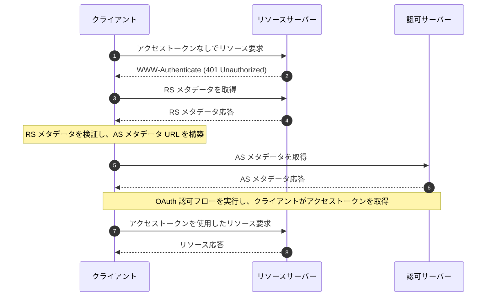

## OAuth 2.0 保護されたリソースメタデータとは？

OAuth 2.0 保護されたリソースメタデータは、[RFC 9728](https://datatracker.ietf.org/doc/html/rfc9728) で定義された標準化された形式です。これは、クライアントと認可サーバーが保護されたリソースとどのようにやり取りするかを理解するのに役立ちます。

このメタデータ形式は、以下の重要な情報を提供します：
- リソースサーバーの機能
- サポートされているトークン形式
- 必要なセキュリティメカニズム
- 認可サーバーとの関係
- 利用可能なスコープと権限

## 保護されたリソースメタデータの利点は何ですか？

OAuth 2.0 システムには、4つの基本的な役割があります：
- <Ref slug="authorization-server"/>: リソースオーナーを正常に認証した後、クライアントにアクセストークンを発行する
- <Ref slug="client"/>: 保護されたリソースへのアクセスを要求するアプリケーション
- <Ref slug="resource-owner"/>: 保護されたリソースへのアクセスを許可できるエンティティ
- <Ref slug="resource-server"/>: 保護されたリソースをホストするサーバー

従来、クライアントが保護されたリソースにアクセスする必要がある場合、まず認可サーバーを発見し、必要なトークンを取得するためにやり取りする必要がありました。リソースサーバーの役割は主にトークンの検証とリソースの提供に限定されており、すべての認証と認可の詳細は認可サーバーとクライアントアプリケーションを通じて調整されていました。

これは、クライアントがリソースサーバーの特定の要件や機能を直接発見する標準化された方法を持たないことを意味していました。

保護されたリソースメタデータは、この動的を変革し、リソースサーバーがその要件と機能を積極的に公開できるようにし、いくつかの重要な利点をもたらします：
- 直接発見: クライアントは、リソースサーバーの要件を直接ソースから学ぶことができます
- 自律性の向上: リソースサーバーは、サポートされているトークン形式、セキュリティメカニズム、および信頼された認可サーバーを明示的に指定できます
- 相互運用性の向上: 標準化された形式により、異なる実装間でアクセス要件の一貫したコミュニケーションが保証されます
- 動的構成: リソースサーバーは、認可サーバーの変更に依存せずに要件を更新できます

## OAuth 2.0 保護されたリソースメタデータはどのように機能しますか？

保護されたリソースメタデータは、OAuth 2.0 エコシステム内で標準化された発見とやり取りのプロセスを通じて機能します：



リソースサーバーメタデータドキュメントは、次のフィールドを含む JSON オブジェクトです：

```json
   {
     "resource": "https://api.example.com",
     "authorization_servers": [
       "https://auth.example.com"
     ],
     "scopes_supported": ["read", "write"],
     "token_formats_supported": ["jwt"],
     "token_introspection_endpoint": "https://api.example.com/introspect",
     "dpop_signing_alg_values_supported": ["ES256", "PS256"]
   }
   ```

クライアントがメタデータドキュメントを受け取ったら、主に次のフィールドに従って自分自身を構成し、リソースサーバーとやり取りできます：

- `resource`: 保護されたリソースの識別子
- `authorization_servers`: 認可された認可サーバーのリスト
- `scopes_supported`: このリソースに利用可能なスコープ
- `token_formats_supported`: サポートされているトークン形式
- `token_introspection_endpoint`: トークン検証のためのエンドポイント
- `dpop_signing_alg_values_supported`: サポートされている DPoP アルゴリズム

## OAuth 2.0 保護されたリソースメタデータエンドポイントを発見する方法は？

保護されたリソースメタデータの発見には、2つの主要なメカニズムがあります：

1. **WWW-Authenticate ヘッダー発見 (フローベース)**:

クライアントが保護されたリソースに対して未承認の要求を行うと、サーバーは 401 ステータスコードで応答し、WWW-Authenticate ヘッダーにメタデータ URL を含めます：

```bash
# 1. クライアントがトークンなしで要求を行う
GET /api/resource HTTP/1.1
Host: api.example.com

# 2. サーバーが 401 とメタデータ URL で応答
HTTP/1.1 401 Unauthorized
WWW-Authenticate: Bearer realm="example",
  scope="read write",
  resource_metadata_url="https://api.example.com/.well-known/oauth-resource-server"
```

ヘッダーは以下を提供します：
- リソース領域の識別
- 必要なスコープ
- メタデータ URL の場所

2. **直接の Well-Known URI 発見**:

GET リクエストを well-known エンドポイントに直接送信してメタデータにアクセスできます：

```bash
GET /.well-known/oauth-resource-server HTTP/1.1
Host: api.example.com
```

エンドポイントは標準化された形式に従います：
- ベース URI: `https://api.example.com`
- Well-known パス: `/.well-known/oauth-resource-server`
- 完全な URL: `https://api.example.com/.well-known/oauth-resource-server`

## 保護されたリソースメタデータにおける WWW-Authenticate ヘッダーの役割は？

WWW-Authenticate ヘッダーは、保護されたリソースメタデータにおける自動発見メカニズムの実装において重要なコンポーネントです。標準の HTTP `WWW-Authenticate` ヘッダーを利用してメタデータ情報を伝達し、クライアントがリソースサーバーのアクセス要件を自動的に発見し、構成できるようにします。

クライアントが最初にアクセストークンを提供せずに保護されたリソースにアクセスしようとすると、リソースサーバーは 401 Unauthorized ステータスコードで応答し、WWW-Authenticate ヘッダーを含めます：

```
WWW-Authenticate: Bearer realm="example",
  scope="read write",
  resource_metadata_url="https://api.example.com/.well-known/oauth-resource-server"
```

このヘッダーには、いくつかの重要な情報が含まれる場合があります：
- `Bearer`: これは OAuth 2.0 ベアラートークン認証スキームであることを示します
- `realm`: リソースの保護領域を定義します
- `scope`: 必要なアクセス権限を指定します
- `resource_metadata_url`: 完全なリソースサーバー構成を含むメタデータドキュメントの場所を指します

このヘッダーを受け取ると、クライアントは `resource_metadata_url` を抽出し、その URL から完全なメタデータドキュメントを取得します。

取得したメタデータ情報に基づいて、クライアントは適切な認可サーバー、サポートされているトークン形式、利用可能なスコープ、およびその他の構成詳細を決定し、認証要求を適切に構成できます。

## OAuth 2.0 保護されたリソースメタデータをどのように保護しますか？

重要なセキュリティ考慮事項には以下が含まれます：

1. **トランスポートセキュリティ**:
   - TLS の必須使用
   - 証明書の検証
   - 安全な接続の処理

2. **メタデータの整合性**:
   - ソースの検証
   - 署名の検証
   - 安全なキャッシング戦略

3. **アクセス制御**:
   - レート制限
   - 要求の検証
   - 不正使用の監視

## OAuth 2.0 保護されたリソースメタデータをどのように実装しますか？

OAuth 2.0 保護されたリソースメタデータが異なるコンポーネントでどのように実装されているかを以下に示します：

1. **リソースサーバーの実装**

リソースサーバーは、未承認のアクセス試行を受け取ると、401 Unauthorized ステータスで応答し、WWW-Authenticate ヘッダーにメタデータ URL を含めます：

```
HTTP/1.1 401 Unauthorized
WWW-Authenticate: Bearer realm="example",
  resource_metadata_url="https://api.example.com/.well-known/oauth-resource-server"
```

2. **クライアントの実装**

クライアントは、リソースアクセスを処理する非同期関数を実装します。401 応答を受け取ると、この関数は WWW-Authenticate ヘッダーからメタデータ URL を抽出し、メタデータを取得し、それをクライアント構成に使用します：

```javascript
async function handleResourceAccess(response) {
  if (response.status === 401) {
    const wwwAuthenticate = response.headers.get('WWW-Authenticate');
    const metadataUrl = extractMetadataUrl(wwwAuthenticate);
    const metadata = await fetchMetadata(metadataUrl);
    // メタデータに基づくクライアント構成
  }
}
```

3. **メタデータドキュメントの構造**

リソースサーバーは、次のフィールドを含む JSON オブジェクトとしてメタデータドキュメントを提供します：
- リソース識別子
- 認可された認可サーバーのリスト
- サポートされているスコープ
- サポートされているトークン形式
- サポートされている DPoP 署名アルゴリズム

メタデータドキュメントの例を以下に示します：

```json
{
  "resource": "https://api.example.com",
  "authorization_servers": ["https://auth.example.com"],
  "scopes_supported": ["read", "write"],
  "token_formats_supported": ["jwt"],
  "dpop_signing_alg_values_supported": ["ES256"]
}
```

これらのコンポーネントは連携して、完全な OAuth 2.0 保護されたリソースメタデータの実装を形成します。この実装を通じて、クライアントは保護されたリソースにアクセスするために必要なパラメータを自動的に発見し、構成することができます。

<SeeAlso slugs={["resource-server", "authorization-server"]} />

<Resources urls={[
  "https://datatracker.ietf.org/doc/html/rfc9728",
]} />