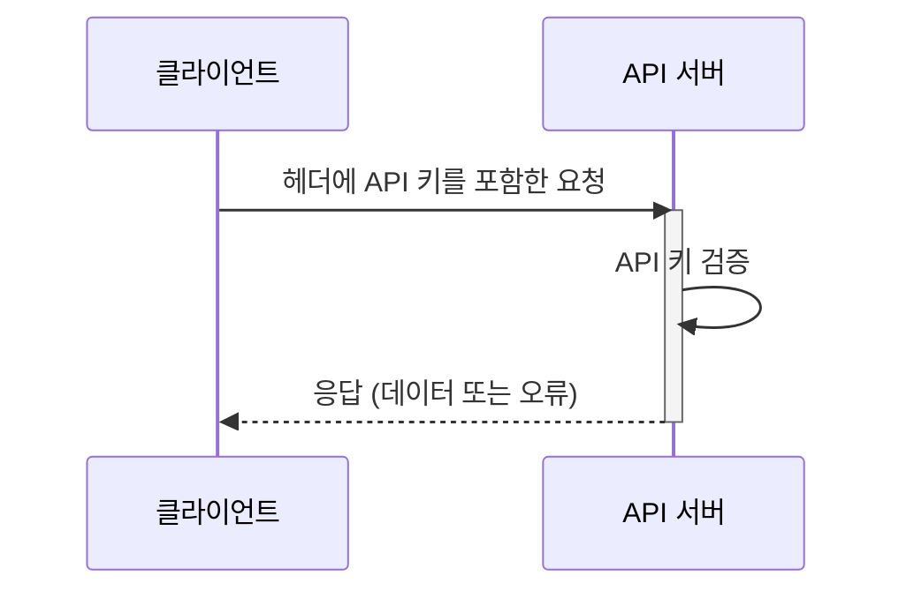

## API 키란 무엇인가?

API 키는 API에 접근하는 클라이언트를 인증하는 데 사용되는 비밀 토큰입니다. 이는 애플리케이션의 비밀번호와 같으며, 특정 API에 대한 접근을 허용합니다. 이를 건물에 접근하기 위한 키카드로 생각할 수 있습니다. 키카드는 접근을 허용하지만, 반드시 당신이 누구인지를 식별하지는 않습니다.

## API 키는 어떻게 작동하나요?

API 키는 간단한 요청 및 응답 프로세스를 통해 작동합니다.

1. **요청:** 애플리케이션이 API 키를 포함하여 API에 요청을 보냅니다. 키는 종종 요청의 헤더에 포함됩니다. 예를 들어, 헤더는 다음과 같이 보일 수 있습니다: `x-api-key: your_actual_api_key`. 헤더 이름이나 값 형식에 대한 단일 표준은 없습니다.

2. **검증:** API 서버는 제공된 키를 데이터베이스와 대조하여 확인합니다.

3. **응답:** 키가 유효하면 서버는 접근을 허용하고 요청된 데이터를 반환합니다. 그렇지 않으면 접근이 거부됩니다.

다음은 이 과정을 설명하는 시퀀스 다이어그램입니다:

## API 키의 장단점은 무엇인가요?

API 키의 유용성과 한계를 살펴보겠습니다:

### 장점

- **매우 간단한 사용법**: 요청에 키를 추가하기만 하면 됩니다! 집 열쇠를 사용하는 것처럼 복잡한 단계가 필요 없습니다.

- **추적이 용이함**: 누가 API를 사용하는지 알고 싶나요? API 키는 이를 간단하게 해줍니다. 어떤 앱이 호출을 하고 얼마나 자주 하는지 확인할 수 있습니다.

- **빠른 속도 제한**: 키당 제한을 설정하여 사람들이 API를 과도하게 사용하는 것을 막을 수 있습니다. 이는 클럽에서 누군가가 들어오고 나가는 횟수를 세는 경비원과 같습니다.

- **공공 데이터에 적합함**: 민감하지 않은 정보를 공유할 때 (예: 날씨 데이터나 공공 통계), API 키는 적합합니다.

### 단점

- **현대적인 대안보다 덜 안전함**: API 키는 <Ref slug="oauth-2.0" /> 및 <Ref slug="jwt" />와 같은 다른 형태의 API 인증만큼 효과적이지 않습니다. 이를 현대 보안 시스템에 비해 기본적인 자물쇠로 생각할 수 있습니다. 그러나 API 사용을 추적하고 API 보안을 시작하는 가장 간단한 방법이기 때문에 여전히 인기가 있습니다.

- **보안 위험**: API 키는 집 열쇠를 현관 매트 아래에 두는 것과 같습니다. 누군가가 이를 발견하면 영원히 사용할 수 있습니다. 그 이유는 다음과 같습니다:
  - 코드에서 자주 보임
  - 자동으로 만료되지 않음
  - 유출되면 (예: 공개 GitHub 저장소에서) 누구나 사용할 수 있음

- **사용자를 구분할 수 없음**: 일부 회사는 사용자를 식별할 수 있는 "API 키"를 사용하지만 (예: Stripe), 전통적인 API 키는 누가 누구인지 알려주지 않습니다. 이는 요청을 하는 애플리케이션만 알려줍니다.

- **정적 특성**: 만료되는 현대적인 인증 토큰과 달리, API 키는 보통 영원히 동일하게 유지됩니다. 이는 다음을 의미합니다:
  - 자동 보안 갱신 없음
  - 키를 교체하기 위한 수작업 필요
  - 키가 노출될 경우 더 높은 위험

## API 키의 사용 사례는 무엇인가요?

- 서비스 간 통신: API 키는 애플리케이션이 CLI를 통해 API와 직접 통신해야 하는 시나리오에 적합합니다. 예: OpenAI API 호출.
- 공공 API: API를 대중에게 공개할 때, API 키는 간단한 접근 제어 방법을 제공합니다.
- 간소화된 설정: 특히 개발 단계에서 빠르고 간단한 인증이 필요할 때. Machine-to-machine 인증과 달리, API 키는 사전에 클라이언트 등록이 필요하지 않으며, 접근 토큰으로 교환할 필요도 없습니다. 요청에 API 키를 매개변수로 전달하기만 하면 됩니다.

실제 시나리오에서 제품을 구축할 때 가장 일반적인 목적은 제품 통합입니다. 다음은 전형적인 사용 사례입니다:

### 예시: Stripe와의 통합

Stripe는 다양한 플랫폼 및 애플리케이션과의 안전한 통합을 위해 API 키를 사용합니다. 개발자 대시보드를 통해 이러한 키를 생성, 조회, 삭제 및 관리할 수 있습니다. API 키를 사용하여 Stripe의 결제 및 청구 기능을 제품에 통합할 수 있습니다.

## 개인 액세스 토큰 (PAT)과 Machine-to-Machine (M2M)의 차이점은 무엇인가요?

API 키에 대해 이야기할 때, 개인 액세스 토큰과 <Ref slug="machine-to-machine" />도 함께 언급될 수 있습니다. 이들은 모두 CLI 명령을 통해 API 리소스에 프로그래밍적으로 접근하거나 백엔드 서비스 간의 통신을 설정할 수 있습니다.

### 개인 액세스 토큰 (PATs)

개인 액세스 토큰은 특정 사용자의 신원과 권한을 나타내는 문자열로, 성공적인 인증 또는 로그인 시 동적으로 생성되며, 일반적으로 제한된 수명을 가지지만 갱신될 수 있습니다. 이는 사용자 특정 데이터 및 기능에 대한 세밀한 접근 제어를 제공하며, CLI 도구, 스크립트 또는 개인 API 접근에 일반적으로 사용됩니다. 주요 차이점은 더 구체적이며 사용자 특정 작업에 사용된다는 것입니다.

### Machine-to-Machine (M2M)

M2M 통신은 넓은 의미에서 인간의 개입 없이 장치가 자동으로 데이터를 교환하는 것입니다.

<Ref slug="openid-connect" /> (또는 <Ref slug="oauth-2.0" />)의 맥락에서, M2M 애플리케이션은 [OAuth 2.0 RFC 6749 프로토콜](https://datatracker.ietf.org/doc/html/rfc6749)에 정의된 <Ref slug="client-credentials-flow" />를 사용하며, 유사한 표준 프로토콜을 지원합니다. 이는 보통 클라이언트 애플리케이션(기계 또는 서비스)이 자체적으로 또는 사용자를 대신하여 리소스에 접근하는 것을 포함합니다. 이는 신뢰할 수 있는 클라이언트만이 백엔드 서비스에 접근할 수 있는 상황에 이상적입니다.

<SeeAlso slugs={["machine-to-machine"]} />