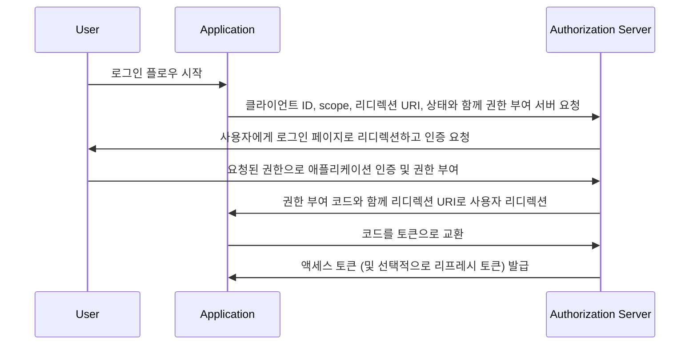

## 권한 부여 코드 플로우 (Authorization Code Flow)란 무엇인가?

권한 부여 코드 플로우 (Authorization Code Flow, 일명 권한 부여 코드 부여)는 [OAuth 2.0 RFC 6749, 섹션 4.1](https://datatracker.ietf.org/doc/html/rfc6749#section-4.1)에 정의된 널리 사용되는 OAuth 2.0 권한 부여 메커니즘으로, 애플리케이션이 사용자를 대신하여 액세스 토큰을 얻을 수 있게 합니다.

이 플로우는 클라이언트 비밀을 안전하게 저장할 수 있는 전통적인 서버 측 웹 애플리케이션과 같은 기밀 애플리케이션에 이상적입니다.

또한 PKCE (<Ref slug="pkce" />) 확장과 결합하여 클라이언트 비밀을 안전하게 저장할 수 없는 네이티브 앱 및 단일 페이지 애플리케이션(SPA)에서도 안전하게 사용할 수 있습니다.

## 권한 부여 코드 플로우 (Authorization Code Flow)는 어떻게 작동하나요?

권한 부여 코드 플로우는 다음과 같은 단계로 이루어집니다:

1. **플로우 시작**: 사용자는 일반적으로 애플리케이션에서 링크나 버튼을 클릭하여 플로우를 시작합니다. 애플리케이션은 사용자에게 클라이언트 ID, 요청된 scope, 리디렉션 URI, 상태 매개변수를 전달하여 권한 부여 서버의 권한 부여 엔드포인트로 리디렉션합니다. 권한 부여 서버는 매개변수를 검증하고 사용자가 권한 부여 서버의 로그인 페이지에서 인증하도록 요청합니다.
2. **사용자 인증 및 권한 부여**: 사용자는 권한 부여 서버에서 인증을 받고 요청된 리소스에 대한 애플리케이션의 접근 권한을 부여합니다.
3. **코드 생성 및 리디렉션**: 권한 부여 서버는 권한 부여 코드를 생성하고 이전에 제공된 리디렉션 URI를 사용하여 사용자를 애플리케이션으로 다시 리디렉션합니다. 권한 부여 코드는 리디렉션 URI의 쿼리 문자열에 포함됩니다.
4. **코드 교환**: 애플리케이션은 쿼리 문자열에서 권한 부여 코드를 추출하고, 권한 부여 서버의 토큰 엔드포인트에 POST 요청을 보내 권한 부여 코드를 액세스 토큰으로 교환합니다. 이 요청에는 클라이언트 ID, 클라이언트 비밀, 리디렉션 URI, 권한 부여 코드도 포함되어야 합니다.
5. **액세스 토큰 수신**: 권한 부여 서버는 권한 부여 코드를 검증하고 성공적으로 검증되면 애플리케이션에 액세스 토큰(및 선택적으로 리프레시 토큰)을 발급합니다. 애플리케이션은 이후 사용자를 대신하여 권한 있는 API 요청을 수행하기 위해 액세스 토큰을 사용할 수 있습니다.

이 단계들은 다음 시퀀스 다이어그램으로 설명할 수 있습니다:



## 권한 부여 코드 플로우 (Authorization Code Flow)를 어떻게 구현하나요?

다음은 [OAuth 2.0 RFC 6749, 섹션 4.1](https://datatracker.ietf.org/doc/html/rfc6749#section-4.1)에 설명된 지침을 따라 권한 부여 코드 플로우를 구현하는 간단한 예입니다:

### 1. 초기 설정

시작하기 전에 auth 서비스에서 다음 정보를 확보하세요:

```javascript
const config = {
  clientId: "YOUR_CLIENT_ID",
  clientSecret: "YOUR_CLIENT_SECRET",
  authorizationEndpoint: "https://authorization-server.com/auth",
  tokenEndpoint: "https://authorization-server.com/token",
  redirectUri: "http://localhost:3000/callback",
};
```

클라이언트 ID, 클라이언트 비밀, 리디렉션 URI는 auth 서비스에서 애플리케이션의 구성입니다.

`authorizationEndpoint`와 `tokenEndpoint`는 auth 서비스에서 제공됩니다.

auth 서버가 OIDC (<Ref slug="openid-connect" />)를 구현하는 경우, <Ref slug="openid-connect-discovery" />를 통해 이 정보를 얻을 수 있습니다.

### 2. 권한 부여 요청 시작

플로우는 사용자가 로그인 버튼을 클릭하는 등 로그인을 원할 때 시작됩니다. 애플리케이션은 로그인 요청을 수행합니다.

이 요청에는 `client ID`, `redirect URI`, `scope`와 같은 매개변수가 포함됩니다. 그런 다음 사용자를 auth 서비스의 권한 부여 엔드포인트(auth 서비스의 로그인 페이지)로 리디렉션합니다.

사용자는 이 로그인 페이지에서 인증 및 권한 부여를 수행합니다.

```javascript
app.get("/login", (req, res) => {
  const authUrl = new URL(config.authorizationEndpoint);
  authUrl.searchParams.append("response_type", "code");
  authUrl.searchParams.append("client_id", config.clientId);
  authUrl.searchParams.append("redirect_uri", config.redirectUri);
  authUrl.searchParams.append("scope", "openid profile email");
  authUrl.searchParams.append("state", "random_state_string");

  res.redirect(authUrl.toString());
});
```

참고: 예제 코드에 표시된 것 외에도 더 많은 매개변수를 추가할 수 있습니다. [전체 인증 요청 매개변수 정의](https://openid.net/specs/openid-connect-core-1_0.html#AuthRequest)를 참조하세요.

### 3. 리디렉션 URI 콜백 처리 및 토큰 교환

사용자가 auth 서비스의 로그인 페이지에서 인증 및 권한 부여를 완료한 후, auth 서비스는 사용자를 애플리케이션의 리디렉션 URI로 다시 리디렉션합니다. 이 리디렉션 URI에는 권한 부여 코드와 상태 매개변수가 포함됩니다.

애플리케이션은 리디렉션 URI에서 권한 부여 코드와 상태 매개변수를 추출하고, auth 서비스의 토큰 엔드포인트에서 액세스 및 리프레시 토큰(있는 경우)으로 교환합니다.

```javascript
app.get("/callback", async (req, res) => {
  const { code, state } = req.query;

  try {
    // 권한 부여 코드를 액세스 토큰 및 리프레시 토큰으로 교환
    const tokenResponse = await axios.post(config.tokenEndpoint, {
      grant_type: "authorization_code",
      code,
      redirect_uri: config.redirectUri,
      client_id: config.clientId,
      client_secret: config.clientSecret,
    });

    const { access_token, refresh_token } = tokenResponse.data;
    // 이후 요청을 위해 토큰 저장
    req.session.accessToken = access_token;

    res.send("인증 성공!");
  } catch (error) {
    res.status(500).send("토큰 교환 실패");
  }
});
```

### 4. 액세스 토큰 사용

토큰을 얻은 후에는 보호된 리소스에 접근하기 위해 사용하세요:

```javascript
async function fetchUserProfile(accessToken) {
  const response = await axios.get("https://api.example.com/userinfo", {
    headers: {
      Authorization: `Bearer ${accessToken}`,
    },
  });
  return response.data;
}
```

## 공개 클라이언트(네이티브 앱 및 SPA)에 권한 부여 코드 플로우 (Authorization Code Flow)를 어떻게 사용하나요?

공개 클라이언트(네이티브 앱 및 SPA)는 권한 부여 코드 플로우를 사용할 때 고유한 보안 문제에 직면합니다. 이러한 애플리케이션은 클라이언트 비밀을 안전하게 저장할 수 없습니다. 클라이언트 비밀은 JavaScript 코드나 장치의 저장소에 노출될 수 있습니다. 이는 공격자가 비밀을 추출하고 악용하기 쉽게 만듭니다.

따라서 클라이언트 비밀 없이 권한 부여 코드 플로우를 안전하게 사용하는 것이 핵심 과제입니다. OAuth 2.0 사양은 이 문제를 해결하기 위해 PKCE (<Ref slug="pkce" />) 확장을 도입했습니다.

PKCE는 공개 클라이언트를 위한 권한 부여 코드 플로우를 보호하기 위해 추가적인 보안 조치를 추가합니다. 이는 클라이언트 비밀을 사용하지 않고도 권한 부여 코드 가로채기 공격을 방지합니다. [PKCE가 OAuth 2.0 권한 부여 코드 플로우를 어떻게 보호하는지](https://blog.logto.io/how-pkce-protects-the-authorization-code-flow-for-native-apps)에 대해 더 알아보세요.

## 권한 부여 코드 플로우 (Authorization Code Flow)를 안전하게 사용하는 방법은?

### **"state"를 사용하여 CSRF 공격 방지**

CSRF (<Ref slug="csrf" />) 공격은 사용자가 인증된 웹 애플리케이션에서 원하지 않는 작업을 수행하도록 유도합니다. 상태 매개변수는 이를 방지하는 데 도움이 됩니다.

- 고유하고 무작위한 값을 생성합니다. 이 값을 서버 측에 저장합니다.
- 상태 매개변수를 포함합니다. 권한 부여 요청 URL에 추가합니다.
- 반환 시 상태를 검증합니다. 권한 부여 서버가 앱으로 다시 리디렉션할 때 반환된 상태와 저장된 값을 비교합니다. 일치하지 않으면 요청을 거부합니다. 이는 요청이 애플리케이션에서 시작되었음을 확인합니다.

### **안전한 리디렉션 URI 구성**

리디렉션 URI는 사용자 인증 후 권한 부여 서버가 권한 부여 코드를 보내는 위치입니다. 안전한 구성은 매우 중요합니다.

- 유효한 리디렉션 URI를 등록합니다. 권한 부여 서버에 앱을 등록할 때 허용된 리디렉션 URI를 지정합니다.
- 정확한 일치. 권한 부여 요청의 리디렉션 URI는 등록된 URI와 정확히 일치해야 합니다. 약간의 차이도 취약성을 초래할 수 있습니다.
- 와일드카드 URI 피하기. 가능하면 프로덕션에서 와일드카드 URI 사용을 피하세요. 이는 공격 표면을 넓힙니다.
- 프로덕션에서는 HTTPS 사용. 프로덕션 환경에서 항상 HTTPS를 사용하여 리디렉션 URI를 보호하세요.

### **모든 클라이언트에 PKCE 사용**

PKCE는 원래 공개 클라이언트를 위해 설계되었지만, <Ref slug="oauth-2.1" /> 사양은 권한 부여 코드 플로우의 전반적인 보안을 강화하기 위해 기밀 클라이언트를 포함한 모든 클라이언트에 대해 PKCE를 강제하도록 요구합니다. (모든 클라이언트에 대해 PKCE 강제 적용에 대해 더 알아보세요: [Enforce PKCE for all clients](https://auth.wiki/oauth-2.1#enforcing-pkce-for-all-clients))

## 권한 부여 코드 플로우 (Authorization Code Flow)와 암시적 플로우 (Implicit Flow)의 차이점은 무엇인가요?

권한 부여 코드 플로우와 암시적 플로우의 주요 차이점은 액세스 토큰을 얻는 방법입니다:

- **권한 부여 코드 플로우**: 클라이언트 애플리케이션은 먼저 권한 부여 엔드포인트에서 권한 부여 코드를 받고, 이후 토큰 엔드포인트에 대한 POST 요청에서 이를 액세스 토큰으로 교환합니다.
- **암시적 플로우**: 클라이언트 애플리케이션은 사용자 권한 부여 후 리디렉션 URI의 URL 프래그먼트에서 직접 액세스 토큰을 받습니다.

<Ref slug="implicit-flow" />에 대해 더 알아보세요.

## 권한 부여 코드 플로우 (Authorization Code Flow)와 클라이언트 자격 증명 플로우 (Client Credentials Flow)의 차이점은 무엇인가요?

권한 부여 코드 플로우와 클라이언트 자격 증명 플로우의 주요 차이점은 플로우가 사용되는 맥락입니다:

- **권한 부여 코드 플로우**: 클라이언트 애플리케이션이 사용자를 대신하여 리소스에 접근해야 할 때 사용됩니다. 이 플로우는 사용자 인증 및 권한 부여를 포함합니다.
- **클라이언트 자격 증명 플로우**: 클라이언트 애플리케이션이 자체적으로 리소스에 접근해야 할 때 사용됩니다. 이 플로우는 클라이언트 인증을 포함하지만 사용자 인증은 포함하지 않으며, 머신 투 머신 (Machine to Machine) 통신에 가장 적합합니다.

<Ref slug="client-credentials-flow" />에 대해 더 알아보세요.

<SeeAlso
  slugs={[
    "device-flow",
    "implicit-flow",
    "client-credentials-flow",
    "pkce",
    "openid-connect",
    "openid-connect-discovery",
    "csrf",
    "oauth-2.1",
  ]}
/>

<Resources urls={[
  "https://datatracker.ietf.org/doc/html/rfc6749",
  "https://openid.net/specs/openid-connect-core-1_0.html#AuthRequest",
  "https://blog.logto.io/how-pkce-protects-the-authorization-code-flow-for-native-apps"
]} />