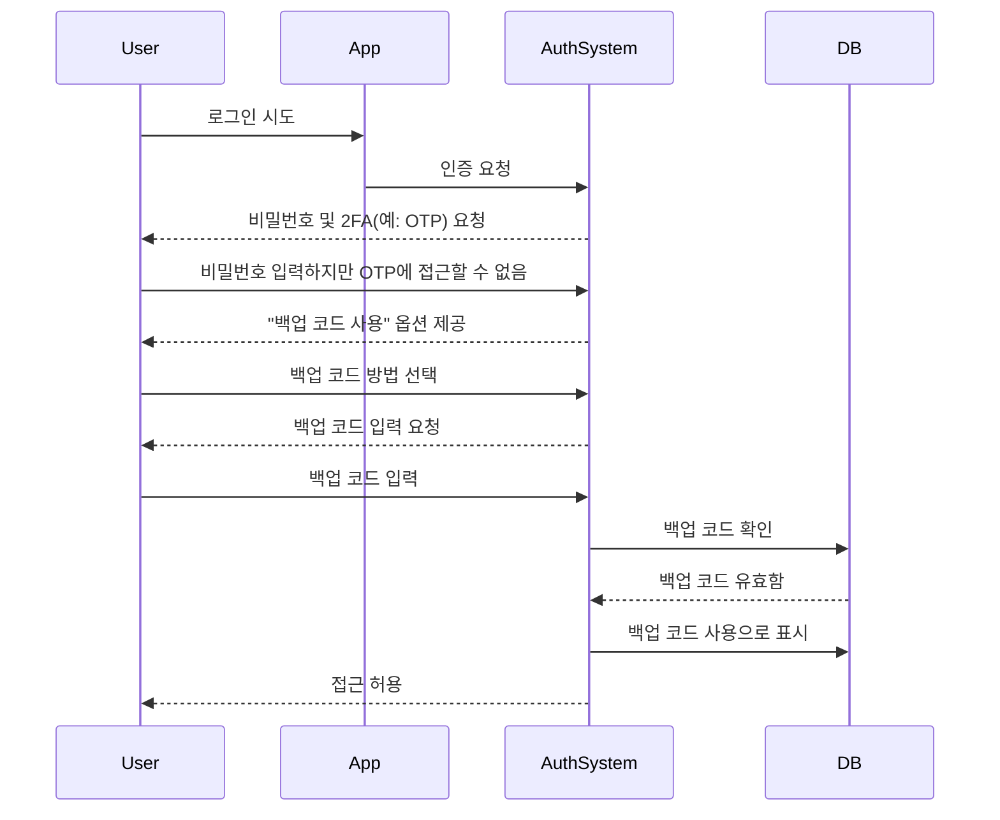

## 백업 코드란 무엇인가?

백업 코드(복구 코드라고도 함)는 SMS, 인증 앱 또는 패스키와 같은 기본 MFA 옵션을 사용할 수 없을 때 대체 인증 방법으로 작동하는 무작위로 생성된 일회용 코드 세트입니다. 휴대폰을 분실하거나 네트워크 문제를 겪거나 기술적 결함이 발생하더라도 항상 계정에 접근할 수 있도록 보장하는 비상 키로 생각할 수 있습니다.

## 백업 코드는 어떻게 작동하나요?

백업 코드는 표준 MFA 방법이 실패할 때 계정에 다시 접근할 수 있는 간단하지만 안전한 방법을 제공합니다. 작동 방식은 다음과 같습니다:

1. **생성**: 시스템은 MFA 설정 중에 고유한 코드 세트(일반적으로 각 8~12자)를 생성합니다.
2. **저장**: 이러한 코드를 오프라인(예: 종이에 인쇄) 또는 암호화된 비밀번호 관리자에 안전하게 저장하라는 메시지가 표시됩니다.
3. **사용**: 기본 MFA 방법을 사용할 수 없는 경우 백업 코드 중 하나를 입력하여 인증합니다.
4. **무효화**: 각 코드는 재사용을 방지하기 위해 사용 후 자동으로 비활성화됩니다.

## 언제 백업 코드를 사용해야 하나요?

백업 코드는 구식이 될까요? MFA가 여전히 이를 지원해야 할까요?

물론입니다. 백업 코드는 MFA의 중요한 안전망으로 남아 있습니다. 패스키 및 FIDO2와 같은 새로운 방법이 주목받고 있지만, 백업 코드는 보편적으로 접근 가능하고 장치에 구애받지 않는 복구 옵션을 제공합니다. 이는 저비용, 고가치의 안전장치이며 현대적인 MFA 방법과 함께 항상 지원되어야 합니다.

백업 코드를 사용할 때:

- 기본 MFA 장치를 사용할 수 없는 경우(예: 휴대폰 분실, 배터리 방전).
- 네트워크 문제로 SMS/이메일 전송이 불가능한 경우.
- 인증 앱이 동기화되지 않는 경우.
- 하드웨어 토큰이 오작동하는 경우.

## 백업 코드를 안전하게 사용하는 방법?

백업 코드의 보안을 유지하려면:

1. **오프라인으로 저장**
    - 장치의 암호화된 폴더에 저장합니다.
    - 인쇄하여 안전한 장소(예: 키패드 금고)에 보관합니다.
    - 보안되지 않은 디지털 형식(예: 온라인 메모 앱)에 저장하지 마세요.
2. **비밀번호 관리자 사용**
    - 대부분의 비밀번호 관리자(예: 1Password, LastPass)는 안전한 메모 기능을 제공합니다.
        - 새 항목 생성: "백업 코드 – [서비스 이름]"
        - 백업 코드를 복사하여 붙여넣고 암호화를 활성화합니다.
    - Google Password Manager를 사용하는 경우:
        - 관련 서비스 항목을 찾습니다.
        - 편집하여 백업 코드에 대한 메모를 추가하고, 코드를 "사용됨/사용되지 않음"으로 레이블링하여 추적합니다.
        - 이렇게 하면 비밀번호 자동 완성 시 필요할 때 빠르게 백업 코드에 접근할 수 있습니다.
3. **사용된 코드 교체**
    - 대부분의 코드를 사용했거나 손상되었다고 의심되는 경우 새 코드를 생성합니다.

## 백업 코드가 포함된 MFA 경험 설계

백업 코드를 구현하는 개발자는 다음 모범 사례를 따르세요:

1. **백업 코드에만 의존하지 마세요**
백업 코드는 비상 대체 수단이지 기본 MFA 방법이 아닙니다. 항상 TOTP, 패스키 또는 기타 강력한 옵션을 제공하세요.
2. **기본적으로 8~10개의 코드 제공**
    
    이는 사용성(드문 비상 상황에 충분함)과 보안(대량 도난 위험 최소화)을 균형 있게 합니다.
    
3. **일회성 사용 강제**
    
    사용 후 코드를 자동으로 무효화합니다.
    
4. **소진 시 코드 자동 재생성**
    
    사용자가 현재 세트를 소진하면 새로운 코드를 발급하여 잠금을 방지합니다.
    
5. **엄격한 검증을 통한 수동 재생성 허용**
    
    사용자가 코드를 분실한 경우 새 코드를 생성할 수 있도록 하되, 재인증(예: 이메일/SMS/비밀번호 확인)을 요구합니다.
    

## 백업 코드와 비밀번호: 차이점은 무엇인가요?

| 기능 | 백업 코드 | 비밀번호 |
| --- | --- | --- |
| **목적** | MFA 실패 시 일회성 대체 수단 | 기본 인증 방법 |
| **형식** | 시스템 생성, 영숫자 | 사용자가 선택, 종종 문자 혼합 |
| **저장** | 해시 처리(종종 솔트 없음, 일회용이기 때문) | 해시 + 솔트 처리(레인보우 테이블 공격 방지) |
| **사용** | 한 번 사용 후 비활성화 | 변경될 때까지 재사용 가능 |
| **재생성** | 시스템이 새로운 세트 발급 | 사용자가 수동으로 재설정 |
| **보안** | 안전하게 저장해야 함 | 약하거나 재사용되면 취약 |

**주요 보안 노트:**

- 둘 다 무차별 대입 공격에 저항하기 위해 길고 무작위로 생성되어야 합니다.
- 비밀번호는 종종 재사용되기 때문에 솔트 처리가 필요합니다.
- 백업 코드는 일반적으로 솔트 처리가 필요하지 않습니다. 일회용이며 무작위로 생성되므로 대규모 공격이 발생할 가능성이 낮습니다.

<Resources
  urls={[
    "https://docs.logto.io/end-user-flows/mfa",
    "https://auth-wiki.logto.io/mfa",
    "https://auth-wiki.logto.io/totp"
  ]}
/>