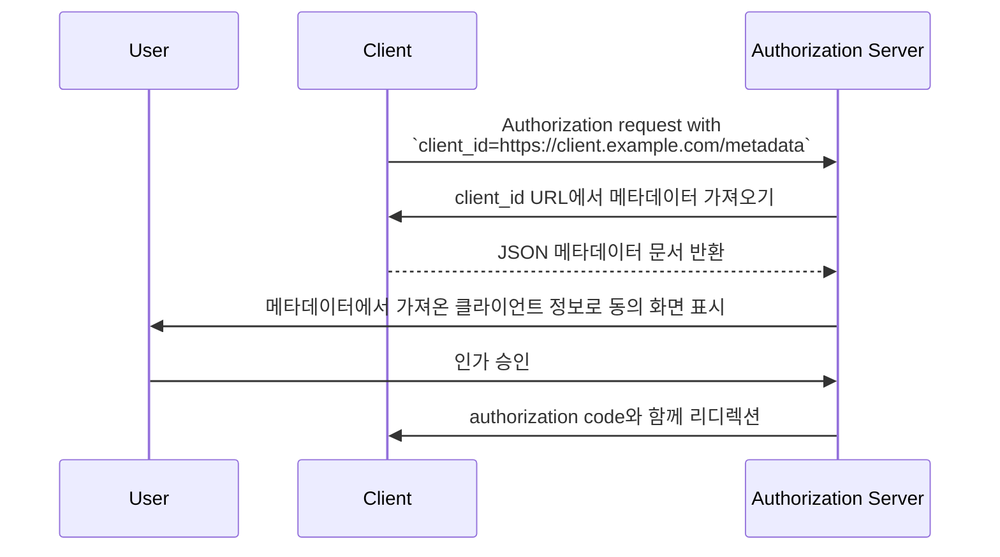

## 클라이언트 ID 메타데이터 문서 (Client ID Metadata Document, CIMD)란?

클라이언트 ID 메타데이터 문서 (Client ID Metadata Document, CIMD)는 [OAuth Client ID Metadata Document](https://datatracker.ietf.org/doc/draft-ietf-oauth-client-id-metadata-document/) 명세에서 정의된 메커니즘으로, OAuth 2.0 <Ref slug="client" />가 사전 등록 없이 <Ref slug="authorization-server" />에 자신을 식별할 수 있도록 해줍니다.

핵심 아이디어는 다음과 같습니다: authorization server(인가 서버)로부터 `client_id`를 (수동 등록 또는 [Dynamic Client Registration](https://datatracker.ietf.org/doc/html/rfc7591)을 통해) 받는 대신, 클라이언트는 **HTTPS URL을 `client_id`로 사용**합니다. 이 URL은 클라이언트의 메타데이터(이름, redirect URI, 지원하는 grant type 등)를 담고 있는 JSON 문서를 가리킵니다. authorization server(인가 서버)는 URL 기반 `client_id`를 받으면 이 문서를 가져옵니다.

이 방식은 커뮤니티에서 **CIMD**(Client ID Metadata Document)로 줄여 부르기도 합니다.

## 어떻게 동작하나요?

클라이언트가 클라이언트 ID 메타데이터 문서 (Client ID Metadata Document, CIMD)를 사용할 때, OAuth 플로우에 한 단계가 추가됩니다: authorization server(인가 서버)가 `client_id` URL을 해석하여 클라이언트의 메타데이터를 가져옵니다.



단계별로 보면 다음과 같습니다:

1. 클라이언트가 자신의 URL을 `client_id`로 하여 <Ref slug="authorization-request" />를 시작합니다 (예: `https://client.example.com/oauth-client`).
2. authorization server(인가 서버)는 `client_id`가 URL임을 인식하고 HTTPS로 해당 URL을 가져옵니다.
3. 응답은 표준 OAuth 클라이언트 메타데이터를 담은 JSON 문서입니다.
4. authorization server(인가 서버)는 메타데이터를 검증하고, 사용자에게 동의 정보를 표시한 뒤 OAuth 플로우를 계속 진행합니다.
5. 이후 요청에서는 HTTP 캐시 헤더에 따라 캐시된 메타데이터를 사용할 수 있습니다.

### 메타데이터 문서

메타데이터 문서는 [RFC 7591 (OAuth 2.0 Dynamic Client Registration Protocol)](https://datatracker.ietf.org/doc/html/rfc7591)에 정의된 필드와 동일한 JSON 객체입니다. 반드시 `client_id` 필드를 포함해야 하며, 그 값은 URL과 정확히 일치해야 합니다.

예시:

```json
{
  "client_id": "https://client.example.com/oauth-client",
  "client_name": "My Application",
  "redirect_uris": ["https://client.example.com/callback"],
  "grant_types": ["authorization_code", "refresh_token"],
  "response_types": ["code"],
  "token_endpoint_auth_method": "none",
  "scope": "openid profile email"
}
```

### 클라이언트 식별자 URL 요건

명세에서는 유효한 클라이언트 식별자 URL에 대해 엄격한 요건을 둡니다:

- **반드시 HTTPS 사용** — HTTP 또는 다른 스킴은 허용되지 않음
- **반드시 경로(path) 컴포넌트 포함** — `https://example.com`과 같은 도메인만 있는 URL은 유효하지 않음
- **fragment, username, password 컴포넌트 포함 불가**
- **단일 점(`.`) 또는 이중 점(`..`) 경로 세그먼트 포함 불가**
- 쿼리스트링은 허용되나 권장하지 않음
- 포트 번호는 허용됨

예시:
- `https://client.example.com/oauth-client` — 유효함
- `http://client.example.com/oauth-client` — 유효하지 않음 (HTTPS 아님)
- `https://example.com` — 유효하지 않음 (경로 없음)
- `https://client.example.com/../oauth-client` — 유효하지 않음 (dot segment)

## 기존 등록 방식은 왜 사용하지 않나요?

이 명세가 존재하는 이유를 이해하려면 기존 방식의 한계를 살펴봐야 합니다:

### 정적 등록 (Static registration)

전통적인 OAuth 배포에서는 개발자가 관리 콘솔 등에서 클라이언트를 수동으로 등록하고 `client_id`를 받습니다. 이는 클라이언트를 미리 알고 있을 때는 잘 동작합니다.

하지만 모든 클라이언트를 미리 등록할 수 없는 개방형 생태계(예: AI 에이전트, MCP 클라이언트 등)에서는 불가능합니다.

### Dynamic Client Registration (DCR)

[Dynamic Client Registration (RFC 7591)](https://datatracker.ietf.org/doc/html/rfc7591)은 클라이언트가 메타데이터를 등록 엔드포인트로 전송하여 프로그래밍 방식으로 등록할 수 있게 해줍니다. 서버는 `client_id`를 생성하고 등록 정보를 저장합니다.

이 방식은 동작하지만, 서버 측에 상태가 생깁니다: 등록마다 레코드가 생성되어 저장, 관리, 정리되어야 합니다. 많은 클라이언트가 존재하는 개방형 생태계에서는 authorization server(인가 서버)에 등록 정보가 쌓이게 되고, 대부분은 한 번 쓰이고 버려질 수 있습니다.

또한 DCR에는 클라이언트가 주장하는 신원을 검증하는 내장 메커니즘이 없습니다. 어떤 클라이언트든 임의의 이름이나 로고로 등록할 수 있습니다.

### 클라이언트 ID 메타데이터 문서 (Client ID Metadata Document, CIMD)의 장점

클라이언트 ID 메타데이터 문서 (Client ID Metadata Document, CIMD) 방식은 다음과 같은 문제를 해결합니다:

| 측면 | Static registration | DCR | Client ID Metadata Document |
|--------|-------------------|-----|----------------------------|
| 서버 측 상태 | 있음 (저장된 레코드) | 있음 (저장된 레코드) | 없음 (요청 시 가져옴) |
| 사전 등록 필요 | 있음 | 없음 | 없음 |
| 신원 검증 | 수동 검토 | 내장 없음 | HTTPS를 통한 도메인 소유권 |
| 정리 필요 | 있음 | 있음 (버려진 레코드) | 없음 (HTTP 캐시로 자동 정리) |
| 클라이언트가 메타데이터 제어 | 없음 | 등록 시점에만 | 있음 (언제든 업데이트 가능) |

핵심은 **도메인 소유권이 신뢰의 기준**이 된다는 점입니다. `client.example.com`을 제어하는 주체만이 `https://client.example.com/oauth-client`에 콘텐츠를 호스팅할 수 있습니다. HTTPS 인증서가 이를 추가 검증 없이 증명해줍니다.

## 인증 (Authentication) 제약

클라이언트와 authorization server(인가 서버) 사이에 사전 공유 비밀이 없으므로, 대칭 비밀 기반 인증 방식은 사용할 수 없습니다. 메타데이터 문서에는 **다음 항목이 포함되어서는 안 됩니다**:

- `client_secret_post`
- `client_secret_basic`
- `client_secret_jwt`
- 공유 대칭 비밀에 의존하는 모든 방식

`client_secret` 및 `client_secret_expires_at` 필드도 문서에 포함되어서는 안 됩니다.

클라이언트가 public client 이상의 인증이 필요하다면 비대칭 암호 방식을 사용할 수 있습니다. 클라이언트는 메타데이터 문서에 공개키(`jwks` 속성 또는 `jwks_uri` 참조)를 게시하고, token endpoint에서 `private_key_jwt`로 인증합니다. authorization server(인가 서버)는 게시된 <Ref slug="jwk">JWK</Ref>로 JWT 서명을 검증합니다.

## authorization server(인가 서버)는 어떻게 지원 여부를 알리나요?

authorization server(인가 서버)는 <Ref slug="authorization-server-metadata" />에 다음 속성을 포함하여 클라이언트 ID 메타데이터 문서 (Client ID Metadata Document, CIMD) 지원 여부를 표시합니다:

```json
{
  "client_id_metadata_document_supported": true
}
```

클라이언트는 URL 기반 `client_id`로 authorization flow를 시작하기 전에 이 플래그를 확인할 수 있습니다. authorization server(인가 서버)가 지원을 광고하지 않으면, 클라이언트는 다른 등록 방식으로 대체해야 합니다.

## 보안 고려사항

### SSRF 보호

authorization server(인가 서버)가 메타데이터 URL을 가져올 때, 클라이언트가 제공한 URL로 HTTP 요청을 하게 됩니다. 이는 SSRF(Server-Side Request Forgery) 공격 벡터가 될 수 있습니다. 구현 시 다음을 권장합니다:

- 사설 및 루프백 IP 주소(예: `127.0.0.1`, `10.x.x.x`, `192.168.x.x`)로의 요청 차단
- 리디렉션을 따라간 후에도 대상 주소 재검증
- 응답 크기 제한(명세에서는 최대 5 KB 권장)
- 적절한 타임아웃 설정

### 캐싱

authorization server(인가 서버)는 메타데이터를 캐싱할 때 HTTP 캐시 헤더(`Cache-Control`, `ETag`)를 준수해야 합니다. 단,

- **오류 응답은 캐시하지 않아야 함** — 일시적 실패로 인해 클라이언트가 영구적으로 차단되어서는 안 됨
- 서버는 클라이언트 서버가 지정한 값과 무관하게 최소/최대 캐시 기간을 강제할 수 있음

### 피싱 방지

악의적인 클라이언트가 `client_name`을 신뢰받는 브랜드명으로, `logo_uri`를 해당 로고로 설정할 수 있습니다. authorization server(인가 서버)는 다음과 같이 이를 완화해야 합니다:

- 동의 화면에 항상 클라이언트 이름과 함께 `client_id`의 호스트명을 표시
- 클라이언트에서 직접 이미지를 불러오는 대신, 로고 이미지를 미리 가져와서 검토

### redirect URI 증명

DCR 대비 보안상의 장점: 메타데이터 문서의 <Ref slug="redirect-uri">redirect URI</Ref>는 클라이언트 도메인에서 HTTPS로 제공됩니다. 이는 등록 요청에서 클라이언트가 주장하는 값보다 클라이언트 신원과 redirect URI의 결합을 더 강하게 만듭니다.

## 클라이언트 ID 메타데이터 문서 서비스 (Client ID Metadata Document Services)

명세에서는 **클라이언트 ID 메타데이터 문서 서비스 (Client ID Metadata Document Services)**도 정의합니다. 이는 개발자를 대신해 메타데이터 문서를 호스팅하는 서드파티 웹 서비스입니다.

실제 개발 환경에서는, 로컬 개발 중에 개발자가 메타데이터를 호스팅할 공개 URL이 없는 경우가 많습니다. 클라이언트 ID 메타데이터 문서 서비스는 authorization server(인가 서버)가 가져올 수 있는 안정적인 공개 URL을 제공하며, 개발자는 로컬에서 작업할 수 있습니다. 이를 통해 OAuth 플로우 테스트를 위해 로컬 머신을 인터넷에 노출하거나 터널링을 설정할 필요가 없습니다.

<SeeAlso slugs={["client", "authorization-server-metadata", "redirect-uri", "jwk"]} />

<Resources
  urls={[
    "https://datatracker.ietf.org/doc/draft-ietf-oauth-client-id-metadata-document/",
    "https://datatracker.ietf.org/doc/html/rfc7591",
    "https://datatracker.ietf.org/doc/html/rfc8414",
  ]}
/>
