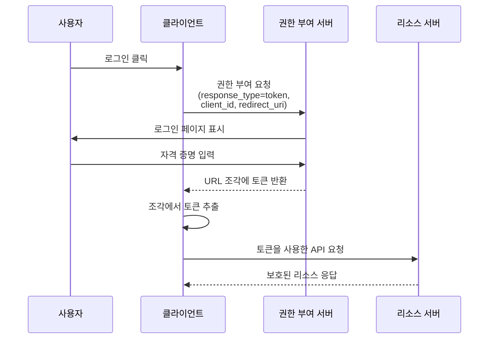

## 암시적 흐름 (Implicit flow)이란 무엇인가?

OAuth 2.0 암시적 흐름 (Implicit flow)은 클라이언트 전용 애플리케이션(SPA 및 네이티브 앱과 같은)이 클라이언트 비밀을 제공하지 않고 권한 부여 서버로부터 URL 조각을 통해 직접 토큰을 받을 수 있도록 하는 인증 방법입니다.

암시적 흐름 (Implicit flow)은 클라이언트 전용 애플리케이션을 위해 설계되었습니다. 이러한 애플리케이션은 브라우저나 사용자의 장치에서 완전히 실행되며 클라이언트 비밀을 안전하게 저장할 수 없습니다.

보안상의 이유로 암시적 흐름 (Implicit flow)은 <Ref slug="oauth-2.1" />에서 공식적으로 사용 중단되었습니다(아래에서 언급될 예정입니다). 클라이언트 전용 애플리케이션은 이제 <Ref slug="pkce" /> 확장을 사용한 <Ref slug="authorization-code-flow" />를 사용해야 합니다.

## 암시적 흐름 (Implicit flow)은 어떻게 작동하나요?

암시적 흐름 (Implicit flow)의 주요 단계는 다음과 같습니다:

주의사항:

- 클라이언트는 권한 부여 요청에서 `client_id`만 제공하면 되며, `client_secret`은 필요하지 않습니다.  
  이는 이러한 클라이언트가 비밀을 안전하게 저장할 수 없기 때문에 이 흐름에서는 클라이언트 비밀이 필요하지 않기 때문입니다.

- `response_type` 매개변수는 `token`으로 설정되어 있으며, 이는 권한 부여 서버가 권한 코드 대신 액세스 토큰을 직접 반환하도록 지시합니다.  
  OIDC (<Ref slug="openid-connect" />)에서는 `response_type`이 `id_token` 또는 `id_token token`이며, 인증 서비스는 다른 응답 유형에 따라 해당 토큰을 반환합니다.

- 토큰은 URL 조각에 직접 반환됩니다. 이는 토큰이 URL에 노출되어 다른 애플리케이션이나 스크립트에 의해 쉽게 접근될 수 있음을 의미합니다.

## 암시적 흐름 (Implicit flow)은 안전한가요?

아니요, OAuth 2.0의 암시적 흐름 (Implicit flow)은 일반적으로 권한 코드 흐름과 같은 다른 흐름보다 덜 안전하다고 간주됩니다.

다음과 같은 여러 취약점 때문에 대부분의 사용 사례에 권장되지 않습니다:

- **URL에서의 토큰 노출**
   - 액세스 토큰이 브라우저의 URL에 직접 나타납니다 (# 기호 이후)
   - 이러한 토큰은 다음과 같이 될 수 있습니다:
     - 브라우저 기록에 저장
     - 참조 헤더를 통해 유출
     - 동일한 페이지의 악성 JavaScript 코드에 의해 캡처

- **클라이언트 인증 없음**
   - 클라이언트 애플리케이션은 자신의 신원을 증명할 필요가 없습니다
   - 이는 `client_id`를 아는 누구나 합법적인 클라이언트인 척할 수 있음을 의미합니다

- **리프레시 토큰 없음**
   - 이 흐름은 리프레시 토큰을 지원하지 않습니다
   - 액세스 토큰이 만료되면 사용자는 다시 로그인해야 합니다
   - 빈번한 로그인을 피하기 위해 사용자는 토큰을 안전하지 않은 방식으로 저장할 수 있습니다

- **XSS 공격에 취약**
   - 모든 토큰은 브라우저에서 처리됩니다
   - 웹사이트가 XSS 공격(교차 사이트 스크립팅)을 받으면
   - 공격자의 JavaScript 코드가 이러한 토큰을 쉽게 훔칠 수 있습니다

이러한 보안 문제로 인해 암시적 흐름 (Implicit flow)은 <Ref slug="oauth-2.1" />에서 사용 중단되었습니다. 클라이언트 전용 애플리케이션은 이제 <Ref slug="pkce" /> 확장을 사용한 <Ref slug="authorization-code-flow" />를 사용해야 합니다.

<Ref slug="pkce" />가 클라이언트 전용 애플리케이션을 위한 권한 코드 흐름을 어떻게 보호하는지 배우려면 [PKCE란 무엇인가: 기본 개념부터 깊이 있는 이해까지](https://blog.logto.io/how-pkce-protects-the-authorization-code-flow-for-native-apps)를 확인하세요.

<SeeAlso
  slugs={["oauth-2.1", "authorization-code-flow", "pkce", "openid-connect"]}
/>

<Resources
  urls={[
    "https://blog.logto.io/implicit-flow-is-dead",
    {
      url: "https://tools.ietf.org/html/rfc6749#section-4.2",
      result: {
        ogTitle: "The OAuth 2.0 Authorization Framework: Implicit Grant",
        ogDescription:
          "The implicit grant type is used to obtain access tokens (it does not support the issuance of refresh tokens) and is optimized for public clients known to operate a particular redirection URI. These clients are typically implemented in a browser using a scripting language such as JavaScript.",
      },
    },
    "https://openid.net/specs/openid-connect-core-1_0.html",
    "https://blog.logto.io/how-pkce-protects-the-authorization-code-flow-for-native-apps",
  ]}
/>