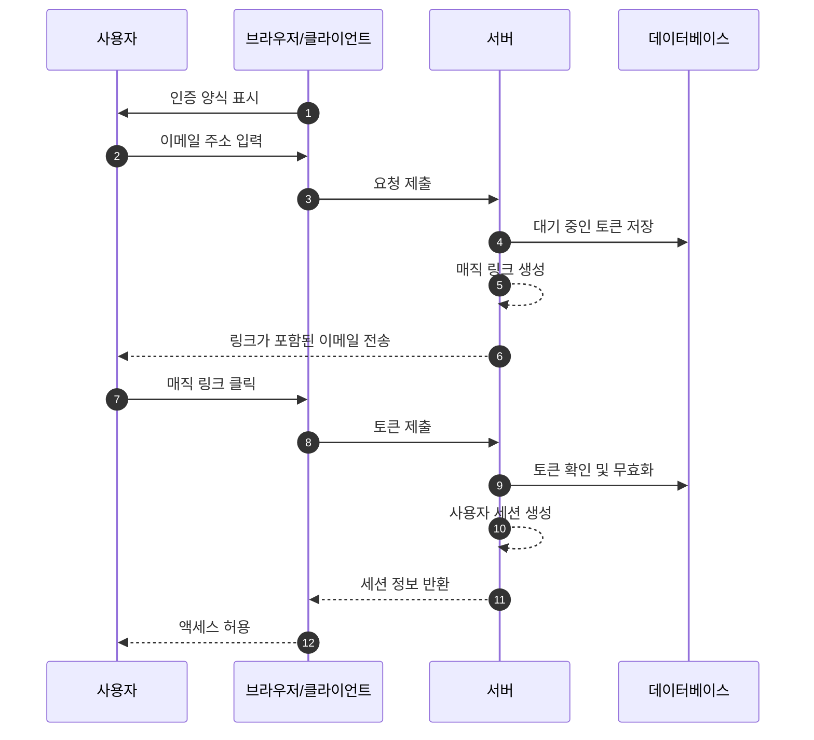
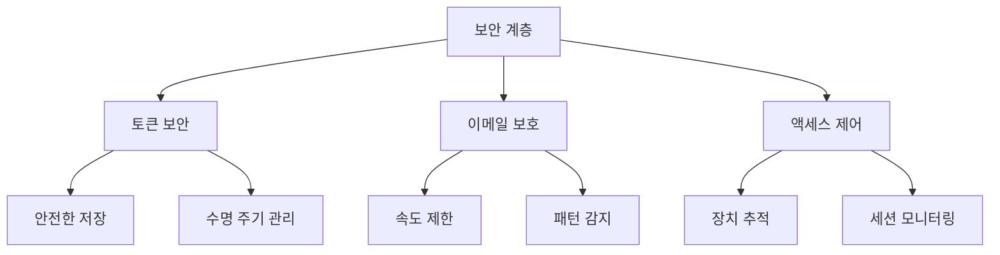

## 매직 링크란 무엇인가요?

매직 링크는 등록 및 로그인 프로세스에서 비밀번호 없는 인증을 가능하게 하는 안전하고 시간 제한이 있는 URL입니다. 비밀번호를 생성하고 기억하는 대신, 사용자는 이메일을 통해 즉시 액세스할 수 있는 특별한 링크를 받습니다. 이것은 마치 한 번만 작동하는 디지털 키와 같습니다. 클릭하면 인증되고, 그 키는 무효화됩니다.

예를 들어, Medium에 가입하거나 Slack에 로그인하려고 할 때 비밀번호를 설정하거나 입력하는 대신, 이러한 플랫폼은 보안 링크가 포함된 이메일을 보냅니다. 한 번 클릭하면 인증됩니다. 이 접근 방식은 보안과 단순함을 결합하여 큰 인기를 얻었습니다.

## 매직 링크는 어떻게 작동하나요?

사용자 관점에서 프로세스는 간단하지만, 그 뒤에는 정교한 보안 메커니즘이 포함되어 있습니다. 일반적인 매직 링크 인증 흐름에서 발생하는 일은 다음과 같습니다:



## 매직 링크의 구조는 어떻게 되나요?

일반적인 매직 링크는 여러 구성 요소로 이루어져 있습니다:

- 애플리케이션의 기본 URL
- 인증 엔드포인트
- 토큰 매개변수
- 추가 매개변수 (선택 사항)

예를 들어:

```
https://app.example.com/verify-auth?token=abc123...&redirect=/dashboard
```

## 매직 링크의 토큰은 어떻게 생성되나요?

사용자가 매직 링크를 요청할 때 (예: "이메일로 로그인" 클릭), 우리는 안전하고 예측할 수 없는 토큰을 생성해야 합니다. 이 토큰은 본질적으로 임시 비밀번호가 되기 때문에 매우 중요합니다.

토큰은 <Ref slug='csprng' />을 사용하여 생성되어야 합니다. CSPRNG는 시스템 하드웨어(예: 키보드 타이밍, 마우스 움직임, 팬 소음 등)에서 엔트로피를 사용하여 예측할 수 없는 진정한 난수를 생성합니다. 이는 공격자가 이전 출력을 알고 있더라도 예측할 수 없습니다.

예를 들어, Node.js에서:

```javascript
import crypto from "node:crypto";

// 안전한 랜덤 토큰 생성
const token = crypto.randomBytes(32).toString("base64url");
// 결과: 'dBjftJeZ4CVP-mB92K27uhbUJU1p1r_wW1gFWFOEjXk'와 같은 값

// Node.js 및 브라우저에서 사용 가능한 Web Crypto API를 사용한 대안
const buffer = crypto.getRandomValues(new Uint8Array(32));
const token2 = Buffer.from(buffer).toString("base64url");
```

안전한 토큰의 요구 사항:

- 예측 불가능성을 보장하기 위해 CSPRNG로 생성
- 최소 32바이트 길이 (256비트 엔트로피)
- URL-안전 인코딩 (base64url은 문제 있는 문자를 제거)
- 재생 공격을 방지하기 위해 시간 제한 및 일회용
- 메타데이터(만료, 사용자 정보)와 함께 안전하게 저장

## 매직 링크 인증을 어떻게 안전하게 할 수 있나요

매직 링크 보안은 여러 계층에 걸친 포괄적인 접근이 필요합니다. 이메일 전송 및 액세스 패턴이 중요하지만, 안전한 토큰 처리가 시스템 보안의 핵심입니다.

### 토큰 보안 기본 원칙

매직 링크의 보안은 적절한 토큰 구현에 크게 의존합니다 (위의 내용을 참조하세요). 각 토큰은 암호학적으로 안전해야 하며, 수명 주기 동안 적절히 관리되어야 합니다. 시스템은 엄격한 토큰 만료(일반적으로 15-30분)와 사용 후 즉시 무효화를 강제해야 합니다.

토큰을 저장할 때는 비밀번호와 동일한 수준의 보안을 적용하세요:

- 노출을 방지하기 위해 저장 전에 토큰 해시화
- 만료된 토큰의 자동 정리 구현
- 토큰 사용 및 무효화의 감사 추적 유지
- 관련 메타데이터(생성 시간, 의도된 사용자, 장치 정보) 저장

### 이메일 전송 보안

이메일은 매직 링크의 주요 전송 채널로, 공격의 잠재적 대상이 됩니다. 무차별 대입 시도를 방지하고 이메일 폭탄 공격으로부터 보호하기 위해 속도 제한을 구현하는 것이 필수적입니다. 예를 들어, 동일한 IP 주소에서 시간당 5개의 매직 링크 요청으로 사용자를 제한할 수 있습니다.

또한, 비정상적인 활동 패턴을 모니터링하여 잠재적인 보안 침해를 감지할 수 있습니다. 여기에는 다음이 포함됩니다:

- 동일한 이메일에 대한 다른 IP에서의 다중 요청
- 비정상적인 지리적 액세스 패턴
- 자동화된 공격을 나타내는 빠른 요청

### 액세스 제어 및 모니터링

장치 지문 인식은 사용자 행동의 일관된 패턴을 추적하여 추가 보안 계층을 제공합니다. 새로운 장치나 위치에서 로그인 시도가 발생하면 추가 확인 단계를 구현하거나 사용자에게 알릴 수 있습니다.

민감한 애플리케이션의 보안을 강화하기 위해:

- 매직 링크와 추가 인증 요소 결합
- 지속적인 세션 모니터링 구현
- 감사 추적을 위한 모든 인증 이벤트 기록
- 새로운 위치에 대한 장치 기반 확인 추가



## 매직 링크 vs SMS / 이메일 OTP

매직 링크와 SMS / 이메일 OTP 모두 외부 채널을 통해 검증을 수행합니다.

매직 링크는 사용자의 이메일로 일회용 URL을 보내고, OTP는 사용자의 전화나 이메일로 인증 코드를 보냅니다.

매직 링크는 사용자가 링크를 클릭하여 검증을 완료하기 때문에 데스크톱 환경에서 우수한 경험을 제공합니다. 이는 코드를 수동으로 입력할 필요를 없애줍니다. 또한 추가적인 컨텍스트 정보를 포함할 수 있어 더 정교한 인증 흐름을 가능하게 합니다.

그러나 모바일 환경에서는 SMS OTP가 사용자가 빠르게 인증 코드를 보고 입력할 수 있기 때문에 더 나은 사용성을 제공할 수 있습니다.

## 매직 링크 vs 인증자 앱

인증자 앱에서 생성된 OTP 코드와 비교할 때, 매직 링크는 사용자가 추가 애플리케이션을 설치할 필요가 없으며 모든 장치에서 원활하게 작동합니다. 이는 특히 비기술적 사용자에게 마찰을 줄여줍니다. 그러나 인증자 앱은 이메일 서버의 전송 속도 및 가용성과 독립적으로 더 나은 실시간 신뢰성을 제공하는 OTP 코드를 생성합니다.

높은 보안 요구 사항이 있는 빈번한 인증이 필요한 시나리오에서는 인증자 앱이 선호되는 선택일 수 있습니다.

## 매직 링크를 언제 사용해야 하나요

매직 링크는 사용자가 일반적으로 덜 자주 로그인하는 비즈니스 및 엔터프라이즈 애플리케이션에 특히 효과적입니다. 예를 들어 프로젝트 관리 도구나 보고 대시보드와 같은 경우, 이메일 전송의 약간의 지연은 비밀번호를 관리하지 않아도 되는 편리함에 비해 무시할 수 있습니다.

### 이상적인 시나리오

이러한 인증 방법은 이메일이 이미 주요 통신 채널인 비즈니스 환경에서 빛을 발합니다. 예를 들어, Slack이나 Notion과 같은 협업 플랫폼은 매직 링크를 효과적으로 활용합니다. 왜냐하면:

- 사용자가 이미 이메일을 적극적으로 모니터링하고 있음
- 로그인 세션이 장기적으로 유지됨
- 인증 프로세스에서 마찰을 줄이는 데 중점을 둠

매직 링크는 SaaS 제품의 사용자 등록 흐름에서도 뛰어나며, 전환 최적화가 중요한 경우에 유용합니다. 사용자가 이메일 주소만으로 서비스를 시작할 수 있을 때, 온보딩 과정에서 이탈률을 크게 줄일 수 있습니다.

### 대안을 고려해야 할 때

그러나 매직 링크는 빈번한 인증이 필요한 애플리케이션에는 최선의 선택이 아닐 수 있습니다. 예를 들어 모바일 뱅킹 앱은 사용자가 하루에 여러 번 잔액을 확인할 수 있기 때문에 빠르고 신뢰할 수 있는 인증 방법이 필요합니다. 이러한 경우, 생체 인증이나 PIN 코드가 더 나은 사용자 경험을 제공할 수 있습니다.

다음과 같은 경우 대체 인증 방법을 고려하세요:

- 애플리케이션이 주로 모바일 기반일 때
- 사용자가 이메일에 의존하지 않고 즉시 액세스해야 할 때
- 환경이 다중 요소 인증을 요구할 때
- 이메일 전송 지연이 사용자 경험에 크게 영향을 미칠 수 있을 때

핵심은 사용자의 행동 패턴과 보안 요구 사항에 맞춰 인증 방법을 조정하는 것입니다. 매직 링크는 최소한의 마찰로 뛰어난 보안을 제공하지만, 단독 솔루션이 아닌 더 넓은 인증 전략의 일부로 사용해야 합니다.

<SeeAlso slugs={["csprng", "passwordless", "otp", "totp"]} />