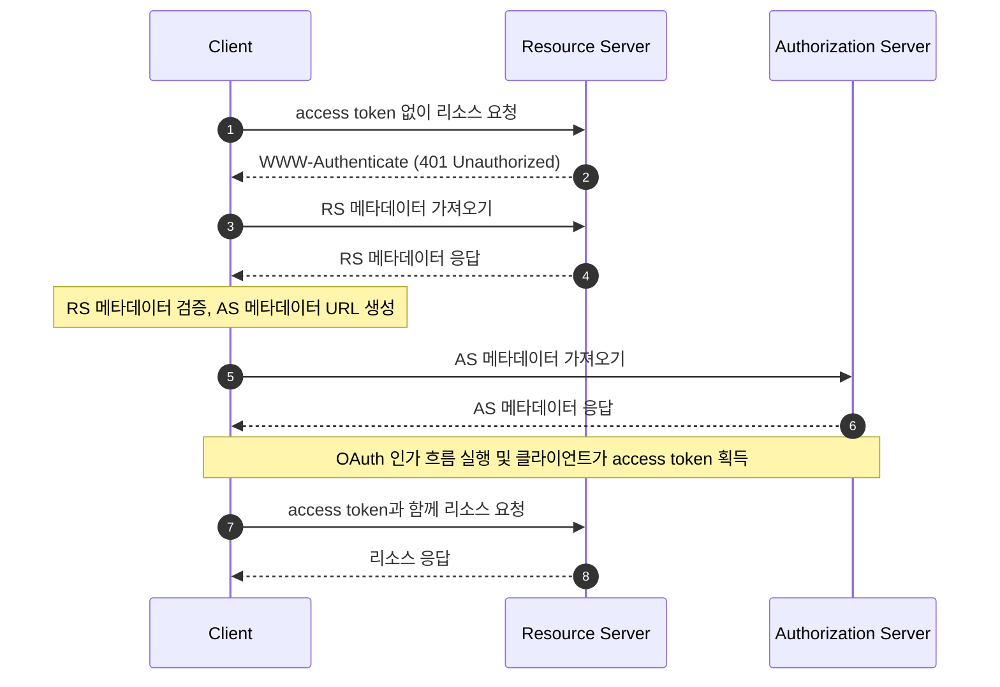

## OAuth 2.0 보호된 리소스 메타데이터 (Protected Resource Metadata)란 무엇인가?

OAuth 2.0 보호된 리소스 메타데이터는 [RFC 9728](https://datatracker.ietf.org/doc/html/rfc9728)에서 정의된 표준화된 형식입니다. 이는 클라이언트와 인증 서버가 보호된 리소스와 상호작용하는 방법을 이해하는 데 도움을 줍니다.

이 메타데이터 형식은 다음과 같은 필수 정보를 제공합니다:
- 리소스 서버 기능
- 지원되는 토큰 형식
- 필요한 보안 메커니즘
- 인증 서버 관계
- 사용 가능한 scope 및 권한

## 보호된 리소스 메타데이터 (Protected Resource Metadata)의 이점은 무엇인가?

OAuth 2.0 시스템에는 네 가지 기본 역할이 있습니다:
- <Ref slug="authorization-server"/>: 리소스 소유자를 성공적으로 인증한 후 클라이언트에게 access token을 발급합니다.
- <Ref slug="client"/>: 보호된 리소스에 대한 접근을 요청하는 애플리케이션입니다.
- <Ref slug="resource-owner"/>: 보호된 리소스에 대한 접근을 허가할 수 있는 엔터티입니다.
- <Ref slug="resource-server"/>: 보호된 리소스를 호스팅하는 서버입니다.

전통적으로 클라이언트가 보호된 리소스에 접근해야 할 때, 필요한 토큰을 얻기 위해 먼저 인증 서버를 발견하고 상호작용해야 했습니다. 리소스 서버의 역할은 주로 토큰을 검증하고 리소스를 제공하는 데 제한되었으며, 모든 인증 및 인가 세부 사항은 인증 서버와 클라이언트 애플리케이션을 통해 조정되었습니다.

이는 클라이언트가 리소스 서버의 특정 요구 사항이나 기능을 직접적으로 발견할 수 있는 표준화된 방법이 없음을 의미했습니다.

보호된 리소스 메타데이터는 리소스 서버가 자신의 요구 사항과 기능을 적극적으로 게시할 수 있게 하여 이 동적 관계를 변화시키며, 다음과 같은 주요 이점을 제공합니다:
- 직접 발견: 클라이언트는 이제 리소스 서버의 요구 사항을 직접 소스에서 배울 수 있습니다.
- 향상된 자율성: 리소스 서버는 지원하는 토큰 형식, 보안 메커니즘 및 신뢰할 수 있는 인증 서버를 명시적으로 지정할 수 있습니다.
- 개선된 상호 운용성: 표준화된 형식은 다양한 구현 간의 접근 요구 사항의 일관된 커뮤니케이션을 보장합니다.
- 동적 구성: 리소스 서버는 인증 서버 변경에 의존하지 않고 요구 사항을 업데이트할 수 있습니다.

## OAuth 2.0 보호된 리소스 메타데이터 (Protected Resource Metadata)는 어떻게 작동하는가?

보호된 리소스 메타데이터는 표준화된 발견 및 상호작용 프로세스를 통해 OAuth 2.0 생태계 내에서 작동합니다:



리소스 서버 메타데이터 문서는 다음 필드를 포함하는 JSON 객체입니다:

```json
   {
     "resource": "https://api.example.com",
     "authorization_servers": [
       "https://auth.example.com"
     ],
     "scopes_supported": ["read", "write"],
     "token_formats_supported": ["jwt"],
     "token_introspection_endpoint": "https://api.example.com/introspect",
     "dpop_signing_alg_values_supported": ["ES256", "PS256"]
   }
   ```

클라이언트가 메타데이터 문서를 수신한 후, 주로 다음 필드에 따라 자신을 구성하고 리소스 서버와 상호작용할 수 있습니다:

- `resource`: 보호된 리소스의 식별자
- `authorization_servers`: 승인된 인증 서버 목록
- `scopes_supported`: 이 리소스에 사용 가능한 scope
- `token_formats_supported`: 지원되는 토큰 형식
- `token_introspection_endpoint`: 토큰 검증을 위한 엔드포인트
- `dpop_signing_alg_values_supported`: 지원되는 DPoP 알고리즘

## OAuth 2.0 보호된 리소스 메타데이터 (Protected Resource Metadata) 엔드포인트를 어떻게 발견하는가?

보호된 리소스 메타데이터를 발견하는 두 가지 주요 메커니즘이 있습니다:

1. **WWW-Authenticate 헤더 발견 (흐름 기반)**:

클라이언트가 보호된 리소스에 대한 승인되지 않은 요청을 할 때, 서버는 401 상태 코드와 함께 WWW-Authenticate 헤더에 메타데이터 URL을 포함하여 응답합니다:

```bash
# 1. 클라이언트가 토큰 없이 요청
GET /api/resource HTTP/1.1
Host: api.example.com

# 2. 서버가 401과 메타데이터 URL로 응답
HTTP/1.1 401 Unauthorized
WWW-Authenticate: Bearer realm="example",
  scope="read write",
  resource_metadata_url="https://api.example.com/.well-known/oauth-resource-server"
```

헤더는 다음을 제공합니다:
- 리소스 영역 식별
- 필요한 scope
- 메타데이터 URL 위치

2. **직접적인 Well-Known URI 발견**:

GET 요청을 well-known 엔드포인트로 직접 보내 메타데이터에 접근할 수 있습니다:

```bash
GET /.well-known/oauth-resource-server HTTP/1.1
Host: api.example.com
```

엔드포인트는 표준화된 형식을 따릅니다:
- 기본 URI: `https://api.example.com`
- Well-known 경로: `/.well-known/oauth-resource-server`
- 전체 URL: `https://api.example.com/.well-known/oauth-resource-server`

## 보호된 리소스 메타데이터 (Protected Resource Metadata)에서 WWW-Authenticate 헤더는 어떻게 작동하는가?

WWW-Authenticate 헤더는 보호된 리소스 메타데이터에서 자동 발견 메커니즘을 구현하는 데 중요한 구성 요소입니다. 이는 표준 HTTP `WWW-Authenticate` 헤더를 활용하여 메타데이터 정보를 전송하고, 클라이언트가 리소스 서버에 대한 접근 요구 사항을 자동으로 발견하고 구성할 수 있게 합니다.

클라이언트가 처음으로 access token 없이 보호된 리소스에 접근하려고 할 때, 리소스 서버는 401 Unauthorized 상태 코드와 함께 WWW-Authenticate 헤더를 포함하여 응답합니다:

```
WWW-Authenticate: Bearer realm="example",
  scope="read write",
  resource_metadata_url="https://api.example.com/.well-known/oauth-resource-server"
```

이 헤더는 여러 중요한 정보를 포함할 수 있습니다:
- `Bearer`: 이것이 OAuth 2.0 Bearer Token 인증 스킴임을 나타냅니다.
- `realm`: 리소스의 보호 공간을 정의합니다.
- `scope`: 필요한 접근 권한을 지정합니다.
- `resource_metadata_url`: 전체 리소스 서버 구성을 포함하는 메타데이터 문서의 위치를 가리킵니다.

이 헤더를 수신한 후, 클라이언트는 `resource_metadata_url`을 추출하고 해당 URL에서 전체 메타데이터 문서를 가져옵니다.

획득한 메타데이터 정보를 기반으로, 클라이언트는 적절한 인증 서버, 지원되는 토큰 형식, 사용 가능한 scope 및 기타 구성 세부 사항을 결정하여 인증 요청을 적절히 구성할 수 있습니다.

## OAuth 2.0 보호된 리소스 메타데이터 (Protected Resource Metadata)를 어떻게 보안하는가?

필수 보안 고려 사항은 다음을 포함합니다:

1. **전송 보안**:
   - 필수 TLS 사용
   - 인증서 검증
   - 안전한 연결 처리

2. **메타데이터 무결성**:
   - 소스 검증
   - 서명 검증
   - 안전한 캐싱 전략

3. **접근 제어**:
   - 속도 제한
   - 요청 검증
   - 남용 모니터링

## OAuth 2.0 보호된 리소스 메타데이터 (Protected Resource Metadata)를 어떻게 구현하는가?

다음은 다양한 구성 요소에서 OAuth 2.0 보호된 리소스 메타데이터가 구현되는 방법입니다:

1. **리소스 서버 구현**

리소스 서버는 승인되지 않은 접근 시도 시 401 Unauthorized 상태와 함께 WWW-Authenticate 헤더에 메타데이터 URL을 포함하여 응답합니다:

```
HTTP/1.1 401 Unauthorized
WWW-Authenticate: Bearer realm="example",
  resource_metadata_url="https://api.example.com/.well-known/oauth-resource-server"
```

2. **클라이언트 구현**

클라이언트는 리소스 접근을 처리하기 위해 비동기 함수를 구현합니다. 401 응답을 받을 때, 이 함수는 WWW-Authenticate 헤더에서 메타데이터 URL을 추출하고, 메타데이터를 가져와 클라이언트 구성을 위해 사용합니다:

```javascript
async function handleResourceAccess(response) {
  if (response.status === 401) {
    const wwwAuthenticate = response.headers.get('WWW-Authenticate');
    const metadataUrl = extractMetadataUrl(wwwAuthenticate);
    const metadata = await fetchMetadata(metadataUrl);
    // 메타데이터 기반 클라이언트 구성
  }
}
```

3. **메타데이터 문서 구조**

리소스 서버는 다음을 포함하는 JSON 객체로 메타데이터 문서를 제공합니다:
- 리소스 식별자
- 승인된 인증 서버 목록
- 지원되는 scope
- 지원되는 토큰 형식
- 지원되는 DPoP 서명 알고리즘

다음은 메타데이터 문서의 예입니다:

```json
{
  "resource": "https://api.example.com",
  "authorization_servers": ["https://auth.example.com"],
  "scopes_supported": ["read", "write"],
  "token_formats_supported": ["jwt"],
  "dpop_signing_alg_values_supported": ["ES256"]
}
```

이러한 구성 요소는 완전한 OAuth 2.0 보호된 리소스 메타데이터 구현을 형성하기 위해 함께 작동합니다. 이 구현을 통해 클라이언트는 보호된 리소스에 접근하기 위한 필요한 매개변수를 자동으로 발견하고 구성할 수 있습니다.

<SeeAlso slugs={["resource-server", "authorization-server"]} />

<Resources urls={[
  "https://datatracker.ietf.org/doc/html/rfc9728",
]} />