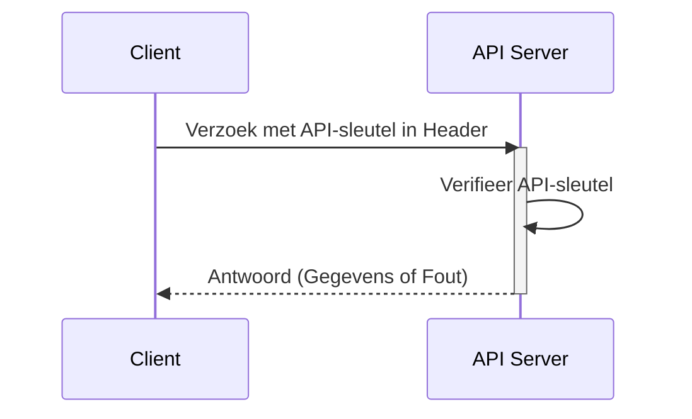

## Wat is een API-sleutel?

Een API-sleutel is een geheime token die wordt gebruikt om clients te authenticeren die toegang hebben tot een API. Het is als een wachtwoord voor je applicatie, waarmee toegang tot een specifieke API wordt verleend. Zie het als een sleutelkaart om toegang te krijgen tot een gebouw. De sleutelkaart verleent toegang, maar identificeert niet noodzakelijk wie je bent.

## Hoe werken API-sleutels?

API-sleutels werken via een eenvoudig verzoek- en antwoordproces.

1. **Verzoek:** Je applicatie stuurt een verzoek naar de API, inclusief de API-sleutel. De sleutel wordt vaak in de header van het verzoek verzonden. Bijvoorbeeld, de header kan er zo uitzien: `x-api-key: your_actual_api_key`. Er is geen enkele standaard voor headernamen of waardeformaten.

2. **Verificatie:** De API-server controleert de verstrekte sleutel in zijn database.

3. **Antwoord:** Als de sleutel geldig is, verleent de server toegang en stuurt de gevraagde gegevens terug. Zo niet, dan wordt de toegang geweigerd.

Hier is een sequentiediagram dat het proces illustreert:

## Wat zijn de voor- en nadelen van API-sleutels?

Laten we eens kijken wat API-sleutels nuttig maakt en waar ze tekortschieten:

### Voordelen

- **Super eenvoudig te gebruiken**: Voeg gewoon een sleutel toe aan je verzoek en je bent klaar! Het is als het gebruik van een huissleutel - geen ingewikkelde stappen nodig.

- **Makkelijk te volgen**: Wil je weten wie je API gebruikt? API-sleutels maken het eenvoudig. Je kunt zien welke apps oproepen doen en hoe vaak ze dat doen.

- **Snelle snelheidsbeperking**: Voorkom dat mensen je API overmatig gebruiken door limieten per sleutel in te stellen. Het is als een uitsmijter bij een club die telt hoe vaak iemand in- en uitgaat.

- **Perfect voor openbare gegevens**: Als je niet-gevoelige informatie deelt (zoals weergegevens of openbare statistieken), zijn API-sleutels precies goed.

### Nadelen

- **Minder veilig dan moderne alternatieven**: API-sleutels zijn niet zo effectief als andere vormen van API-authenticatie, zoals <Ref slug="oauth-2.0" /> en <Ref slug="jwt" />. Zie ze als een basis slot vergeleken met een modern beveiligingssysteem. Ze blijven echter populair omdat ze de eenvoudigste manier zijn om API-gebruik bij te houden en te beginnen met API-beveiliging.

- **Beveiligingsrisico's**: API-sleutels zijn als het achterlaten van je huissleutel onder de deurmat. Als iemand het vindt, kan hij het voor altijd gebruiken. Hier is waarom:
  - Ze zijn vaak zichtbaar in code
  - Ze verlopen niet automatisch
  - Als ze uitlekken (zoals in openbare GitHub-repos), kan iedereen ze gebruiken

- **Kan gebruikers niet onderscheiden**: Hoewel sommige bedrijven "API-sleutels" gebruiken die gebruikers kunnen identificeren (zoals Stripe), kunnen traditionele API-sleutels je niet vertellen wie wie is. Ze vertellen je alleen welke applicatie het verzoek doet.

- **Statisch van aard**: In tegenstelling tot moderne auth tokens die verlopen, blijven API-sleutels meestal voor altijd hetzelfde. Dit betekent:
  - Geen automatische beveiligingsverversingen
  - Handmatig werk nodig om sleutels te roteren
  - Hoger risico als sleutels worden blootgesteld

## Wat zijn de gebruikssituaties voor API-sleutels?

- Service-naar-service communicatie: API-sleutels zijn geschikt voor scenario's waarin applicaties direct via CLIs met API's moeten communiceren. Bijvoorbeeld het aanroepen van OpenAI API's.
- Openbare API's: Bij het blootstellen van API's aan het publiek bieden API-sleutels een eenvoudige methode van toegangscontrole.
- Vereenvoudigde setup: Voor snelle en eenvoudige authenticatiebehoeften, vooral in de ontwikkelingsfase. In tegenstelling tot Machine-to-machine (M2M) authenticatie, vereisen API-sleutels geen voorafgaande clientregistratie en hoeven ze niet te worden ingewisseld voor een access token. Je geeft gewoon je API-sleutel als parameter in je verzoek en het werkt gewoon.

In real-world scenario's is het meest voorkomende doel bij het bouwen van producten productintegratie. Hier is een typisch gebruiksscenario:

### Voorbeeld: Integratie met Stripe

Stripe gebruikt API-sleutels voor veilige integratie met verschillende platforms en applicaties. Je kunt deze sleutels maken, bekijken, verwijderen en beheren via het Developers Dashboard. Door API-sleutels te gebruiken, kun je Stripe's checkout- en factureringsfuncties in je product integreren.

## Wat is het verschil tussen Personal Access Tokens (PAT) en Machine-to-Machine (M2M)?

Bij het praten over API-sleutels kunnen persoonlijke toegangstokens en <Ref slug="machine-to-machine" /> ook samen worden genoemd, aangezien ze allemaal programmatisch toegang kunnen krijgen tot API-bronnen via CLI-opdrachten, of communicatie tussen backend-services kunnen tot stand brengen.

### Persoonlijke toegangstokens (PATs)

Een persoonlijk toegangstoken is ook een string, maar vertegenwoordigt ***de identiteit en permissies van een specifieke gebruiker***, wordt dynamisch gegenereerd na succesvolle authenticatie of inloggen, en heeft meestal een beperkte levensduur maar kan worden vernieuwd. Het biedt fijnmazige toegangscontrole tot gebruikersspecifieke gegevens en mogelijkheden en wordt vaak gebruikt voor CLI-tools, scripts of persoonlijke API-toegang. Het belangrijkste verschil is dat het specifieker is en wordt gebruikt voor gebruikersspecifieke acties.

### Machine-to-Machine (M2M)

M2M-communicatie is wanneer apparaten automatisch gegevens uitwisselen zonder menselijke tussenkomst in bredere zin.

In de context van <Ref slug="openid-connect" /> (of <Ref slug="oauth-2.0" />), gebruiken M2M-applicaties de <Ref slug="client-credentials-flow" />, zoals gedefinieerd in het [OAuth 2.0 RFC 6749 protocol](https://datatracker.ietf.org/doc/html/rfc6749), dat vergelijkbare standaardprotocollen ondersteunt. Het omvat meestal een clientapplicatie (een machine of service) die bronnen benadert, hetzij op zichzelf, hetzij namens een gebruiker. Het is ideaal voor situaties waarin alleen vertrouwde clients toegang kunnen krijgen tot backend-services.

<SeeAlso slugs={["machine-to-machine"]} />