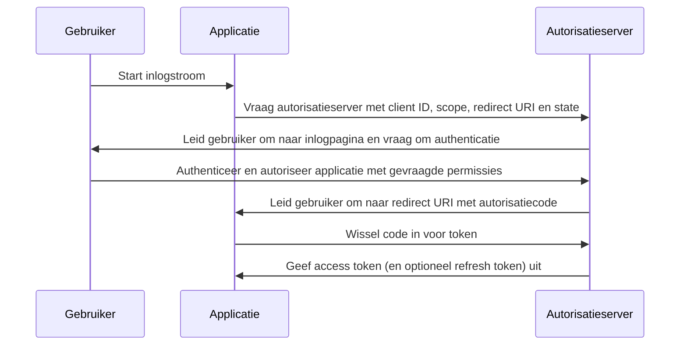

## Wat is autorisatiecode stroom (authorization code flow)?

De autorisatiecode stroom (authorization code flow) (ook bekend als autorisatiecode toekenning), gedefinieerd in [OAuth 2.0 RFC 6749, sectie 4.1](https://datatracker.ietf.org/doc/html/rfc6749#section-4.1), is een veelgebruikt OAuth 2.0 autorisatiemechanisme dat applicaties in staat stelt een access token te verkrijgen namens een gebruiker.

Deze stroom is ideaal voor vertrouwelijke applicaties zoals traditionele server-side webapps die clientgeheimen veilig kunnen opslaan.

Het kan ook veilig worden gebruikt voor native apps en Single Page Applications (SPAs) die clientgeheimen niet veilig kunnen opslaan wanneer gecombineerd met de PKCE (<Ref slug="pkce" />) extensie.

## Hoe werkt de autorisatiecode stroom (authorization code flow)?

De autorisatiecode stroom (authorization code flow) omvat de volgende stappen:

1. **Start van de stroom**: De gebruiker start de stroom meestal door op een link of knop in de applicatie te klikken om in te loggen. De applicatie leidt de gebruiker om naar het autorisatieserver's autorisatie endpoint, waarbij de client ID, de gevraagde scope, een redirect URI en een state parameter worden meegegeven. De autorisatieserver valideert de parameters en vraagt de gebruiker om zich te authenticeren op de inlogpagina van de autorisatieserver.
2. **Gebruikersauthenticatie en autorisatie**: De gebruiker authenticeert zich bij de autorisatieserver en geeft de applicatie toestemming om toegang te krijgen tot de gevraagde bronnen.
3. **Code generatie en omleiding**: De autorisatieserver genereert een autorisatiecode en leidt de gebruiker terug naar de applicatie met behulp van de eerder verstrekte redirect URI. De autorisatiecode is opgenomen in de query string van de redirect URI.
4. **Code uitwisseling**: De applicatie haalt de autorisatiecode uit de query string en doet een POST-verzoek naar het token endpoint van de autorisatieserver om de autorisatiecode in te wisselen voor een access token. De applicatie moet ook de client ID, client secret, redirect URI en de autorisatiecode in het verzoek opnemen.
5. **Verkrijgen van access token**: De autorisatieserver valideert de autorisatiecode en geeft een access token (en optioneel een refresh token) aan de applicatie bij succesvolle validatie. De applicatie kan vervolgens het access token gebruiken om geautoriseerde API-verzoeken te doen namens de gebruiker.

De stappen kunnen worden geïllustreerd door het volgende sequentiediagram:



## Hoe implementeer je de autorisatiecode stroom (authorization code flow)?

Hier is een eenvoudig voorbeeld van het implementeren van de autorisatiecode stroom (authorization code flow), volgens de richtlijnen uiteengezet in [OAuth 2.0 RFC 6749, sectie 4.1](https://datatracker.ietf.org/doc/html/rfc6749#section-4.1):

### 1. Initiële setup

Zorg ervoor dat je de volgende informatie van je auth service hebt voordat je begint:

```javascript
const config = {
  clientId: "YOUR_CLIENT_ID",
  clientSecret: "YOUR_CLIENT_SECRET",
  authorizationEndpoint: "https://authorization-server.com/auth",
  tokenEndpoint: "https://authorization-server.com/token",
  redirectUri: "http://localhost:3000/callback",
};
```

Client ID, client secret en redirect URI zijn de configuratie van je applicatie in de auth service.

De `authorizationEndpoint` en `tokenEndpoint` worden verstrekt door je auth service.

Als je auth server OIDC (<Ref slug="openid-connect" />) implementeert, kun je deze informatie verkrijgen via <Ref slug="openid-connect-discovery" />.

### 2. Start autorisatieverzoek

De stroom begint wanneer een gebruiker wil inloggen (bijvoorbeeld door op een inlogknop te klikken). De applicatie zal een inlogverzoek doen.

Dit verzoek bevat parameters zoals `client ID`, `redirect URI` en `scope`. Vervolgens leidt het de gebruiker om naar het autorisatie endpoint van de auth service (de inlogpagina van de auth service).

De gebruiker zal zich authenticeren en autoriseren op deze inlogpagina.

```javascript
app.get("/login", (req, res) => {
  const authUrl = new URL(config.authorizationEndpoint);
  authUrl.searchParams.append("response_type", "code");
  authUrl.searchParams.append("client_id", config.clientId);
  authUrl.searchParams.append("redirect_uri", config.redirectUri);
  authUrl.searchParams.append("scope", "openid profile email");
  authUrl.searchParams.append("state", "random_state_string");

  res.redirect(authUrl.toString());
});
```

Opmerking: Je kunt meer parameters toevoegen dan die in de voorbeeldcode worden getoond. Zie [Volledige definitie van authenticatieverzoekparameters](https://openid.net/specs/openid-connect-core-1_0.html#AuthRequest).

### 3. Behandel redirect URI callback en tokenuitwisseling

Nadat de gebruiker authenticatie en autorisatie heeft voltooid op de inlogpagina van de auth service, leidt de auth service de gebruiker terug naar de redirect URI van de applicatie. Deze redirect URI bevat de autorisatiecode en state parameters.

De applicatie haalt de autorisatiecode en state parameters uit de redirect URI en wisselt ze in voor access en refresh tokens (indien aanwezig) bij het token endpoint van de auth service.

```javascript
app.get("/callback", async (req, res) => {
  const { code, state } = req.query;

  try {
    // Wissel de autorisatiecode in voor een access token en refresh token
    const tokenResponse = await axios.post(config.tokenEndpoint, {
      grant_type: "authorization_code",
      code,
      redirect_uri: config.redirectUri,
      client_id: config.clientId,
      client_secret: config.clientSecret,
    });

    const { access_token, refresh_token } = tokenResponse.data;
    // Sla tokens op voor volgende verzoeken
    req.session.accessToken = access_token;

    res.send("Authenticatie succesvol!");
  } catch (error) {
    res.status(500).send("Tokenuitwisseling mislukt");
  }
});
```

### 4. Gebruik access token

Zodra je het token hebt, gebruik het om toegang te krijgen tot beschermde bronnen:

```javascript
async function fetchUserProfile(accessToken) {
  const response = await axios.get("https://api.example.com/userinfo", {
    headers: {
      Authorization: `Bearer ${accessToken}`,
    },
  });
  return response.data;
}
```

## Hoe gebruik je de autorisatiecode stroom (authorization code flow) voor publieke clients (native apps en SPAs)?

Publieke clients (zoals native apps en SPAs) staan voor unieke beveiligingsuitdagingen bij het gebruik van de autorisatiecode stroom (authorization code flow). Deze applicaties kunnen clientgeheimen niet veilig opslaan. Het clientgeheim zou worden blootgesteld in JavaScript-code of binnen de opslag van het apparaat. Dit maakt het gemakkelijk voor aanvallers om het geheim te extraheren en te misbruiken.

Daarom is de belangrijkste uitdaging hoe de autorisatiecode stroom (authorization code flow) veilig te gebruiken zonder een clientgeheim. De OAuth 2.0 specificatie introduceerde de PKCE (<Ref slug="pkce" />) extensie om dit probleem op te lossen.

PKCE voegt extra beveiligingsmaatregelen toe om de autorisatiecode stroom (authorization code flow) voor publieke clients te beschermen. Het voorkomt autorisatiecode onderscheppingsaanvallen zelfs zonder gebruik van een clientgeheim. Bekijk deze blog om meer te leren over [Hoe PKCE de OAuth 2.0 autorisatiecode stroom beschermt](https://blog.logto.io/how-pkce-protects-the-authorization-code-flow-for-native-apps).

## Hoe gebruik je de autorisatiecode stroom (authorization code flow) veilig?

### **Gebruik "state" om CSRF-aanvallen te voorkomen**

CSRF (<Ref slug="csrf" />) aanvallen misleiden gebruikers om ongewenste acties uit te voeren in een geauthenticeerde webapplicatie. De state parameter helpt dit te voorkomen.

- Genereer een unieke, willekeurige waarde. Sla deze waarde server-side op.
- Voeg de state parameter toe. Voeg deze toe aan de autorisatieverzoek URL.
- Verifieer de state bij terugkeer. Wanneer de autorisatieserver terugleidt naar je app, vergelijk de geretourneerde state met de opgeslagen waarde. Als ze niet overeenkomen, wijs het verzoek af. Dit bevestigt dat het verzoek afkomstig is van je applicatie.

### **Configureer veilige redirect URIs**

De redirect URI is waar de autorisatieserver de autorisatiecode naartoe stuurt na gebruikersauthenticatie. Veilige configuratie is cruciaal.

- Registreer geldige redirect URIs. Tijdens app-registratie bij de autorisatieserver, specificeer de toegestane redirect URIs.
- Exacte overeenstemming. De redirect URI in het autorisatieverzoek moet exact overeenkomen met een geregistreerde URI. Zelfs een klein verschil kan een kwetsbaarheid creëren.
- Vermijd wildcard URIs. Vermijd indien mogelijk het gebruik van wildcard URIs in productie. Ze vergroten het aanvalsoppervlak.
- HTTPS voor productie. Gebruik altijd HTTPS voor redirect URIs in productieomgevingen.

### **Gebruik PKCE voor alle clients**

Hoewel PKCE oorspronkelijk was ontworpen voor publieke clients, vereist de <Ref slug="oauth-2.1" /> specificatie dat PKCE wordt afgedwongen voor alle clients, inclusief vertrouwelijke clients, om de algehele beveiliging van de autorisatiecode stroom (authorization code flow) te verbeteren. (Zie [Dwing PKCE af voor alle clients](https://auth.wiki/oauth-2.1#enforcing-pkce-for-all-clients))

## Wat is het verschil tussen autorisatiecode stroom (authorization code flow) en impliciete stroom (implicit flow)?

Het belangrijkste verschil tussen de autorisatiecode stroom (authorization code flow) en de impliciete stroom (implicit flow) is hoe het access token wordt verkregen:

- **Autorisatiecode stroom (authorization code flow)**: De clientapplicatie ontvangt eerst een autorisatiecode van het autorisatie endpoint en wisselt deze vervolgens in voor een access token in een volgend POST-verzoek naar het token endpoint.
- **Impliciete stroom (implicit flow)**: De clientapplicatie ontvangt het access token direct in de URL-fragment van de redirect URI na gebruikersautorisatie.

Leer meer over <Ref slug="implicit-flow" />.

## Wat is het verschil tussen autorisatiecode stroom (authorization code flow) en client credentials stroom (client credentials flow)?

Het belangrijkste verschil tussen de autorisatiecode stroom (authorization code flow) en de client credentials stroom (client credentials flow) is de context waarin de stroom wordt gebruikt:

- **Autorisatiecode stroom (authorization code flow)**: Gebruikt wanneer de clientapplicatie toegang moet krijgen tot bronnen namens een gebruiker. De stroom omvat gebruikersauthenticatie en autorisatie.
- **Client credentials stroom (client credentials flow)**: Gebruikt wanneer de clientapplicatie toegang moet krijgen tot bronnen namens zichzelf. De stroom omvat clientauthenticatie maar geen gebruikersauthenticatie, en is het meest geschikt voor machine-to-machine communicatie.

Leer meer over <Ref slug="client-credentials-flow" />.

<SeeAlso
  slugs={[
    "device-flow",
    "implicit-flow",
    "client-credentials-flow",
    "pkce",
    "openid-connect",
    "openid-connect-discovery",
    "csrf",
    "oauth-2.1",
  ]}
/>

<Resources urls={[
  "https://datatracker.ietf.org/doc/html/rfc6749",
  "https://openid.net/specs/openid-connect-core-1_0.html#AuthRequest",
  "https://blog.logto.io/how-pkce-protects-the-authorization-code-flow-for-native-apps"
]} />
