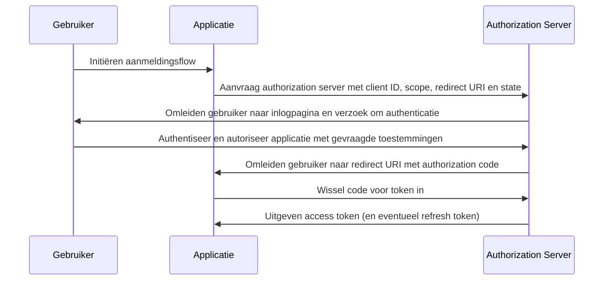

## Wat is de authorization code flow?

De authorization code flow (ook bekend als de authorization code grant), gedefinieerd in [OAuth 2.0 RFC 6749, sectie 4.1](https://datatracker.ietf.org/doc/html/rfc6749#section-4.1), is een veelgebruikte OAuth 2.0 autorisatiemechanisme dat applicaties in staat stelt om een access token te verkrijgen namens een gebruiker. Deze flow is bijzonder geschikt voor vertrouwelijke applicaties (bijvoorbeeld traditionele server-side webapplicaties) waar de client secret veilig kan worden opgeslagen.

Authorization code flow is een robuuste en veilige methode voor het verkrijgen van access tokens in OAuth 2.0, waardoor het een voorkeurskeuze is voor veel webapplicaties. Het begrijpen van deze flow is essentieel voor ontwikkelaars die werken met OAuth 2.0 en API-integraties.

## Hoe werkt de authorization code flow?

De authorization code flow omvat de volgende stappen:

1. **Flow-initiatie**: De gebruiker start de flow door meestal te klikken op een link of knop in de applicatie om in te loggen. De applicatie stuurt de gebruiker door naar het authorization endpoint van de authorization server, waarbij de client ID, de gevraagde scope, een redirect URI en een state parameter worden meegegeven. De authorization server valideert de parameters en vraagt de gebruiker om zich te authentiseren op de inlogpagina van de authorization server.
2. **Gebruikersauthenticatie en autorisatie**: De gebruiker authentiseert zich met de authorization server en geeft de applicatie toestemming om toegang te krijgen tot de gevraagde bronnen.
3. **Codegeneratie en omleiding**: De authorization server genereert een authorization code en leidt de gebruiker terug naar de applicatie met behulp van de eerder opgegeven redirect URI. De authorization code is opgenomen in de queryreeks van de redirect URI.
4. **Code-uitwisseling**: De applicatie haalt de authorization code uit de queryreeks en maakt een POST-aanvraag naar het token endpoint van de authorization server om de authorization code voor een access token in te wisselen. De applicatie moet ook de client ID, client secret, redirect URI en de authorization code in de aanvraag opnemen.
5. **Toegangstoken verwerving**: De authorization server valideert de authorization code en geeft een access token uit (en eventueel een refresh token) aan de applicatie bij succesvolle validatie. De applicatie kan vervolgens het access token gebruiken om machtigde API-aanvragen te doen namens de gebruiker.

De stappen kunnen worden geïllustreerd door het volgende sequentiediagram:



## Authentication request

Aanvraagparameters zijn als volgt:

- **client_id**: VEREIST. Geldige OAuth 2.0 client identifier.
- **scope**: VEREIST. Deze waarde specificeert een set bronnen die de gebruiker aanvraagt ​​van de authorization server. Bijvoorbeeld: `openid profile email`.
- **response_type**: VEREIST. De waarde moet `code` zijn om aan te geven dat de applicatie een authorization code verwacht.
- **redirect_uri**: VEREIST. De URI waarnaar de authenticatieantwoord zal worden verzonden en moet precies overeenkomen met de redirect URI die de client vooraf heeft geregistreerd bij de authorization server.
- **state**: AANBEVOLEN. Een ondoorzichtige waarde die wordt gebruikt om de staat tussen de aanvraag en callback te behouden. Het wordt ook gebruikt om <Ref slug="csrf" />-aanvallen te voorkomen.
- **nonce**: OPTIONEEL. Een willekeurige tekenreeks die wordt gebruikt om een ​​client-sessie te associëren met een ID-token en om replay-aanvallen te verminderen.
- **prompt**: OPTIONEEL. Ruimtegescheiden, hoofdlettergevoelige lijst met stringwaarden die specificeert of de authorization server de eindgebruiker vraagt ​​om opnieuw authenticatie en toestemming te verlenen. De gedefinieerde waarden zijn:
  - **none**: De authorization server MAG GEEN enkele authenticatie- of toestemmingsgebruikersinterfaceschermen weergeven. Er wordt een fout geretourneerd als een eindgebruiker nog niet is geauthentiseerd of als de client geen vooraf geconfigureerde toestemming heeft voor de gevraagde Claims of niet voldoet aan andere voorwaarden voor de verwerking van de aanvraag. De foutcode zal typisch `login_required`, `interaction_required` zijn. Dit kan worden gebruikt als een methode om te controleren op bestaande authenticatie en/of toestemming.
  - **login**: De authorization server MOET de eindgebruiker vragen om opnieuw te authenticeren. Als het de eindgebruiker niet opnieuw kan authenticeren, MOET het een fout retourneren, typisch `login_required`.
  - **consent**: De authorization server MOET de eindgebruiker vragen om toestemming voordat hij informatie terugstuurt naar de client. Als het geen toestemming kan verkrijgen, MOET het een fout retourneren, typisch `consent_required`.
  - **select_account**: De authorization server MOET de eindgebruiker vragen om een gebruikersaccount te selecteren. Dit stelt een eindgebruiker met meerdere accounts bij de authorization server in staat om te selecteren tussen de meerdere accounts waarvoor zij mogelijk huidige sessies hebben. Als het geen keuze voor accountselectie kan verkrijgen die gemaakt is door de eindgebruiker, MOET het een fout retourneren, typisch `account_selection_required`.

[Volledige definitie van aanvraagparameters](https://openid.net/specs/openid-connect-core-1_0.html#AuthRequest)

### Authentication request voorbeeld

```bash
curl -X GET "https://authorization-server.com/auth" \
  -d "response_type=code" \
  -d "client_id=YOUR_APPLICATION_ID" \
  -d "redirect_uri=https://yourapp.com/callback" \
  -d "scope=openid profile email" \
  -d "state=RANDOM_STRING_FOR_STATE"
```

Een typisch succesvol antwoord:

```http
HTTP/1.1 302 Found
Location: https://yourapp.com/callback?
  code=YOUR_AUTHORIZATION_CODE
  &state=RANDOM_STRING_FOR_STATE
```

## Token exchange request

Zodra de bovenstaande authenticatieaanvraag succesvol is beantwoord, wordt de client automatisch omgeleid naar de callback-URI `https://yourapp.com/callback`, met de code als een URI-parameter.

Er wordt verwacht dat de client de `code` ophaalt en verwerkt met een daaropvolgende token exchange request, om toegang tot het toegangstoken te verkrijgen.

### Token exchange request voorbeeld

```bash
curl -X POST "https://authorization-server.com/token" \
  -H "Content-Type: application/x-www-form-urlencoded" \
  -d "client_id=YOUR_CLIENT_ID" \
  -d "code=YOUR_AUTHORIZATION_CODE" \
  -d "redirect_uri=https://yourapp.com/callback" \
  -d "grant_type=authorization_code" \
```

## Voordelen

- **Verbeterde beveiliging**: De client secret wordt nooit blootgesteld aan de browser van de gebruiker, waardoor het risico op clientimpostie wordt verminderd.
- **Eenmalige authorization code**: De authorization code heeft een korte levensduur en kan slechts één keer worden gebruikt, waardoor het risico van onderschepping en replay-aanvallen wordt verminderd.
- **Kortlevende tokens**: Access tokens die in deze flow worden uitgegeven, zijn kortlevend (meestal 1 uur), waardoor het risico van ongeautoriseerde toegang wordt verminderd als het token wordt gecompromitteerd.
- **Refresh token**: De authorization server kan optioneel een refresh token uitgeven, waardoor de applicatie een nieuw access token kan verkrijgen zonder tussenkomst van de gebruiker.

## Wat is het verschil tussen authorization code flow en implicit flow?

Het belangrijkste verschil tussen de authorization code flow en de implicit flow is hoe het access token wordt verkregen:

- **Authorization code flow**: De clientapplicatie ontvangt eerst een authorization code van het authorization endpoint, en wisselt deze vervolgens in voor een access token in een daaropvolgende POST-aanvraag naar het token endpoint.
- **Implicit flow**: De clientapplicatie ontvangt het access token direct van het authorization endpoint.

## Wat is het verschil tussen authorization code flow en client credentials flow?

Het belangrijkste verschil tussen de authorization code flow en de client credentials flow is de context waarin de flow wordt gebruikt:

- **Authorization code flow**: Wordt gebruikt wanneer de clientapplicatie toegang moet krijgen tot bronnen namens een gebruiker. De flow omvat gebruikersauthenticatie en autorisatie.
- **Client credentials flow**: Wordt gebruikt wanneer de clientapplicatie toegang moet krijgen tot bronnen namens zichzelf. De flow omvat clientauthenticatie maar geen gebruikersauthenticatie, en is het best geschikt voor machine-to-machine communicatie.

## Wat zijn de typische gebruiksscenario's voor de authorization code flow?

- Traditionele webapplicaties die gebruikersauthenticatie en toegang tot API's vereisen.
- Applicaties die veilig toegang moeten krijgen tot gebruikersgegevens van derde partijen.

<SeeAlso slugs={['device-flow', 'implicit-flow', 'client-credentials-flow']} />

<Resources urls={['https://datatracker.ietf.org/doc/html/rfc6749']} />