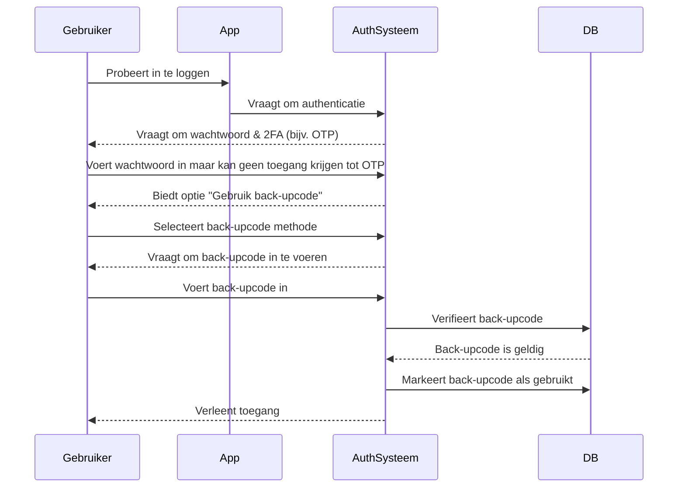

## Wat is een back-upcode?

Een back-upcode (ook wel herstelcode genoemd) is een set willekeurig gegenereerde, eenmalig te gebruiken codes die dienen als een alternatieve authenticatiemethode wanneer je primaire MFA (MFA) opties, zoals SMS, authenticator-apps of passkeys, niet beschikbaar zijn. Zie ze als noodsleutels die ervoor zorgen dat je altijd toegang tot je account hebt, zelfs als je je telefoon verliest, netwerkproblemen ondervindt of technische storingen tegenkomt.

## Hoe werkt een back-upcode?

Back-upcodes bieden een eenvoudige maar veilige manier om toegang tot je account te herstellen wanneer standaard MFA-methoden falen. Zo werken ze:

1. **Generatie**: Het systeem creëert een unieke set codes (meestal 8–12 tekens elk) tijdens de MFA-instelling.
2. **Opslag**: Je wordt gevraagd deze codes veilig op te slaan—ofwel offline (bijv. afgedrukt op papier) of in een versleutelde wachtwoordmanager.
3. **Gebruik**: Als je je primaire MFA-methode niet kunt gebruiken, voer je een van je back-upcodes in om te authenticeren.
4. **Ongeldig maken**: Elke code wordt na gebruik automatisch uitgeschakeld om hergebruik te voorkomen.

## Wanneer gebruik je een back-upcode?

Zullen back-upcodes verouderd raken? Moet MFA ze nog steeds ondersteunen?

Absoluut. Back-upcodes blijven een cruciaal vangnet voor MFA. Terwijl nieuwere methoden zoals passkeys en FIDO2 aan populariteit winnen, bieden back-upcodes een universeel toegankelijke, apparaat-onafhankelijke hersteloptie. Ze zijn een goedkope, waardevolle beveiliging en moeten altijd worden ondersteund naast moderne MFA-methoden.

Gebruik een back-upcode wanneer:

- Je primaire MFA-apparaat niet beschikbaar is (bijv. verloren telefoon, lege batterij).
- Netwerkproblemen de levering van SMS/e-mail verhinderen.
- Je authenticator-app niet synchroniseert.
- Je hardwaretoken defect raakt.

## Hoe gebruik je een back-upcode veilig?

Om ervoor te zorgen dat je back-upcodes veilig blijven:

1. **Sla ze offline op**
    - Bewaar ze in een versleutelde map op je apparaat.
    - Print ze en bewaar ze op een veilige locatie (bijv. een kluis met toetsenbord).
    - Vermijd het opslaan in onveilige digitale formaten (bijv. online notitie-apps).
2. **Gebruik een wachtwoordmanager**
    - De meeste wachtwoordmanagers (bijv. 1Password, LastPass) bieden een functie voor veilige notities.
        - Maak een nieuwe invoer: "Back-upcodes – [Servicenaam]"
        - Kopieer en plak je back-upcodes en schakel vervolgens versleuteling in.
    - Als je Google Password Manager gebruikt, kun je:
        - De relevante service-invoer vinden.
        - Het bewerken en een notitie toevoegen voor je back-upcodes, en codes labelen als "Gebruikt/Ongebruikt" om ze bij te houden.
        - Op deze manier kun je bij het automatisch invullen van wachtwoorden snel toegang krijgen tot je back-upcodes wanneer dat nodig is.
3. **Vervang gebruikte codes**
    - Genereer nieuwe codes als je de meeste hebt gebruikt of vermoedt dat ze zijn gecompromitteerd.

## Een MFA-ervaring ontwerpen met back-upcodes

Voor ontwikkelaars die back-upcodes implementeren, volg deze best practices:

1. **Vertrouw niet alleen op back-upcodes**
Ze zijn een noodoplossing, geen primaire MFA-methode. Bied altijd TOTP, passkeys of andere robuuste opties aan.
2. **Bied standaard 8–10 codes aan**
    
    Dit balanceert bruikbaarheid (genoeg voor zeldzame noodgevallen) en veiligheid (minimaliseert risico op massadiefstal).
    
3. **Handhaaf eenmalig gebruik**
    
    Maak codes automatisch ongeldig na gebruik.
    
4. **Genereer automatisch nieuwe codes wanneer ze op zijn**
    
    Voorkom uitsluitingen door nieuwe codes uit te geven zodra een gebruiker zijn huidige set heeft uitgeput.
    
5. **Sta handmatige regeneratie toe met strikte verificatie**
    
    Laat gebruikers nieuwe codes genereren als ze die van hen verliezen, maar vereis herauthenticatie (bijv. e-mail/SMS/wachtwoordbevestiging).
    

## Back-upcodes vs. Wachtwoorden: Wat is het verschil?

| Kenmerk | Back-upcodes | Wachtwoorden |
| --- | --- | --- |
| **Doel** | Eenmalige noodoplossing wanneer MFA faalt | Primaire authenticatiemethode |
| **Formaat** | Systeemgegenereerd, alfanumeriek | Door gebruiker gekozen, vaak mix van tekens |
| **Opslag** | Gehasht (vaak ongezouten, omdat ze eenmalig zijn) | Gehasht + gezouten (om rainbow table-aanvallen te voorkomen) |
| **Gebruik** | Uitgeschakeld na één gebruik | Herbruikbaar totdat het wordt gewijzigd |
| **Regeneratie** | Systeem geeft nieuwe sets uit | Gebruiker reset handmatig |
| **Veiligheid** | Moet veilig worden opgeslagen | Kwetsbaar als het zwak of hergebruikt is |

**Belangrijke veiligheidsnotities:**

- Beide moeten lang en willekeurig gegenereerd zijn om brute-force aanvallen te weerstaan.
- Wachtwoorden vereisen salting omdat gebruikers ze vaak hergebruiken.
- Back-upcodes hebben meestal geen salting nodig—ze zijn eenmalig en willekeurig gegenereerd, waardoor grootschalige exploits onwaarschijnlijk zijn.

<Resources
  urls={[
    "https://docs.logto.io/end-user-flows/mfa",
    "https://auth-wiki.logto.io/mfa",
    "https://auth-wiki.logto.io/totp"
  ]}
/>