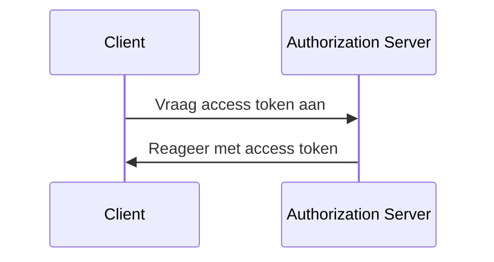
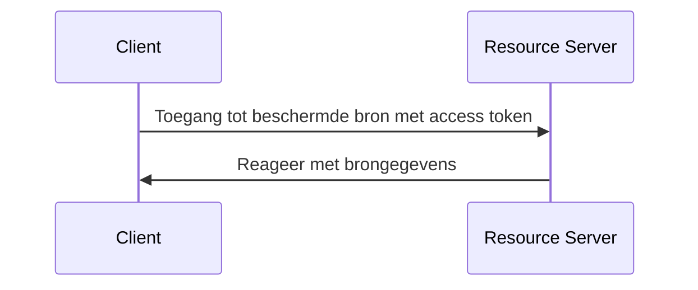

## Wat is client credentials flow?

De client credentials flow (Grant) is een <Ref slug="oauth-2.0-grant" /> type dat vertrouwelijke clients toestaat om <Ref slug="access-token">access tokens</Ref> te verkrijgen voor toegang tot beschermde bronnen. Meestal wordt deze flow gebruikt voor <Ref slug="machine-to-machine" /> communicatie waarbij de client een server of een service is.

> [!Opmerking]
> De client credentials flow is niet geschikt voor eindgebruikerauthorisatie. Voor eindgebruikerauthorisatie zou je <Ref slug="authentication-request" /> of <Ref slug="authorization-request" /> moeten gebruiken.

## Hoe werkt client credentials flow?

De client credentials flow is een eenvoudig proces in twee stappen:

1. **Tokenverzoek**: De client stuurt een <Ref slug="token-request" /> met zijn clientgegevens (client ID en client secret) en de gevraagde <Ref slug="scope">scopes</Ref>.
2. **Tokenrespons**: De <Ref slug="authorization-server" /> valideert de clientgegevens en geeft een access token af als de client is geautoriseerd.

Hier is een vereenvoudigd sequentiediagram van de client credentials flow:



Hier is een niet-normatief voorbeeld van een client credentials flow tokenverzoek:

```http
POST /token HTTP/1.1
Host: your-authorization-server.com
Content-Type: application/x-www-form-urlencoded

grant_type=client_credentials
  &client_id=YOUR_CLIENT_ID
  &client_secret=YOUR_CLIENT_SECRET
  &scope=read write
```

De authorization server valideert de clientgegevens en geeft een access token af als de client is geautoriseerd. Zodra de client het access token ontvangt, kan het deze gebruiken om toegang te krijgen tot beschermde bronnen (bijv. een API) namens zichzelf. Hier is een voorbeeld van hoe een client het access token gebruikt om toegang te krijgen tot een API:



Let op dat de <Ref slug="resource-server" /> het access token zou moeten valideren en de <Ref slug="access-control" /> beleid zou moeten afdwingen om ervoor te zorgen dat de client de nodige permissies heeft om toegang te krijgen tot de bron.

### Belangrijke parameters in een client credentials flow tokenverzoek

In tegenstelling tot andere OAuth 2.0 flows, heeft de client credentials flow een eenvoudig <Ref slug="token-request" /> met de volgende belangrijke parameters:

- **`grant_type`**: Het grant type moet worden ingesteld op `client_credentials` om de client credentials flow aan te geven.
- **`client_id`**: De client identifier uitgegeven door de authorization server.
- **`client_secret`**: De client secret uitgegeven door de authorization server.
- **`scope`**: De gevraagde <Ref slug="scope">scopes</Ref> (permissies) voor het access token.
- **`resource`**: De optionele parameter die de <Ref slug="resource-indicator" /> specificeert voor de gevraagde bronnen. De authorization server moet [RFC 8707](https://datatracker.ietf.org/doc/html/rfc8707) ondersteunen om deze parameter te gebruiken.

## Overwegingen voor beveiliging

### Vertrouwelijke clients

De client credentials flow is geschikt voor <Ref slug="client" headingId="confidential-clients" /> (vertrouwelijke clients) die het client secret veilig kunnen opslaan. Als de client een openbare client is (bijvoorbeeld een single-page application), zou het de client credentials flow niet moeten gebruiken omdat het client secret kan worden blootgesteld.

### Tokenverval

Hoewel het access token verkregen in de client credentials flow een lange vervaltijd kan hebben, wordt aanbevolen om kortdurende access tokens te gebruiken (bijv. 1 uur) om het risico van ongeautoriseerde toegang te verminderen als het token wordt gecompromitteerd.

### Client secret rotatie

Om de beveiliging te verbeteren, wordt aanbevolen om het client secret periodiek te roteren. De authorization server zou client secret rotatie moeten ondersteunen zonder de mogelijkheid van de client om access tokens te verkrijgen te beïnvloeden. Bijvoorbeeld, de authorization server zou meerdere client secrets moeten ondersteunen voor achterwaartse compatibiliteit tijdens het rotatieproces.

<SeeAlso slugs={["machine-to-machine", "token-request", "access-token", "scope", "resource-indicator"]} />

<Resources
  urls={[
    "https://blog.logto.io/programmatic-authentication-methods",
    { 
      url: "https://datatracker.ietf.org/doc/html/rfc6749#section-4.4",
      result: {
        ogTitle: "Client Credentials Grant",
        ogDescription: "De client kan een access token aanvragen met alleen zijn client credentials (of andere ondersteunde manieren van authentication) wanneer de client toegang vraagt tot de beschermde bronnen onder zijn controle, of die van een andere resource eigenaar die eerder zijn geregeld met de authorization server."
      }
    }
  ]}
/>