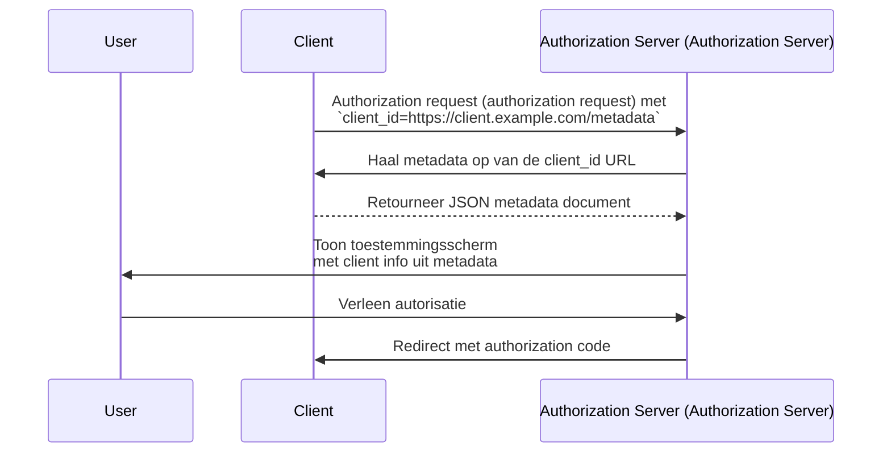

## Wat is een Client ID Metadata Document (CIMD)?

Een Client ID Metadata Document (CIMD) is een mechanisme gedefinieerd in de [OAuth Client ID Metadata Document](https://datatracker.ietf.org/doc/draft-ietf-oauth-client-id-metadata-document/) specificatie waarmee een OAuth 2.0 <Ref slug="client" /> zichzelf kan identificeren bij een <Ref slug="authorization-server" /> zonder voorafgaande registratie.

Het kernidee: in plaats van een `client_id` te ontvangen van de authorization server (authorization server) (via handmatige registratie of [Dynamic Client Registration](https://datatracker.ietf.org/doc/html/rfc7591)), **gebruikt de client een HTTPS-URL als zijn `client_id`**. Die URL verwijst naar een JSON-document met de metadata van de client — naam, redirect URIs (redirect URIs), ondersteunde grant types, en meer. De authorization server haalt dit document op wanneer hij een URL-gebaseerde `client_id` tegenkomt.

Deze aanpak wordt soms afgekort als **CIMD** (Client ID Metadata Document) in de community.

## Hoe werkt het?

Wanneer een client een Client ID Metadata Document (CIMD) gebruikt, voegt de OAuth-flow één stap toe: de authorization server resolveert de `client_id` URL om de metadata van de client op te halen.



Dit gebeurt stap voor stap:

1. De client start een <Ref slug="authorization-request" /> met zijn URL als de `client_id` (bijv. `https://client.example.com/oauth-client`).
2. De authorization server herkent de `client_id` als een URL en haalt deze op via HTTPS.
3. De response is een JSON-document met standaard OAuth client metadata.
4. De authorization server valideert de metadata, toont toestemmingsinformatie aan de gebruiker, en gaat verder met de OAuth-flow.
5. Latere verzoeken kunnen gecachte metadata gebruiken volgens de HTTP-caching headers.

### Het metadata document

Het metadata document is een JSON-object dat dezelfde velden gebruikt als gedefinieerd in [RFC 7591 (OAuth 2.0 Dynamic Client Registration Protocol)](https://datatracker.ietf.org/doc/html/rfc7591). Het moet een `client_id` veld bevatten waarvan de waarde exact overeenkomt met de URL.

Een voorbeeld:

```json
{
  "client_id": "https://client.example.com/oauth-client",
  "client_name": "Mijn Applicatie",
  "redirect_uris": ["https://client.example.com/callback"],
  "grant_types": ["authorization_code", "refresh_token"],
  "response_types": ["code"],
  "token_endpoint_auth_method": "none",
  "scope": "openid profile email"
}
```

### Vereisten voor client identifier URL

De specificatie stelt strikte eisen aan wat een geldige client identifier URL is:

- **Moet HTTPS gebruiken** — geen gewone HTTP of andere schema's.
- **Moet een padcomponent bevatten** — een kale domeinnaam zoals `https://example.com` is niet geldig.
- **Mag geen** fragment, gebruikersnaam of wachtwoordcomponenten bevatten.
- **Mag geen** enkel-punt (`.`) of dubbel-punt (`..`) padsegmenten bevatten.
- Query strings zijn toegestaan maar worden afgeraden.
- Poortnummers zijn toegestaan.

Bijvoorbeeld:
- `https://client.example.com/oauth-client` — geldig
- `http://client.example.com/oauth-client` — ongeldig (geen HTTPS)
- `https://example.com` — ongeldig (geen pad)
- `https://client.example.com/../oauth-client` — ongeldig (puntsegment)

## Waarom geen bestaande registratiemethoden gebruiken?

Om te begrijpen waarom deze specificatie bestaat, kijk naar de beperkingen van bestaande benaderingen:

### Statische registratie

In traditionele OAuth-implementaties registreert een ontwikkelaar de client handmatig bij de authorization server — meestal via een beheerdersconsole — en ontvangt een `client_id`. Dit werkt als je je clients van tevoren kent.

Het werkt niet voor open ecosystemen waar elke client mogelijk moet kunnen verbinden. Je kunt niet elke mogelijke AI-agent of MCP client vooraf registreren.

### Dynamic Client Registration (DCR)

[Dynamic Client Registration (RFC 7591)](https://datatracker.ietf.org/doc/html/rfc7591) laat clients zich programmatisch registreren door hun metadata naar een registratie-endpoint te sturen. De server maakt een `client_id` aan en slaat de registratie op.

Dit werkt, maar creëert server-side state: elke registratie levert een record op dat moet worden opgeslagen, onderhouden en uiteindelijk opgeruimd. In een open ecosysteem met veel clients verzamelt de authorization server registraties — waarvan de meeste misschien één keer worden gebruikt en daarna worden verlaten.

DCR heeft ook geen ingebouwd mechanisme om te verifiëren dat een client is wie hij beweert te zijn. Elke client kan zich registreren met elke naam of logo.

### Voordelen van Client ID Metadata Document (CIMD)

De Client ID Metadata Document (CIMD) aanpak pakt deze problemen aan:

| Aspect | Statische registratie | DCR | Client ID Metadata Document (CIMD) |
|--------|----------------------|-----|----------------------------|
| Server-side state | Ja (opgeslagen records) | Ja (opgeslagen records) | Nee (op aanvraag opgehaald) |
| Vooraf registreren vereist | Ja | Nee | Nee |
| Identiteitsverificatie | Handmatige controle | Geen ingebouwd | Domeineigendom via HTTPS |
| Opruimen nodig | Ja | Ja (verlaten records) | Nee (zelfreinigend via HTTP-cache) |
| Client beheert metadata | Nee | Bij registratie | Ja (altijd bij te werken) |

Het belangrijkste inzicht is dat **domeineigendom het vertrouwensanker wordt**. Alleen de entiteit die `client.example.com` beheert, kan content hosten op `https://client.example.com/oauth-client`. Het HTTPS-certificaat bewijst dit zonder extra verificatiestap.

## Authenticatiebeperkingen

Omdat er geen vooraf gedeeld geheim is tussen de client en de authorization server, kunnen symmetrische, op geheim gebaseerde authenticatiemethoden niet worden gebruikt. Het metadata document **mag niet** bevatten:

- `client_secret_post`
- `client_secret_basic`
- `client_secret_jwt`
- Elke methode die afhankelijk is van een gedeeld symmetrisch geheim

De velden `client_secret` en `client_secret_expires_at` mogen ook niet in het document voorkomen.

Als de client zichzelf verder moet authenticeren dan alleen als public client, kan hij asymmetrische cryptografie gebruiken. De client publiceert zijn publieke sleutels in het metadata document (via een `jwks` property of een `jwks_uri` verwijzing) en authenticeert bij de token endpoint met `private_key_jwt`. De authorization server verifieert de JWT-handtekening tegen de gepubliceerde <Ref slug="jwk">JWK</Ref>.

## Hoe ontdekt de authorization server ondersteuning?

Authorization servers geven aan dat ze Client ID Metadata Documents ondersteunen door de volgende property op te nemen in hun <Ref slug="authorization-server-metadata" />:

```json
{
  "client_id_metadata_document_supported": true
}
```

Clients kunnen deze vlag controleren voordat ze een authorization flow starten met een URL-gebaseerde `client_id`. Als de authorization server geen ondersteuning aangeeft, moet de client terugvallen op andere registratiemethoden.

## Beveiligingsoverwegingen

### SSRF-bescherming

Wanneer de authorization server de metadata URL ophaalt, doet hij een HTTP-verzoek naar een door de client opgegeven URL. Dit is een potentieel Server-Side Request Forgery (SSRF) risico. Implementaties moeten:

- Verzoeken naar private en loopback IP-adressen blokkeren (bijv. `127.0.0.1`, `10.x.x.x`, `192.168.x.x`)
- Doeladressen opnieuw valideren na het volgen van redirects
- Limieten stellen aan de responsegrootte (de specificatie raadt maximaal 5 KB aan)
- Passende timeouts instellen

### Caching

Authorization servers moeten HTTP-cache headers (`Cache-Control`, `ETag`) respecteren bij het cachen van metadata. Echter:

- **Cache geen foutresponses** — een tijdelijke storing mag een client niet permanent blokkeren.
- Servers mogen minimale en maximale cacheduur afdwingen, ongeacht wat de clientserver specificeert.

### Phishingpreventie

Een kwaadwillende client kan `client_name` instellen op een vertrouwde merknaam en `logo_uri` op het logo daarvan. Authorization servers moeten dit mitigeren door:

- Altijd de `client_id` hostnaam naast de clientnaam op toestemmingsschermen te tonen
- Logo-afbeeldingen vooraf op te halen en te modereren in plaats van ze direct van de client te laden

### Redirect URI (redirect URI) attestatie

Een beveiligingsvoordeel ten opzichte van DCR: de <Ref slug="redirect-uri">redirect URIs</Ref> in het metadata document worden gehost op het domein van de client, via HTTPS. Dit zorgt voor een sterkere binding tussen de client identity en zijn redirect URIs dan zelfverklaarde waarden in een registratieverzoek.

## Client ID Metadata Document Services

De specificatie definieert ook **Client ID Metadata Document Services** — externe webdiensten die metadata documenten hosten namens ontwikkelaars.

Dit vult een praktische leemte: tijdens lokale ontwikkeling hebben ontwikkelaars geen publiek toegankelijke URL om hun metadata te hosten. Een Client ID Metadata Document Service biedt een stabiele publieke URL die authorization servers kunnen ophalen, terwijl de ontwikkelaar lokaal werkt. Dit voorkomt dat lokale machines aan het internet moeten worden blootgesteld of tunnels moeten worden opgezet om OAuth-flows te testen.

<SeeAlso slugs={["client", "authorization-server-metadata", "redirect-uri", "jwk"]} />

<Resources
  urls={[
    "https://datatracker.ietf.org/doc/draft-ietf-oauth-client-id-metadata-document/",
    "https://datatracker.ietf.org/doc/html/rfc7591",
    "https://datatracker.ietf.org/doc/html/rfc8414",
  ]}
/>
