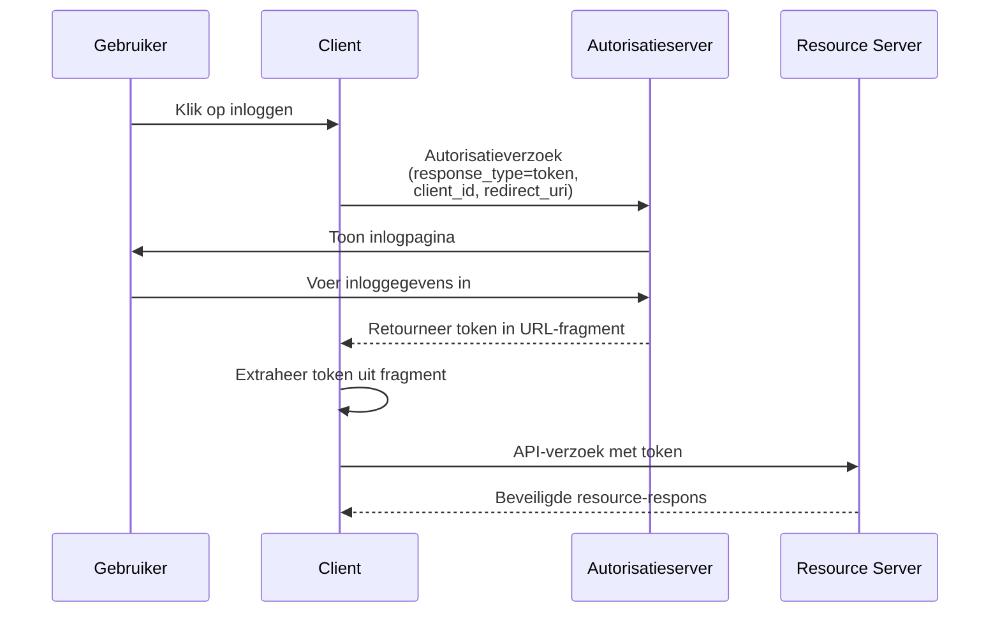

## Wat is impliciete flow (implicit flow)?

De OAuth 2.0 impliciete flow (implicit flow) is een authenticatiemethode die client-only applicaties (zoals SPAs en native apps) toestaat om tokens direct via URL-fragmenten van de autorisatieserver te ontvangen zonder een client secret te verstrekken.

Impliciete flow (Implicit flow) is ontworpen voor client-only applicaties, omdat deze volledig in de browser of op het apparaat van de gebruiker draaien en geen client secrets veilig kunnen opslaan.

Impliciete flow (Implicit flow) is officieel afgeschaft in <Ref slug="oauth-2.1" /> om veiligheidsredenen (die hieronder zullen worden genoemd). Client-only applicaties moeten nu de <Ref slug="authorization-code-flow" /> met de <Ref slug="pkce" /> extensie gebruiken.

## Hoe werkt impliciete flow (implicit flow)?

De belangrijkste stappen van de impliciete flow (implicit flow) zijn als volgt:

Opmerkingen:

- De client hoeft alleen een `client_id` te verstrekken in het autorisatieverzoek, zonder een `client_secret` te vereisen.  
  Dit komt omdat deze clients geen secrets veilig kunnen opslaan, dus deze flow vereist geen client secret.

- De `response_type` parameter is ingesteld op `token`, wat de autorisatieserver instrueert om het access token direct te retourneren in plaats van een autorisatiecode.  
  In OIDC (<Ref slug="openid-connect" />) is de `response_type` ofwel `id_token` of `id_token token`, en de auth service zal de overeenkomstige tokens retourneren op basis van verschillende response types.

- Het token wordt direct in het URL-fragment geretourneerd. Dit betekent dat het token in de URL wordt blootgesteld en gemakkelijk toegankelijk is voor andere applicaties of scripts.

## Is impliciete flow (implicit flow) veilig?

Nee, de impliciete flow (implicit flow) in OAuth 2.0 wordt over het algemeen als minder veilig beschouwd dan andere flows zoals de authorization code flow.

Het wordt niet aanbevolen voor de meeste gebruikssituaties vanwege verschillende kwetsbaarheden:

- **Tokenblootstelling in URL**
   - Access tokens verschijnen direct in de URL van de browser (na het # symbool)
   - Deze tokens kunnen:
     - In de browsergeschiedenis worden opgeslagen
     - Via referrer headers worden gelekt
     - Door kwaadaardige JavaScript-code op dezelfde pagina worden onderschept

- **Geen clientauthenticatie**
   - De clientapplicatie hoeft zijn identiteit niet te bewijzen
   - Dit betekent dat iedereen die de `client_id` kent zich kan voordoen als een legitieme client

- **Geen refresh tokens**
   - Deze flow ondersteunt geen refresh tokens
   - Gebruikers moeten opnieuw inloggen wanneer access tokens verlopen
   - Om frequente logins te vermijden, kunnen gebruikers tokens op onveilige manieren opslaan

- **Kwetsbaar voor XSS-aanvallen**
   - Alle tokens worden in de browser verwerkt
   - Als de website lijdt aan een XSS-aanval (Cross-Site Scripting)
   - Kan de JavaScript-code van aanvallers deze tokens gemakkelijk stelen

Vanwege deze beveiligingsproblemen is impliciete flow (implicit flow) afgeschaft in <Ref slug="oauth-2.1" />. Client-only applicaties moeten nu de <Ref slug="authorization-code-flow" /> met de <Ref slug="pkce" /> extensie gebruiken.

Je kunt [Wat is PKCE: van basisconcepten tot diepgaand begrip](https://blog.logto.io/how-pkce-protects-the-authorization-code-flow-for-native-apps) bekijken om te leren hoe PKCE de authorization code flow beschermt voor client-only applicaties.

<SeeAlso
  slugs={["oauth-2.1", "authorization-code-flow", "pkce", "openid-connect"]}
/>

<Resources
  urls={[
    "https://blog.logto.io/implicit-flow-is-dead",
    {
      url: "https://tools.ietf.org/html/rfc6749#section-4.2",
      result: {
        ogTitle: "The OAuth 2.0 Authorization Framework: Implicit Grant",
        ogDescription:
          "The implicit grant type is used to obtain access tokens (it does not support the issuance of refresh tokens) and is optimized for public clients known to operate a particular redirection URI. These clients are typically implemented in a browser using a scripting language such as JavaScript.",
      },
    },
    "https://openid.net/specs/openid-connect-core-1_0.html",
    "https://blog.logto.io/how-pkce-protects-the-authorization-code-flow-for-native-apps",
  ]}
/>