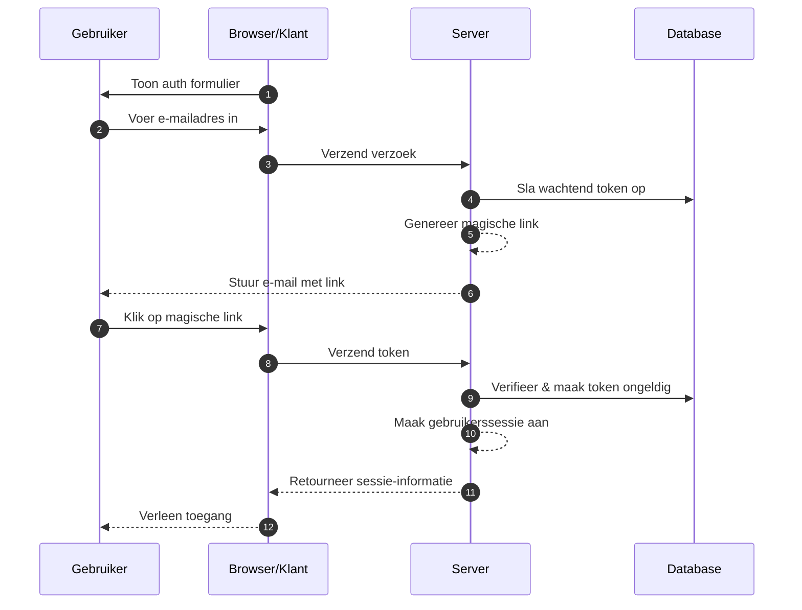
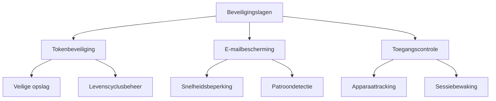

## Wat zijn magische links (magic links)?

Een magische link (magic link) is een veilige, tijdgebonden URL die wachtwoordloze authenticatie mogelijk maakt voor zowel registratie- als inlogprocessen. In plaats van wachtwoorden te maken en te onthouden, ontvangen gebruikers een speciale link via e-mail die hen directe toegang verleent. Zie het als een digitale sleutel die slechts één keer werkt - wanneer je erop klikt, ben je geauthenticeerd en daarna wordt die sleutel ongeldig.

Bijvoorbeeld, wanneer je je aanmeldt voor Medium of probeert in te loggen op Slack, sturen deze platforms je in plaats van een wachtwoord in te stellen of in te voeren, een e-mail met een veilige link. Eén klik en je bent geauthenticeerd. Deze aanpak heeft aanzienlijke populariteit gewonnen omdat het veiligheid combineert met eenvoud.

## Hoe werken magische links (magic links)?

Het proces is eenvoudig vanuit het perspectief van de gebruiker, maar omvat geavanceerde beveiligingsmechanismen achter de schermen. Dit is wat er gebeurt tijdens een typische magische link authenticatie flow:



## Wat is de structuur van een magische link (magic link)?

Een typische magische link bestaat uit verschillende componenten:

- Basis-URL van de applicatie
- Authenticatie-eindpunt
- Tokenparameter
- Extra parameters (optioneel)

Bijvoorbeeld:

```
https://app.example.com/verify-auth?token=abc123...&redirect=/dashboard
```

## Hoe wordt het token van een magische link (magic link) gegenereerd?

Wanneer een gebruiker een magische link aanvraagt (bijv. klikken op "Inloggen met e-mail"), moeten we een veilig, onvoorspelbaar token genereren. Dit token is cruciaal omdat het in wezen een tijdelijk wachtwoord wordt.

Het token moet worden gegenereerd met een <Ref slug='csprng' />. Een CSPRNG gebruikt entropie van de hardware van je systeem (zoals toetsenbordtiming, muisbewegingen, ventilatorgeluid, enz.) om echt willekeurige getallen te genereren die onmogelijk te voorspellen zijn, zelfs als een aanvaller eerdere uitvoer kent.

Bijvoorbeeld, in Node.js:

```javascript
import crypto from "node:crypto";

// Genereer een veilig willekeurig token
const token = crypto.randomBytes(32).toString("base64url");
// Resultaat: iets als 'dBjftJeZ4CVP-mB92K27uhbUJU1p1r_wW1gFWFOEjXk'

// Alternatief met behulp van Web Crypto API (beschikbaar in Node.js en browsers)
const buffer = crypto.getRandomValues(new Uint8Array(32));
const token2 = Buffer.from(buffer).toString("base64url");
```

Vereisten voor een veilig token:

- Gegenereerd via CSPRNG om onvoorspelbaarheid te garanderen
- Minimaal 32 bytes lang (256 bits entropie)
- URL-veilig gecodeerd (base64url elimineert problematische tekens)
- Tijdgebonden en eenmalig gebruik om replay-aanvallen te voorkomen
- Veilig opgeslagen met metadata (vervaldatum, gebruikersinformatie)

## Hoe beveilig je magische link (magic link) authenticatie

De beveiliging van magische links vereist een uitgebreide aanpak over meerdere lagen. Hoewel e-mailbezorging en toegangspatronen cruciaal zijn, blijft veilige tokenverwerking de hoeksteen van de beveiliging van het systeem.

### Basisprincipes van tokenbeveiliging

De beveiliging van magische links hangt sterk af van de juiste tokenimplementatie (zie de inhoud hierboven). Elk token moet cryptografisch veilig zijn en correct worden beheerd gedurende zijn levenscyclus. Het systeem moet strikte tokenverval afdwingen (meestal 15-30 minuten) en onmiddellijke ongeldigverklaring na gebruik.

Bij het opslaan van tokens, behandel ze met hetzelfde beveiligingsniveau als wachtwoorden:

- Hash tokens voor opslag om blootstelling te voorkomen
- Implementeer automatische opruiming van verlopen tokens
- Houd een audittrail bij van tokengebruik en ongeldigverklaring
- Sla bijbehorende metadata op (aanmaaktijd, beoogde gebruiker, apparaatinformatie)

### Beveiliging van e-mailbezorging

E-mail dient als het primaire bezorgkanaal voor magische links, waardoor het een potentieel doelwit voor aanvallen is. Het implementeren van snelheidsbeperkingen is essentieel om brute force pogingen te voorkomen en te beschermen tegen e-mailbombardementen. Bijvoorbeeld, je zou gebruikers kunnen beperken tot 5 magische link verzoeken per uur vanaf hetzelfde IP-adres.

Bovendien helpt het monitoren van ongebruikelijke activiteitspatronen bij het detecteren van mogelijke beveiligingsinbreuken. Dit omvat:

- Meerdere verzoeken van verschillende IP's voor hetzelfde e-mailadres
- Ongebruikelijke geografische toegangspatronen
- Snelle opeenvolgende verzoeken die op geautomatiseerde aanvallen wijzen

### Toegangscontrole en monitoring

Apparaatvingerafdrukken voegen een extra beveiligingslaag toe door consistente patronen van gebruikersgedrag te volgen. Wanneer een inlogpoging afkomstig is van een nieuw apparaat of locatie, kun je extra verificatiestappen implementeren of de gebruiker waarschuwen.

Voor verbeterde beveiliging in gevoelige applicaties:

- Combineer magische links met extra authenticatiefactoren
- Implementeer continue sessiebewaking
- Log alle authenticatiegebeurtenissen voor audittrails
- Voeg apparaatgebaseerde verificatie toe voor nieuwe locaties



## Magische links (magic links) vs SMS / E-mail OTP

Zowel magische links als SMS / E-mail OTP vertrouwen op externe kanalen voor verificatie.

Magische links sturen een eenmalige URL naar de e-mail van de gebruiker, terwijl OTP een verificatiecode naar hun telefoon of e-mail stuurt.

Magische links bieden een superieure desktopervaring omdat gebruikers eenvoudig op de link klikken om de verificatie te voltooien, waardoor het handmatig invoeren van codes overbodig wordt. Ze kunnen ook extra contextinformatie bevatten, waardoor meer geavanceerde authenticatiestromen mogelijk zijn.

In mobiele scenario's kan SMS OTP echter betere bruikbaarheid bieden, omdat gebruikers snel verificatiecodes kunnen bekijken en invoeren.

## Magische links (magic links) vs authenticator apps

In vergelijking met OTP-codes die door Authenticator Apps worden gegenereerd, vereisen magische links niet dat gebruikers extra applicaties installeren en werken ze naadloos op alle apparaten. Dit vermindert wrijving, vooral voor niet-technische gebruikers. Authenticator Apps genereren echter OTP-codes met betere realtime betrouwbaarheid, onafhankelijk van de bezorgsnelheden en beschikbaarheid van e-mailservers.

Voor scenario's die frequente authenticatie met hoge beveiligingseisen vereisen, kunnen Authenticator Apps de voorkeur hebben.

## Wanneer gebruik je magische links (magic links)

Magische links zijn bijzonder effectief voor zakelijke en enterprise applicaties waar gebruikers doorgaans minder vaak inloggen, zoals projectmanagementtools of rapportagedashboards. In deze scenario's is de lichte vertraging in e-mailbezorging verwaarloosbaar vergeleken met het gemak van het niet beheren van wachtwoorden.

### Ideale scenario's

Deze authenticatiemethoden blinken uit in zakelijke contexten waar e-mail al het primaire communicatiekanaal is. Bijvoorbeeld, samenwerkingsplatforms zoals Slack of Notion maken effectief gebruik van magische links omdat:

- Gebruikers hun e-mail al actief in de gaten houden
- Inlogsessies meestal lang duren
- De focus ligt op het verminderen van wrijving in het authenticatieproces

Magische links zijn ook uitstekend voor gebruikersregistratiestromen in SaaS-producten waar conversieoptimalisatie cruciaal is. Wanneer gebruikers je service kunnen gebruiken met alleen een e-mailadres, vermindert dit aanzienlijk de uitvalpercentages tijdens het onboardingproces.

### Wanneer alternatieven overwegen

Magische links zijn echter mogelijk niet de beste keuze voor applicaties die frequente authenticatie vereisen. Mobiele bankapps, bijvoorbeeld, hebben snelle en betrouwbare authenticatiemethoden nodig, aangezien gebruikers mogelijk meerdere keren per dag hun saldo controleren. In dergelijke gevallen bieden biometrische authenticatie of pincodes vaak een betere gebruikerservaring.

Overweeg alternatieve authenticatiemethoden wanneer:

- Je applicatie voornamelijk mobiel is
- Gebruikers onmiddellijke toegang nodig hebben zonder afhankelijkheid van e-mail
- De omgeving multi-factor authenticatie vereist
- E-mailbezorgvertragingen de gebruikerservaring aanzienlijk kunnen beïnvloeden

De sleutel is om je authenticatiemethode af te stemmen op het gedragspatroon en de beveiligingseisen van je gebruikers. Hoewel magische links uitstekende beveiliging bieden met minimale wrijving, zouden ze deel moeten uitmaken van een bredere authenticatiestrategie in plaats van de enige oplossing.

<SeeAlso slugs={["csprng", "passwordless", "otp", "totp"]} />