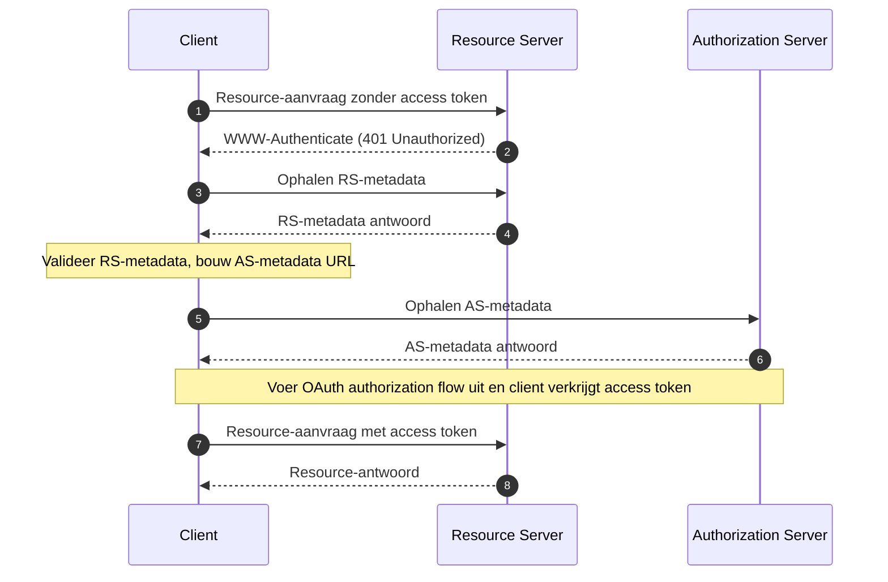

## Wat is OAuth 2.0 Beschermde Resource Metadata (Protected Resource Metadata)?

OAuth 2.0 Beschermde Resource Metadata (Protected Resource Metadata) is een gestandaardiseerd formaat gedefinieerd in [RFC 9728](https://datatracker.ietf.org/doc/html/rfc9728). Het helpt clients en authorization servers te begrijpen hoe ze kunnen communiceren met beschermde resources.

Dit metadataformaat biedt essentiële informatie over:
- Resource server mogelijkheden
- Ondersteunde tokenformaten
- Vereiste beveiligingsmechanismen
- Relaties met authorization servers
- Beschikbare scopes en permissies

## Wat zijn de voordelen van Beschermde Resource Metadata (Protected Resource Metadata)?

In het OAuth 2.0 systeem zijn er vier basisrollen:
- <Ref slug="authorization-server"/>: Geeft access tokens uit aan clients na succesvolle authenticatie van de resource owner
- <Ref slug="client"/>: Applicatie die toegang vraagt tot beschermde resources
- <Ref slug="resource-owner"/>: Entiteit die in staat is toegang te verlenen tot beschermde resources
- <Ref slug="resource-server"/>: Server die beschermde resources host

Traditioneel, wanneer een client toegang nodig heeft tot beschermde resources, moet deze eerst de authorization server ontdekken en ermee communiceren om de benodigde tokens te verkrijgen. De rol van de Resource Server was voornamelijk beperkt tot het valideren van tokens en het serveren van resources, waarbij alle authenticatie- en autorisatiedetails werden gecoördineerd via de authorization server en de clientapplicatie.

Dit betekende dat clients geen gestandaardiseerde manier hadden om direct de specifieke vereisten of mogelijkheden van een Resource Server te ontdekken.

Beschermde Resource Metadata (Protected Resource Metadata) transformeert deze dynamiek door Resource Servers in staat te stellen actief hun vereisten en mogelijkheden te publiceren en het brengt verschillende belangrijke voordelen met zich mee:
- Directe Ontdekking: Clients kunnen nu direct van de bron leren over de vereisten van een Resource Server
- Verbeterde Autonomie: Resource Servers kunnen expliciet hun ondersteunde tokenformaten, beveiligingsmechanismen en vertrouwde authorization servers specificeren
- Verbeterde Interoperabiliteit: Een gestandaardiseerd formaat zorgt voor consistente communicatie van toegangsvereisten over verschillende implementaties
- Dynamische Configuratie: Resource Servers kunnen hun vereisten bijwerken zonder afhankelijk te zijn van wijzigingen in de authorization server

## Hoe werkt OAuth 2.0 Beschermde Resource Metadata (Protected Resource Metadata)?

Beschermde Resource Metadata (Protected Resource Metadata) opereert binnen het OAuth 2.0 ecosysteem via een gestandaardiseerd ontdekking- en interactieproces:



Het resource server metadata document is een JSON-object dat de volgende velden bevat:

```json
   {
     "resource": "https://api.example.com",
     "authorization_servers": [
       "https://auth.example.com"
     ],
     "scopes_supported": ["read", "write"],
     "token_formats_supported": ["jwt"],
     "token_introspection_endpoint": "https://api.example.com/introspect",
     "dpop_signing_alg_values_supported": ["ES256", "PS256"]
   }
   ```

En zodra de client het metadatadocument heeft ontvangen, kan het zichzelf configureren en communiceren met de resource server voornamelijk volgens de volgende velden:

- `resource`: Identificator voor de beschermde resource
- `authorization_servers`: Lijst van geautoriseerde authorization servers
- `scopes_supported`: Beschikbare scopes voor deze resource
- `token_formats_supported`: Ondersteunde tokenformaten
- `token_introspection_endpoint`: Endpoint voor tokenvalidatie
- `dpop_signing_alg_values_supported`: Ondersteunde DPoP-algoritmen

## Hoe ontdek je OAuth 2.0 Beschermde Resource Metadata (Protected Resource Metadata) endpoints?

Er zijn twee primaire ontdekkingsmechanismen voor Beschermde Resource Metadata (Protected Resource Metadata):

1. **WWW-Authenticate Header Ontdekking (Flow-gebaseerd)**:

Wanneer een client een ongeautoriseerde aanvraag doet naar een beschermde resource, reageert de server met een 401 statuscode en bevat de metadata URL in de WWW-Authenticate header:

```bash
# 1. Client doet aanvraag zonder token
GET /api/resource HTTP/1.1
Host: api.example.com

# 2. Server reageert met 401 en metadata URL
HTTP/1.1 401 Unauthorized
WWW-Authenticate: Bearer realm="example",
  scope="read write",
  resource_metadata_url="https://api.example.com/.well-known/oauth-resource-server"
```

De header biedt:
- Resource realm identificatie
- Vereiste scopes
- Locatie van de metadata URL

2. **Directe Well-Known URI Ontdekking**:

Je kunt de metadata direct benaderen door een GET-aanvraag te doen naar de well-known endpoint:

```bash
GET /.well-known/oauth-resource-server HTTP/1.1
Host: api.example.com
```

De endpoint volgt een gestandaardiseerd formaat:
- Basis URI: `https://api.example.com`
- Well-known pad: `/.well-known/oauth-resource-server`
- Volledige URL: `https://api.example.com/.well-known/oauth-resource-server`

## Hoe werkt de WWW-Authenticate header in Beschermde Resource Metadata (Protected Resource Metadata)?

De WWW-Authenticate header is een belangrijk onderdeel in Beschermde Resource Metadata (Protected Resource Metadata) voor het implementeren van een automatisch ontdekkingsmechanisme. Het maakt gebruik van de standaard HTTP `WWW-Authenticate` header om metadata-informatie over te dragen, waardoor clients automatisch de toegangsvereisten voor resource servers kunnen ontdekken en configureren.

Wanneer een client voor het eerst probeert toegang te krijgen tot een beschermde resource zonder een access token te verstrekken, reageert de resource server met een 401 Unauthorized statuscode en bevat een WWW-Authenticate header:

```
WWW-Authenticate: Bearer realm="example",
  scope="read write",
  resource_metadata_url="https://api.example.com/.well-known/oauth-resource-server"
```

Deze header kan verschillende belangrijke informatie bevatten:
- `Bearer`: Geeft aan dat dit een OAuth 2.0 Bearer Token authenticatieschema is
- `realm`: Definieert de beschermingsruimte van de resource
- `scope`: Specificeert de vereiste toegangsrechten
- `resource_metadata_url`: Wijst naar de locatie van het metadatadocument dat de volledige resource server configuratie bevat

Bij ontvangst van deze header, extraheert de client de `resource_metadata_url` en haalt het volledige metadatadocument op van die URL.

Op basis van de verkregen metadata-informatie kan de client de juiste authorization servers, ondersteunde tokenformaten, beschikbare scopes en andere configuratiedetails bepalen om authenticatieaanvragen correct te configureren.

## Hoe beveilig je OAuth 2.0 Beschermde Resource Metadata (Protected Resource Metadata)?

Essentiële beveiligingsoverwegingen omvatten:

1. **Transportbeveiliging**:
   - Verplicht gebruik van TLS
   - Certificaatvalidatie
   - Beveiligde verbindingen afhandelen

2. **Metadata Integriteit**:
   - Bronvalidatie
   - Handtekeningverificatie
   - Veilige cachingstrategieën

3. **Toegangscontrole**:
   - Rate limiting
   - Aanvraagvalidatie
   - Misbruikmonitoring

## Hoe implementeer je OAuth 2.0 Beschermde Resource Metadata (Protected Resource Metadata)?

Hier is hoe OAuth 2.0 Beschermde Resource Metadata (Protected Resource Metadata) wordt geïmplementeerd over verschillende componenten:

1. **Resource Server Implementatie**

De resource server reageert met een 401 Unauthorized status en bevat de metadata URL in de WWW-Authenticate header bij het ontvangen van een ongeautoriseerde toegangspoging:

```
HTTP/1.1 401 Unauthorized
WWW-Authenticate: Bearer realm="example",
  resource_metadata_url="https://api.example.com/.well-known/oauth-resource-server"
```

2. **Client Implementatie**

De client implementeert een asynchrone functie om resource toegang af te handelen. Bij ontvangst van een 401-reactie, extraheert deze functie de metadata URL uit de WWW-Authenticate header, haalt de metadata op en gebruikt deze voor clientconfiguratie:

```javascript
async function handleResourceAccess(response) {
  if (response.status === 401) {
    const wwwAuthenticate = response.headers.get('WWW-Authenticate');
    const metadataUrl = extractMetadataUrl(wwwAuthenticate);
    const metadata = await fetchMetadata(metadataUrl);
    // Clientconfiguratie op basis van metadata
  }
}
```

3. **Metadata Document Structuur**

De resource server biedt een metadatadocument als een JSON-object dat bevat:
- Resource identificator
- Lijst van geautoriseerde authorization servers
- Ondersteunde scopes
- Ondersteunde tokenformaten
- Ondersteunde DPoP ondertekeningsalgoritmen

Hier is een voorbeeld van het metadatadocument:

```json
{
  "resource": "https://api.example.com",
  "authorization_servers": ["https://auth.example.com"],
  "scopes_supported": ["read", "write"],
  "token_formats_supported": ["jwt"],
  "dpop_signing_alg_values_supported": ["ES256"]
}
```

Deze componenten werken samen om een complete OAuth 2.0 Beschermde Resource Metadata (Protected Resource Metadata) implementatie te vormen. Door deze implementatie kunnen clients automatisch de benodigde parameters ontdekken en configureren voor toegang tot beschermde resources.

<SeeAlso slugs={["resource-server", "authorization-server"]} />

<Resources urls={[
  "https://datatracker.ietf.org/doc/html/rfc9728",
]} />