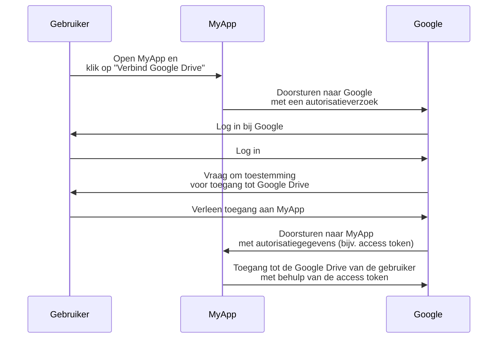

## Wat is een resource-owner (resource-eigenaar)?

In de context van <Ref slug="oauth-2.0" />, is een resource-owner (resource-eigenaar) een identiteit (meestal een gebruiker) die de mogelijkheid heeft om toegang te verlenen tot een beveiligde resource (bijvoorbeeld gegevens, bestanden of diensten).

Bijvoorbeeld, je hebt een webapplicatie MyApp die toegang wil tot de Google Drive van de gebruiker. Hier is een typisch OAuth 2.0-stroom:

In deze stroom is de **gebruiker** de **resource-owner (resource-eigenaar)** die toegang verleent tot hun Google Drive aan MyApp, terwijl **MyApp** de <Ref slug="client" /> is die toegang wil tot de beveiligde resources en **Google** zowel de <Ref slug="authorization-server" /> als de <Ref slug="resource-server" /> is.

Zoals de naam al aangeeft, bezit de resource-owner (resource-eigenaar) enkele resources in een <Ref slug="resource-server" /> en kan hij in de context van <Ref slug="oauth-2.0" /> clients autoriseren om namens hen toegang te krijgen.

## Waarom is de resource-owner (resource-eigenaar) belangrijk?

Tijdens een <Ref slug="authorization" /> proces is de resource-owner (resource-eigenaar) onmisbaar omdat zij degenen zijn die expliciet toegang verlenen of ontzeggen tot hun resources. De toestemming van de resource-owner (resource-eigenaar) is verplicht om zowel technische als nalevingsredenen:

- **Technisch**: De toestemming van de resource-owner (resource-eigenaar) zorgt ervoor dat de client de benodigde rechten heeft om toegang te krijgen tot de resources. In plaats van alles-of-niets toegang kan de resource-owner (resource-eigenaar) gedeeltelijke toegang verlenen volgens het verzoek van de client. Aan de andere kant kan de resource-owner (resource-eigenaar) ook expliciet op elk moment de toegang intrekken. Deze aanpak biedt een duidelijke en controleerbare manier voor <Ref slug="access-control" />.
- **Naleving**: De toestemming van de resource-owner (resource-eigenaar) is in veel rechtsgebieden een wettelijke vereiste, vooral wanneer wordt omgegaan met gevoelige gegevens. Bijvoorbeeld, de Algemene Verordening Gegevensbescherming (AVG) verplicht dat de gegevenssubject (resource-owner) expliciete toestemming moet geven voor gegevensverwerkingsactiviteiten.

## Resource-owner (resource-eigenaar) vs. resource-server

<Ref slug="resource-server">Resource-servers (resourceservers)</Ref> zijn verantwoordelijk voor het hosten en serveren van de **beveiligde resources**. Zij zijn de poortwachters die de access tokens verifiëren en de resources aan de clients serveren.

De resource-owner (resource-eigenaar), aan de andere kant, kan volledige of gedeeltelijke controle hebben over de beveiligde resources in de resource-server (resource-server) volgens de <Ref slug="access-control" /> beleidslijnen.

<SeeAlso slugs={["resource-server", "oauth-2.0", "resource-indicator", "access-control"]} />

<Resources
  urls={[
    "https://tools.ietf.org/html/rfc6749",
  ]}
/>