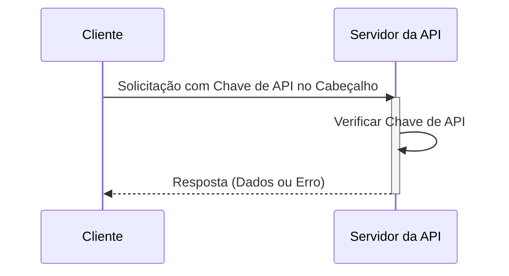

## O que é uma chave de API?

Uma chave de API é um token secreto usado para autenticar clientes que acessam uma API. É como uma senha para sua aplicação, permitindo acesso a uma API específica. Pense nisso como um cartão de acesso para entrar em um prédio. O cartão concede acesso, mas não necessariamente identifica quem você é.

## Como funcionam as chaves de API?

As chaves de API funcionam através de um processo simples de solicitação e resposta.

1. **Solicitação:** Sua aplicação envia uma solicitação para a API, incluindo a chave de API. A chave é frequentemente enviada no cabeçalho da solicitação. Por exemplo, o cabeçalho pode ser assim: `x-api-key: sua_chave_de_api_real`. Não há um padrão único para nomes de cabeçalho ou formatos de valor.

2. **Verificação:** O servidor da API verifica a chave fornecida em seu banco de dados.

3. **Resposta:** Se a chave for válida, o servidor concede acesso e envia de volta os dados solicitados. Caso contrário, o acesso é negado.

Aqui está um diagrama de sequência ilustrando o processo:

## Quais são os prós e contras das chaves de API?

Vamos ver o que torna as chaves de API úteis e onde elas falham:

### Prós

- **Super simples de usar**: Basta adicionar uma chave à sua solicitação e pronto! É como usar uma chave de casa - sem etapas complicadas necessárias.

- **Fácil de rastrear**: Quer saber quem está usando sua API? As chaves de API tornam isso simples. Você pode ver quais aplicativos estão fazendo chamadas e com que frequência.

- **Limitação de taxa rápida**: Impedir que as pessoas usem demais sua API definindo limites por chave. É como ter um segurança em um clube que conta quantas vezes alguém entra e sai.

- **Perfeito para dados públicos**: Se você está compartilhando informações não sensíveis (como dados meteorológicos ou estatísticas públicas), as chaves de API são ideais.

### Contras

- **Menos seguro que alternativas modernas**: As chaves de API não são tão eficazes quanto outras formas de autenticação de API, como <Ref slug="oauth-2.0" /> e <Ref slug="jwt" />. Pense nelas como uma fechadura básica em comparação com um sistema de segurança moderno. No entanto, elas continuam populares porque são a maneira mais simples de rastrear o uso da API e começar com a segurança da API.

- **Riscos de segurança**: As chaves de API são como deixar sua chave de casa debaixo do tapete. Se alguém a encontrar, pode usá-la para sempre. Aqui está o porquê:
  - Elas são frequentemente visíveis no código
  - Elas não expiram automaticamente
  - Se vazadas (como em repositórios públicos do GitHub), qualquer um pode usá-las

- **Não podem distinguir usuários**: Enquanto algumas empresas usam "chaves de API" que podem identificar usuários (como o Stripe), as chaves de API tradicionais não podem dizer quem é quem. Elas apenas informam qual aplicativo está fazendo a solicitação.

- **Estáticas por natureza**: Ao contrário dos tokens de autenticação modernos que expiram, as chaves de API geralmente permanecem as mesmas para sempre. Isso significa:
  - Nenhuma atualização automática de segurança
  - Trabalho manual necessário para girar chaves
  - Maior risco se as chaves forem expostas

## Quais são os casos de uso para chaves de API?

- Comunicação de serviço para serviço: As chaves de API são adequadas para cenários onde aplicativos precisam se comunicar com APIs diretamente através de CLIs. Ex.: Chamadas para APIs do OpenAI.
- APIs públicas: Ao expor APIs ao público, as chaves de API fornecem um método direto de controle de acesso.
- Configuração simplificada: Para necessidades rápidas e simples de autenticação, especialmente na fase de desenvolvimento. Ao contrário da autenticação Machine-to-machine, as chaves de API não requerem registro de cliente prévio e não precisam ser trocadas por um access token. Você apenas passa sua chave de API como um parâmetro em sua solicitação e ela simplesmente funciona.

Em cenários do mundo real, o propósito mais comum ao construir produtos é a integração de produtos. Aqui está um caso de uso típico:

### Exemplo: Integração com o Stripe

O Stripe usa chaves de API para integração segura com diferentes plataformas e aplicativos. Você pode criar, visualizar, excluir e gerenciar essas chaves através do Painel de Desenvolvedores. Usando chaves de API, você pode integrar os recursos de checkout e faturamento do Stripe em seu produto.

## Qual é a diferença entre Tokens de Acesso Pessoal (PAT) e Machine-to-Machine (M2M)?

Ao falar sobre chaves de API, tokens de acesso pessoal e <Ref slug="machine-to-machine" /> também podem ser mencionados juntos, já que todos podem acessar programaticamente recursos de API através de comandos CLI ou estabelecer comunicação entre serviços de backend.

### Tokens de Acesso Pessoal (PATs)

Um token de acesso pessoal também é uma string, mas representa a identidade e permissões de ***um usuário específico***, é gerado dinamicamente após autenticação ou login bem-sucedido e geralmente tem uma vida útil limitada, mas pode ser renovado. Ele fornece controle de acesso detalhado a dados e capacidades específicas do usuário e é comumente usado para ferramentas CLI, scripts ou acesso pessoal à API. A principal diferença é que é mais específico e usado para ações específicas do usuário.

### Machine-to-Machine (M2M)

A comunicação M2M ocorre quando dispositivos trocam dados automaticamente sem envolvimento humano em um sentido mais amplo.

No contexto de <Ref slug="openid-connect" /> (ou <Ref slug="oauth-2.0" />), aplicativos M2M usam o <Ref slug="client-credentials-flow" />, conforme definido no [protocolo OAuth 2.0 RFC 6749](https://datatracker.ietf.org/doc/html/rfc6749), que suporta protocolos padrão semelhantes. Geralmente envolve um aplicativo cliente (uma máquina ou serviço) acessando recursos por conta própria ou em nome de um usuário. É ideal para situações onde apenas clientes confiáveis podem acessar serviços de backend.

<SeeAlso slugs={["machine-to-machine"]} />