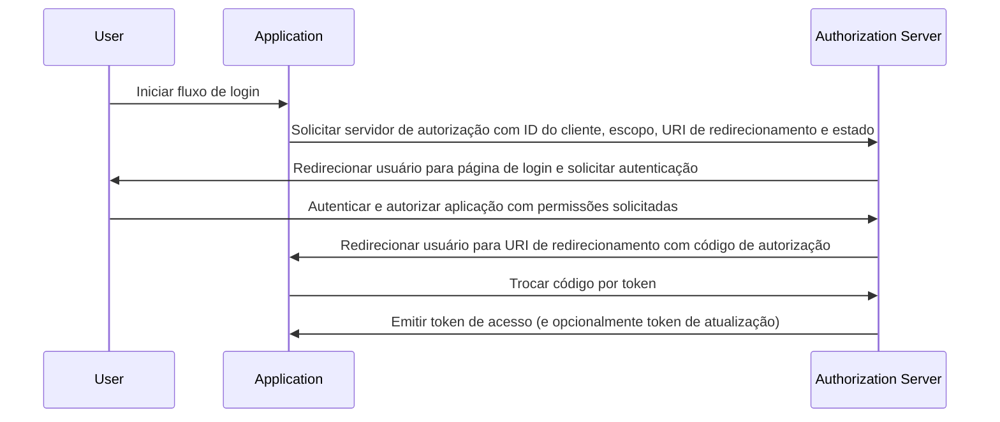

## O que é o fluxo de código de autorização (authorization code flow)?

O fluxo de código de autorização (authorization code flow) (também conhecido como concessão de código de autorização), definido na [RFC 6749 do OAuth 2.0, seção 4.1](https://datatracker.ietf.org/doc/html/rfc6749#section-4.1), é um mecanismo de autorização amplamente utilizado no OAuth 2.0 que permite que aplicações obtenham um token de acesso em nome de um usuário.

Este fluxo é ideal para aplicações confidenciais, como aplicativos web tradicionais do lado do servidor, que podem armazenar com segurança segredos de cliente.

Também pode ser usado de forma segura para aplicativos nativos e Aplicações de Página Única (SPAs) que não podem armazenar segredos de cliente com segurança quando combinados com a extensão PKCE (<Ref slug="pkce" />).

## Como funciona o fluxo de código de autorização (authorization code flow)?

O fluxo de código de autorização (authorization code flow) envolve as seguintes etapas:

1. **Início do fluxo**: O usuário inicia o fluxo normalmente clicando em um link ou botão na aplicação para fazer login. A aplicação redireciona o usuário para o endpoint de autorização do servidor de autorização, passando o ID do cliente, o escopo solicitado, um URI de redirecionamento e um parâmetro de estado. O servidor de autorização valida os parâmetros e solicita que o usuário se autentique na página de login do servidor de autorização.
2. **Autenticação e autorização do usuário**: O usuário se autentica com o servidor de autorização e concede à aplicação permissão para acessar os recursos solicitados.
3. **Geração de código e redirecionamento**: O servidor de autorização gera um código de autorização e redireciona o usuário de volta para a aplicação usando o URI de redirecionamento fornecido anteriormente. O código de autorização é incluído na string de consulta do URI de redirecionamento.
4. **Troca de código**: A aplicação extrai o código de autorização da string de consulta e faz uma solicitação POST para o endpoint de token do servidor de autorização para trocar o código de autorização por um token de acesso. A aplicação também deve incluir o ID do cliente, o segredo do cliente, o URI de redirecionamento e o código de autorização na solicitação.
5. **Recuperação do token de acesso**: O servidor de autorização valida o código de autorização e emite um token de acesso (e opcionalmente um token de atualização) para a aplicação após a validação bem-sucedida. A aplicação pode então usar o token de acesso para fazer solicitações de API autorizadas em nome do usuário.

As etapas podem ser ilustradas pelo seguinte diagrama de sequência:



## Como implementar o fluxo de código de autorização (authorization code flow)?

Aqui está um exemplo simples de implementação do fluxo de código de autorização (authorization code flow), seguindo as diretrizes descritas na [RFC 6749 do OAuth 2.0, seção 4.1](https://datatracker.ietf.org/doc/html/rfc6749#section-4.1):

### 1. Configuração inicial

Certifique-se de ter as seguintes informações do seu serviço de autenticação antes de começar:

```javascript
const config = {
  clientId: "YOUR_CLIENT_ID",
  clientSecret: "YOUR_CLIENT_SECRET",
  authorizationEndpoint: "https://authorization-server.com/auth",
  tokenEndpoint: "https://authorization-server.com/token",
  redirectUri: "http://localhost:3000/callback",
};
```

ID do cliente, segredo do cliente e URI de redirecionamento são a configuração da sua aplicação no serviço de autenticação.

O `authorizationEndpoint` e o `tokenEndpoint` são fornecidos pelo seu serviço de autenticação.

Se o seu servidor de autenticação implementar OIDC (<Ref slug="openid-connect" />), você pode obter essas informações através do <Ref slug="openid-connect-discovery" />.

### 2. Iniciar solicitação de autorização

O fluxo começa quando um usuário deseja fazer login (por exemplo, clicando em um botão de login). A aplicação fará uma solicitação de login.

Esta solicitação inclui parâmetros como `client ID`, `redirect URI` e `scope`. Em seguida, redireciona o usuário para o endpoint de autorização do serviço de autenticação (a página de login do serviço de autenticação).

O usuário se autenticará e autorizará nesta página de login.

```javascript
app.get("/login", (req, res) => {
  const authUrl = new URL(config.authorizationEndpoint);
  authUrl.searchParams.append("response_type", "code");
  authUrl.searchParams.append("client_id", config.clientId);
  authUrl.searchParams.append("redirect_uri", config.redirectUri);
  authUrl.searchParams.append("scope", "openid profile email");
  authUrl.searchParams.append("state", "random_state_string");

  res.redirect(authUrl.toString());
});
```

Nota: Você pode adicionar mais parâmetros além dos mostrados no código de exemplo. Veja [Definição completa dos parâmetros de solicitação de autenticação](https://openid.net/specs/openid-connect-core-1_0.html#AuthRequest).

### 3. Lidar com o callback do URI de redirecionamento e troca de token

Após o usuário completar a autenticação e autorização na página de login do serviço de autenticação, o serviço de autenticação redireciona o usuário de volta para o URI de redirecionamento da aplicação. Este URI de redirecionamento inclui os parâmetros de código de autorização e estado.

A aplicação extrai os parâmetros de código de autorização e estado do URI de redirecionamento e os troca por tokens de acesso e atualização (se houver) no endpoint de token do serviço de autenticação.

```javascript
app.get("/callback", async (req, res) => {
  const { code, state } = req.query;

  try {
    // Trocar o código de autorização por um token de acesso e token de atualização
    const tokenResponse = await axios.post(config.tokenEndpoint, {
      grant_type: "authorization_code",
      code,
      redirect_uri: config.redirectUri,
      client_id: config.clientId,
      client_secret: config.clientSecret,
    });

    const { access_token, refresh_token } = tokenResponse.data;
    // Armazenar tokens para solicitações subsequentes
    req.session.accessToken = access_token;

    res.send("Autenticação bem-sucedida!");
  } catch (error) {
    res.status(500).send("Falha na troca de token");
  }
});
```

### 4. Usar token de acesso

Uma vez que você tenha o token, use-o para acessar recursos protegidos:

```javascript
async function fetchUserProfile(accessToken) {
  const response = await axios.get("https://api.example.com/userinfo", {
    headers: {
      Authorization: `Bearer ${accessToken}`,
    },
  });
  return response.data;
}
```

## Como usar o fluxo de código de autorização (authorization code flow) para clientes públicos (aplicativos nativos e SPAs)?

Clientes públicos (como aplicativos nativos e SPAs) enfrentam desafios de segurança únicos ao usar o fluxo de código de autorização (authorization code flow). Essas aplicações não podem armazenar segredos de cliente com segurança. O segredo do cliente seria exposto no código JavaScript ou no armazenamento do dispositivo. Isso facilita para atacantes extraírem e usarem indevidamente o segredo.

Portanto, o principal desafio é como usar o fluxo de código de autorização (authorization code flow) com segurança sem um segredo de cliente. A especificação OAuth 2.0 introduziu a extensão PKCE (<Ref slug="pkce" />) para resolver esse problema.

PKCE adiciona medidas de segurança adicionais para proteger o fluxo de código de autorização (authorization code flow) para clientes públicos. Ele previne ataques de interceptação de código de autorização mesmo sem usar um segredo de cliente. Confira este blog para saber mais sobre [Como o PKCE protege o fluxo de código de autorização (authorization code flow) do OAuth 2.0](https://blog.logto.io/how-pkce-protects-the-authorization-code-flow-for-native-apps).

## Como usar o fluxo de código de autorização (authorization code flow) com segurança?

### **Usando "state" para prevenir ataques CSRF**

Ataques CSRF (<Ref slug="csrf" />) enganam os usuários para realizar ações indesejadas em uma aplicação web autenticada. O parâmetro de estado ajuda a prevenir isso.

- Gere um valor único e aleatório. Armazene este valor no lado do servidor.
- Inclua o parâmetro de estado. Anexe-o ao URL de solicitação de autorização.
- Verifique o estado ao retornar. Quando o servidor de autorização redirecionar de volta para sua aplicação, compare o estado retornado com o valor armazenado. Se não corresponderem, rejeite a solicitação. Isso confirma que a solicitação se originou da sua aplicação.

### **Configurando URIs de redirecionamento seguros**

O URI de redirecionamento é onde o servidor de autorização envia o código de autorização após a autenticação do usuário. A configuração segura é crucial.

- Registre URIs de redirecionamento válidos. Durante o registro da aplicação com o servidor de autorização, especifique os URIs de redirecionamento permitidos.
- Correspondência exata. O URI de redirecionamento na solicitação de autorização deve corresponder exatamente a um URI registrado. Mesmo uma pequena diferença pode criar uma vulnerabilidade.
- Evite URIs curinga. Se possível, evite usar URIs curinga em produção. Eles ampliam a superfície de ataque.
- HTTPS para produção. Sempre use HTTPS para URIs de redirecionamento em ambientes de produção.

### **Usando PKCE para todos os clientes**

Embora o PKCE tenha sido originalmente projetado para clientes públicos, a especificação <Ref slug="oauth-2.1" /> exige que o PKCE seja aplicado a todos os clientes, incluindo clientes confidenciais, para melhorar a segurança geral do fluxo de código de autorização (authorization code flow). (Veja [Aplicar PKCE para todos os clientes](https://auth.wiki/oauth-2.1#enforcing-pkce-for-all-clients))

## Qual é a diferença entre o fluxo de código de autorização (authorization code flow) e o fluxo implícito (implicit flow)?

A principal diferença entre o fluxo de código de autorização (authorization code flow) e o fluxo implícito (implicit flow) é como o token de acesso é obtido:

- **Fluxo de código de autorização (authorization code flow)**: A aplicação cliente recebe primeiro um código de autorização do endpoint de autorização e, em seguida, o troca por um token de acesso em uma solicitação POST subsequente para o endpoint de token.
- **Fluxo implícito (implicit flow)**: A aplicação cliente recebe o token de acesso diretamente no fragmento de URL do URI de redirecionamento após a autorização do usuário.

Saiba mais sobre <Ref slug="implicit-flow" />.

## Qual é a diferença entre o fluxo de código de autorização (authorization code flow) e o fluxo de credenciais do cliente (client credentials flow)?

A principal diferença entre o fluxo de código de autorização (authorization code flow) e o fluxo de credenciais do cliente (client credentials flow) é o contexto em que o fluxo é usado:

- **Fluxo de código de autorização (authorization code flow)**: Usado quando a aplicação cliente precisa acessar recursos em nome de um usuário. O fluxo envolve autenticação e autorização do usuário.
- **Fluxo de credenciais do cliente (client credentials flow)**: Usado quando a aplicação cliente precisa acessar recursos em seu próprio nome. O fluxo envolve autenticação do cliente, mas não autenticação do usuário, sendo mais adequado para comunicação máquina a máquina.

Saiba mais sobre <Ref slug="client-credentials-flow" />.

<SeeAlso
  slugs={[
    "device-flow",
    "implicit-flow",
    "client-credentials-flow",
    "pkce",
    "openid-connect",
    "openid-connect-discovery",
    "csrf",
    "oauth-2.1",
  ]}
/>

<Resources urls={[
  "https://datatracker.ietf.org/doc/html/rfc6749",
  "https://openid.net/specs/openid-connect-core-1_0.html#AuthRequest",
  "https://blog.logto.io/how-pkce-protects-the-authorization-code-flow-for-native-apps"
]} />
