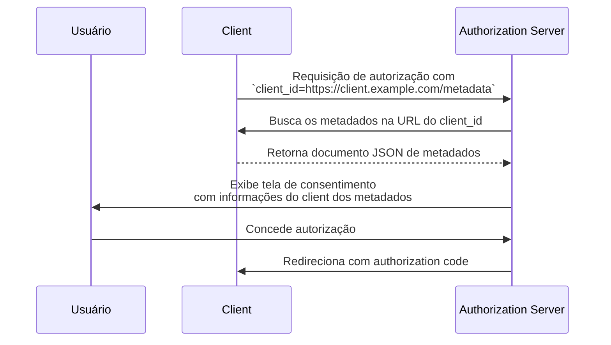

## O que é um Documento de Metadados de Client ID (Client ID Metadata Document)?

Um Documento de Metadados de Client ID (Client ID Metadata Document) é um mecanismo definido na especificação [OAuth Client ID Metadata Document](https://datatracker.ietf.org/doc/draft-ietf-oauth-client-id-metadata-document/) que permite que um OAuth 2.0 <Ref slug="client" /> se identifique para um <Ref slug="authorization-server" /> sem registro prévio.

A ideia central: em vez de receber um `client_id` do authorization server (através de registro manual ou [Dynamic Client Registration](https://datatracker.ietf.org/doc/html/rfc7591)), o client **usa uma URL HTTPS como seu `client_id`**. Essa URL aponta para um documento JSON contendo os metadados do client — nome, URIs de redirecionamento, grant types suportados e mais. O authorization server busca esse documento quando encontra o `client_id` baseado em URL.

Essa abordagem às vezes é abreviada como **CIMD** (Client ID Metadata Document) na comunidade.

## Como funciona?

Quando um client usa um Documento de Metadados de Client ID (Client ID Metadata Document), o fluxo OAuth adiciona um passo: o authorization server resolve a URL do `client_id` para recuperar os metadados do client.



Veja o que acontece passo a passo:

1. O client inicia uma <Ref slug="authorization-request" /> usando sua URL como o `client_id` (por exemplo, `https://client.example.com/oauth-client`).
2. O authorization server reconhece o `client_id` como uma URL e faz o fetch via HTTPS.
3. A resposta é um documento JSON contendo os metadados padrão do client OAuth.
4. O authorization server valida os metadados, exibe as informações de consentimento para o usuário e prossegue com o fluxo OAuth.
5. Requisições subsequentes podem usar os metadados em cache conforme os cabeçalhos de cache HTTP.

### O documento de metadados

O documento de metadados é um objeto JSON que usa os mesmos campos definidos na [RFC 7591 (OAuth 2.0 Dynamic Client Registration Protocol)](https://datatracker.ietf.org/doc/html/rfc7591). Ele deve incluir um campo `client_id` cujo valor corresponde exatamente à URL.

Exemplo:

```json
{
  "client_id": "https://client.example.com/oauth-client",
  "client_name": "My Application",
  "redirect_uris": ["https://client.example.com/callback"],
  "grant_types": ["authorization_code", "refresh_token"],
  "response_types": ["code"],
  "token_endpoint_auth_method": "none",
  "scope": "openid profile email"
}
```

### Requisitos para a URL do identificador do client

A especificação impõe requisitos rigorosos sobre o que constitui uma URL válida de identificador de client:

- **Deve usar HTTPS** — não pode ser HTTP simples ou outros esquemas.
- **Deve incluir um componente de caminho (path)** — um domínio puro como `https://example.com` não é válido.
- **Não pode conter** fragmento, nome de usuário ou senha.
- **Não pode conter** segmentos de caminho de ponto único (`.`) ou duplo (`..`).
- Query strings são permitidas, mas desencorajadas.
- Números de porta são permitidos.

Por exemplo:
- `https://client.example.com/oauth-client` — válido
- `http://client.example.com/oauth-client` — inválido (não é HTTPS)
- `https://example.com` — inválido (sem path)
- `https://client.example.com/../oauth-client` — inválido (segmento de ponto)

## Por que não usar métodos de registro existentes?

Para entender por que essa especificação existe, considere as limitações das abordagens existentes:

### Registro estático

Em implantações OAuth tradicionais, um desenvolvedor registra manualmente o client no authorization server — normalmente por meio de um console de administração — e recebe um `client_id`. Isso funciona quando você conhece seus clients com antecedência.

Não funciona para ecossistemas abertos onde qualquer client pode precisar se conectar. Não é possível pré-registrar todo possível agente de IA ou client MCP.

### Dynamic Client Registration (DCR)

[Dynamic Client Registration (RFC 7591)](https://datatracker.ietf.org/doc/html/rfc7591) permite que clients se registrem programaticamente enviando seus metadados para um endpoint de registro. O servidor cria um `client_id` e armazena o registro.

Isso funciona, mas cria estado no lado do servidor: cada registro produz um registro que precisa ser armazenado, mantido e eventualmente limpo. Em um ecossistema aberto com muitos clients, o authorization server acumula registros — a maioria dos quais pode ser usada uma vez e abandonada.

DCR também não possui mecanismo embutido para verificar se um client é realmente quem diz ser. Qualquer client pode se registrar com qualquer nome ou logo.

### Vantagens do Documento de Metadados de Client ID (Client ID Metadata Document)

A abordagem do Documento de Metadados de Client ID (Client ID Metadata Document) resolve essas questões:

| Aspecto | Registro estático | DCR | Documento de Metadados de Client ID |
|---------|-------------------|-----|-------------------------------------|
| Estado no servidor | Sim (registros armazenados) | Sim (registros armazenados) | Não (busca sob demanda) |
| Pré-registro necessário | Sim | Não | Não |
| Verificação de identidade | Revisão manual | Nenhuma embutida | Propriedade do domínio via HTTPS |
| Limpeza necessária | Sim | Sim (registros abandonados) | Não (autolimpeza via cache HTTP) |
| Client controla os metadados | Não | No momento do registro | Sim (pode atualizar a qualquer momento) |

O ponto chave é que **a propriedade do domínio se torna o pilar de confiança**. Apenas a entidade que controla `client.example.com` pode hospedar conteúdo em `https://client.example.com/oauth-client`. O certificado HTTPS prova isso sem necessidade de verificação adicional.

## Restrições de autenticação

Como não há segredo pré-compartilhado entre o client e o authorization server, métodos de autenticação baseados em segredo simétrico não podem ser usados. O documento de metadados **não deve** incluir:

- `client_secret_post`
- `client_secret_basic`
- `client_secret_jwt`
- Qualquer método que dependa de segredo simétrico compartilhado

Os campos `client_secret` e `client_secret_expires_at` também não devem aparecer no documento.

Se o client precisar se autenticar além de ser um client público, pode usar criptografia assimétrica. O client publica suas chaves públicas no documento de metadados (via uma propriedade `jwks` ou uma referência `jwks_uri`) e se autentica no token endpoint usando `private_key_jwt`. O authorization server verifica a assinatura do JWT contra o <Ref slug="jwk">JWK</Ref> publicado.

## Como o authorization server descobre o suporte?

Authorization servers indicam suporte para Documentos de Metadados de Client ID (Client ID Metadata Documents) incluindo a seguinte propriedade em seu <Ref slug="authorization-server-metadata" />:

```json
{
  "client_id_metadata_document_supported": true
}
```

Clients podem verificar esse flag antes de iniciar um fluxo de autorização com um `client_id` baseado em URL. Se o authorization server não anunciar suporte, o client deve recorrer a outros métodos de registro.

## Considerações de segurança

### Proteção contra SSRF

Quando o authorization server busca a URL de metadados, está fazendo uma requisição HTTP para uma URL fornecida pelo client. Isso é um vetor potencial de Server-Side Request Forgery (SSRF). Implementações devem:

- Bloquear requisições para endereços IP privados e loopback (por exemplo, `127.0.0.1`, `10.x.x.x`, `192.168.x.x`)
- Revalidar endereços de destino após seguir redirecionamentos
- Impor limites de tamanho de resposta (a especificação recomenda máximo de 5 KB)
- Definir timeouts apropriados

### Cache

Authorization servers devem respeitar os cabeçalhos de cache HTTP (`Cache-Control`, `ETag`) ao armazenar metadados em cache. No entanto:

- **Não faça cache de respostas de erro** — uma falha temporária não deve bloquear permanentemente um client.
- Servidores podem impor durações mínima e máxima de cache independentemente do que o servidor do client especifica.

### Prevenção de phishing

Um client malicioso pode definir `client_name` como o nome de uma marca confiável e `logo_uri` como seu logo. Authorization servers devem mitigar isso:

- Sempre exibindo o hostname do `client_id` junto com o nome do client nas telas de consentimento
- Fazendo prefetch e moderação das imagens de logo ao invés de carregá-las diretamente do client

### Atestado de redirect URI

Uma vantagem de segurança sobre DCR: as <Ref slug="redirect-uri">redirect URIs</Ref> no documento de metadados são hospedadas no domínio do client, servidas via HTTPS. Isso cria uma ligação mais forte entre a identidade do client e suas redirect URIs do que valores autoafirmados em uma requisição de registro.

## Serviços de Documento de Metadados de Client ID (Client ID Metadata Document Services)

A especificação também define **Serviços de Documento de Metadados de Client ID (Client ID Metadata Document Services)** — serviços web de terceiros que hospedam documentos de metadados em nome dos desenvolvedores.

Isso resolve uma lacuna prática: durante o desenvolvimento local, desenvolvedores não têm uma URL publicamente acessível para hospedar seus metadados. Um Serviço de Documento de Metadados de Client ID fornece uma URL pública estável que authorization servers podem buscar, enquanto o desenvolvedor trabalha localmente. Isso evita a necessidade de expor máquinas locais à internet ou configurar túneis para testar fluxos OAuth.

<SeeAlso slugs={["client", "authorization-server-metadata", "redirect-uri", "jwk"]} />

<Resources
  urls={[
    "https://datatracker.ietf.org/doc/draft-ietf-oauth-client-id-metadata-document/",
    "https://datatracker.ietf.org/doc/html/rfc7591",
    "https://datatracker.ietf.org/doc/html/rfc8414",
  ]}
/>
