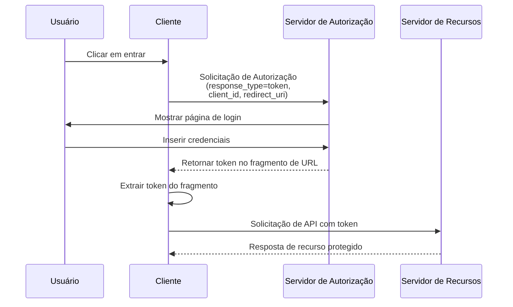

## O que é o fluxo implícito (implicit flow)?

O fluxo implícito (implicit flow) do OAuth 2.0 é um método de autenticação que permite que aplicativos apenas cliente (como SPAs e aplicativos nativos) recebam tokens diretamente através de fragmentos de URL do servidor de autorização sem fornecer um segredo de cliente.

O fluxo implícito (implicit flow) é projetado para aplicativos apenas cliente, porque eles são executados completamente no navegador ou no dispositivo do usuário e não podem armazenar segredos de cliente de forma segura.

O fluxo implícito (implicit flow) foi oficialmente descontinuado no <Ref slug="oauth-2.1" /> por razões de segurança (serão mencionadas abaixo). Aplicativos apenas cliente devem agora usar o <Ref slug="authorization-code-flow" /> com a extensão <Ref slug="pkce" />.

## Como funciona o fluxo implícito (implicit flow)?

Os principais passos do fluxo implícito (implicit flow) são os seguintes:

Observações:

- O cliente só precisa fornecer um `client_id` na solicitação de autorização, sem exigir um `client_secret`.  
  Isso ocorre porque esses clientes não podem armazenar segredos de forma segura, então esse fluxo não requer um segredo de cliente.

- O parâmetro `response_type` é definido como `token`, instruindo o servidor de autorização a retornar o access token diretamente em vez de um código de autorização.  
  No OIDC (<Ref slug="openid-connect" />), o `response_type` é `id_token` ou `id_token token`, e o serviço de autenticação retornará os tokens correspondentes com base nos diferentes tipos de resposta.

- O token é retornado diretamente no fragmento de URL. Isso significa que o token é exposto na URL e pode ser facilmente acessado por outros aplicativos ou scripts.

## O fluxo implícito (implicit flow) é seguro?

Não, o fluxo implícito (implicit flow) no OAuth 2.0 é geralmente considerado menos seguro do que outros fluxos, como o fluxo de código de autorização.

Não é recomendado para a maioria dos casos de uso devido a várias vulnerabilidades:

- **Exposição de token na URL**
   - Access tokens aparecem diretamente na URL do navegador (após o símbolo #)
   - Esses tokens podem ser:
     - Salvos no histórico do navegador
     - Vazados através de cabeçalhos de referência
     - Capturados por código JavaScript malicioso na mesma página

- **Sem autenticação do cliente**
   - O aplicativo cliente não precisa provar sua identidade
   - Isso significa que qualquer pessoa que conheça o `client_id` pode se passar por um cliente legítimo

- **Sem tokens de atualização**
   - Este fluxo não suporta tokens de atualização
   - Os usuários devem fazer login novamente quando os access tokens expirarem
   - Para evitar logins frequentes, os usuários podem armazenar tokens de maneiras inseguras

- **Vulnerável a ataques XSS**
   - Todos os tokens são manipulados no navegador
   - Se o site sofrer um ataque XSS (Cross-Site Scripting)
   - O código JavaScript dos atacantes pode facilmente roubar esses tokens

Devido a essas preocupações de segurança, o fluxo implícito (implicit flow) foi descontinuado no <Ref slug="oauth-2.1" />. Aplicativos apenas cliente devem agora usar o <Ref slug="authorization-code-flow" /> com a extensão <Ref slug="pkce" />.

Você pode conferir [O que é PKCE: dos conceitos básicos ao entendimento profundo](https://blog.logto.io/how-pkce-protects-the-authorization-code-flow-for-native-apps) para aprender como o PKCE protege o fluxo de código de autorização para aplicativos apenas cliente.

<SeeAlso
  slugs={["oauth-2.1", "authorization-code-flow", "pkce", "openid-connect"]}
/>

<Resources
  urls={[
    "https://blog.logto.io/implicit-flow-is-dead",
    {
      url: "https://tools.ietf.org/html/rfc6749#section-4.2",
      result: {
        ogTitle: "The OAuth 2.0 Authorization Framework: Implicit Grant",
        ogDescription:
          "O tipo de concessão implícita é usado para obter access tokens (não suporta a emissão de tokens de atualização) e é otimizado para clientes públicos conhecidos por operar um URI de redirecionamento específico. Esses clientes são tipicamente implementados em um navegador usando uma linguagem de script como JavaScript.",
      },
    },
    "https://openid.net/specs/openid-connect-core-1_0.html",
    "https://blog.logto.io/how-pkce-protects-the-authorization-code-flow-for-native-apps",
  ]}
/>