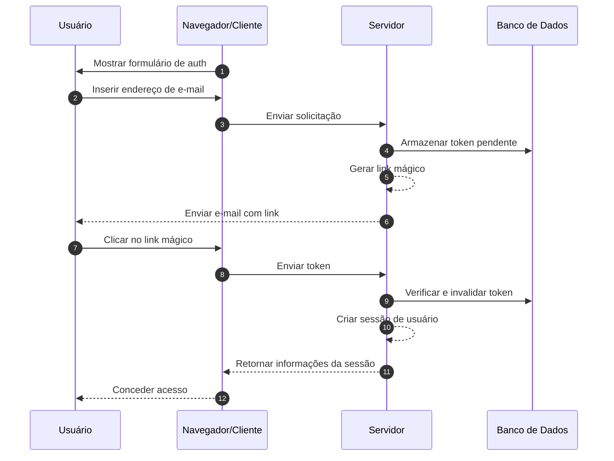
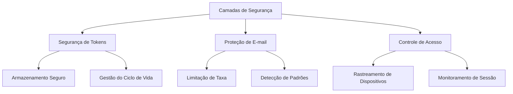

## O que são links mágicos (magic links)?

Um link mágico (magic link) é uma URL segura e com tempo limitado que permite a autenticação passwordless tanto para processos de registro quanto de login. Em vez de criar e lembrar senhas, os usuários recebem um link especial por e-mail que lhes concede acesso imediato. Pense nisso como uma chave digital que funciona apenas uma vez - quando você clica, está autenticado, e então essa chave se torna inválida.

Por exemplo, quando você se inscreve no Medium ou tenta fazer login no Slack, em vez de configurar ou inserir uma senha, essas plataformas enviam um e-mail com um link seguro. Um clique, e você está autenticado. Essa abordagem ganhou popularidade significativa porque combina segurança com simplicidade.

## Como funcionam os links mágicos (magic links)?

O processo é simples do ponto de vista do usuário, mas envolve mecanismos de segurança sofisticados nos bastidores. Veja o que acontece durante um fluxo típico de autenticação com link mágico (magic link):



## Qual é a estrutura de um link mágico (magic link)?

Um link mágico típico consiste em vários componentes:

- URL base da aplicação
- Endpoint de autenticação
- Parâmetro de token
- Parâmetros adicionais (opcional)

Por exemplo:

```
https://app.example.com/verify-auth?token=abc123...&redirect=/dashboard
```

## Como é gerado o token de um link mágico (magic link)?

Quando um usuário solicita um link mágico (magic link) (por exemplo, clicando em "Entrar com E-mail"), precisamos gerar um token seguro e imprevisível. Este token é crucial, pois essencialmente se torna uma senha temporária.

O token deve ser gerado usando um <Ref slug='csprng' />. Um CSPRNG usa entropia do hardware do seu sistema (como tempo de teclado, movimentos do mouse, ruído do ventilador, etc.) para gerar números verdadeiramente aleatórios que são impossíveis de prever, mesmo que um invasor conheça saídas anteriores.

Por exemplo, em Node.js:

```javascript
import crypto from "node:crypto";

// Gerar um token aleatório seguro
const token = crypto.randomBytes(32).toString("base64url");
// Resultado: algo como 'dBjftJeZ4CVP-mB92K27uhbUJU1p1r_wW1gFWFOEjXk'

// Alternativa usando Web Crypto API (disponível em Node.js e navegadores)
const buffer = crypto.getRandomValues(new Uint8Array(32));
const token2 = Buffer.from(buffer).toString("base64url");
```

Requisitos para um token seguro:

- Gerado via CSPRNG para garantir imprevisibilidade
- Pelo menos 32 bytes de comprimento (256 bits de entropia)
- Codificado de forma segura para URL (base64url elimina caracteres problemáticos)
- Com tempo limitado e uso único para prevenir ataques de repetição
- Armazenado de forma segura com metadados (expiração, informações do usuário)

## Como garantir a segurança da autenticação com link mágico (magic link)

A segurança do link mágico (magic link) requer uma abordagem abrangente em várias camadas. Enquanto a entrega de e-mails e os padrões de acesso são críticos, o manuseio seguro de tokens permanece o alicerce da segurança do sistema.

### Fundamentos de segurança de tokens

A segurança dos links mágicos (magic links) depende fortemente da implementação adequada de tokens (veja o conteúdo acima). Cada token deve ser criptograficamente seguro e devidamente gerenciado ao longo de seu ciclo de vida. O sistema deve impor uma expiração rigorosa de tokens (tipicamente 15-30 minutos) e invalidação imediata após o uso.

Ao armazenar tokens, trate-os com o mesmo nível de segurança que senhas:

- Hash de tokens antes do armazenamento para prevenir exposição
- Implementar limpeza automática de tokens expirados
- Manter um registro de auditoria do uso e invalidação de tokens
- Armazenar metadados associados (tempo de criação, usuário pretendido, informações do dispositivo)

### Segurança na entrega de e-mails

O e-mail serve como o principal canal de entrega para links mágicos (magic links), tornando-o um alvo potencial para ataques. Implementar limitação de taxa é essencial para prevenir tentativas de força bruta e proteger contra ataques de bombardeio de e-mails. Por exemplo, você pode limitar os usuários a 5 solicitações de link mágico por hora a partir do mesmo endereço IP.

Além disso, monitorar padrões de atividade incomuns ajuda a detectar possíveis violações de segurança. Isso inclui:

- Múltiplas solicitações de diferentes IPs para o mesmo e-mail
- Padrões de acesso geográfico incomuns
- Solicitações rápidas que indicam ataques automatizados

### Controle de acesso e monitoramento

A impressão digital do dispositivo adiciona uma camada extra de segurança ao rastrear padrões consistentes de comportamento do usuário. Quando uma tentativa de login vem de um novo dispositivo ou local, você pode implementar etapas adicionais de verificação ou alertar o usuário.

Para segurança aprimorada em aplicativos sensíveis:

- Combine links mágicos (magic links) com fatores adicionais de autenticação
- Implemente monitoramento contínuo de sessão
- Registre todos os eventos de autenticação para trilhas de auditoria
- Adicione verificação baseada em dispositivo para novos locais



## Links mágicos (magic links) vs SMS / Email OTP

Tanto os Links Mágicos (Magic Links) quanto o SMS / Email OTP dependem de canais externos para verificação.

Os Links Mágicos (Magic Links) enviam uma URL única para o e-mail do usuário, enquanto o OTP envia um código de verificação para o telefone ou e-mail.

Os Links Mágicos (Magic Links) oferecem uma experiência superior em desktops, pois os usuários simplesmente clicam no link para completar a verificação, eliminando a necessidade de inserir códigos manualmente. Eles também podem carregar informações de contexto adicionais, permitindo fluxos de autenticação mais sofisticados.

No entanto, em cenários móveis, o SMS OTP pode oferecer melhor usabilidade, pois os usuários podem visualizar rapidamente e inserir códigos de verificação.

## Links mágicos (magic links) vs aplicativos autenticadores

Comparados aos códigos OTP gerados por Aplicativos Autenticadores, os Links Mágicos (Magic Links) não exigem que os usuários instalem aplicativos adicionais e funcionam perfeitamente em todos os dispositivos. Isso reduz o atrito, especialmente para usuários não técnicos. No entanto, Aplicativos Autenticadores geram códigos OTP com melhor confiabilidade em tempo real, independentes das velocidades de entrega e disponibilidade do servidor de e-mail.

Para cenários que exigem autenticação frequente com altos requisitos de segurança, Aplicativos Autenticadores podem ser a escolha preferida.

## Quando usar links mágicos (magic links)

Os links mágicos (magic links) são particularmente eficazes para aplicativos empresariais e de negócios onde os usuários normalmente fazem login com menos frequência, como ferramentas de gerenciamento de projetos ou painéis de relatórios. Nesses cenários, o leve atraso na entrega de e-mails é insignificante em comparação com a conveniência de não gerenciar senhas.

### Cenários ideais

Esses métodos de autenticação brilham em contextos empresariais onde o e-mail já é o principal canal de comunicação. Por exemplo, plataformas de colaboração como Slack ou Notion utilizam links mágicos (magic links) de forma eficaz porque:

- Os usuários já estão monitorando ativamente seus e-mails
- As sessões de login tendem a ser de longa duração
- O foco está em reduzir o atrito no processo de autenticação

Os links mágicos (magic links) também são excelentes para fluxos de registro de usuários em produtos SaaS onde a otimização de conversão é crucial. Quando os usuários podem começar a usar seu serviço apenas com um endereço de e-mail, isso reduz significativamente as taxas de desistência durante o processo de integração.

### Quando considerar alternativas

No entanto, os links mágicos (magic links) podem não ser a melhor escolha para aplicativos que exigem autenticação frequente. Aplicativos de banco móvel, por exemplo, precisam de métodos de autenticação rápidos e confiáveis, já que os usuários podem verificar seu saldo várias vezes ao dia. Nesses casos, a autenticação biométrica ou códigos PIN geralmente oferecem uma melhor experiência do usuário.

Considere métodos de autenticação alternativos quando:

- Seu aplicativo é principalmente baseado em dispositivos móveis
- Os usuários precisam de acesso imediato sem dependência de e-mail
- O ambiente requer autenticação multifatorial
- Atrasos na entrega de e-mails podem impactar significativamente a experiência do usuário

A chave é alinhar seu método de autenticação com os padrões de comportamento dos usuários e requisitos de segurança. Embora os links mágicos (magic links) ofereçam excelente segurança com atrito mínimo, eles devem fazer parte de uma estratégia de autenticação mais ampla, em vez de serem a única solução.

<SeeAlso slugs={["csprng", "passwordless", "otp", "totp"]} />