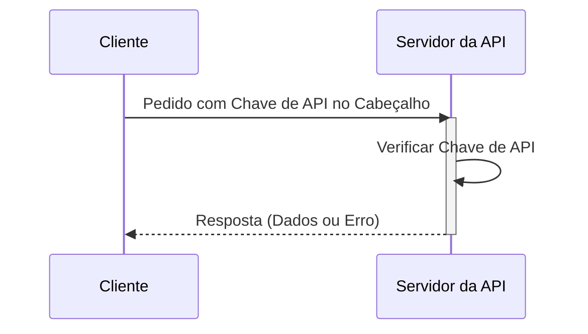

## O que é uma chave de API?

Uma chave de API é um token secreto usado para autenticar clientes que acedem a uma API. É como uma senha para a tua aplicação, permitindo o acesso a uma API específica. Pensa nela como um cartão de acesso para entrar num edifício. O cartão concede acesso, mas não identifica necessariamente quem és.

## Como funcionam as chaves de API?

As chaves de API funcionam através de um processo simples de pedido e resposta.

1. **Pedido:** A tua aplicação envia um pedido para a API, incluindo a chave de API. A chave é frequentemente enviada no cabeçalho do pedido. Por exemplo, o cabeçalho pode parecer assim: `x-api-key: your_actual_api_key`. Não há um padrão único para nomes de cabeçalho ou formatos de valor.

2. **Verificação:** O servidor da API verifica a chave fornecida em relação à sua base de dados.

3. **Resposta:** Se a chave for válida, o servidor concede acesso e envia de volta os dados solicitados. Caso contrário, o acesso é negado.

Aqui está um diagrama de sequência que ilustra o processo:

## Quais são os prós e contras das chaves de API?

Vamos ver o que torna as chaves de API úteis e onde elas falham:

### Prós

- **Super simples de usar**: Basta adicionar uma chave ao teu pedido e estás pronto para ir! É como usar uma chave de casa - sem passos complicados necessários.

- **Fácil de rastrear**: Queres saber quem está a usar a tua API? As chaves de API tornam isso simples. Podes ver quais aplicações estão a fazer chamadas e com que frequência.

- **Limitação de taxa rápida**: Impede que as pessoas usem excessivamente a tua API definindo limites por chave. É como ter um segurança num clube que conta quantas vezes alguém entra e sai.

- **Perfeito para dados públicos**: Se estás a partilhar informações não sensíveis (como dados meteorológicos ou estatísticas públicas), as chaves de API são ideais.

### Contras

- **Menos seguras do que alternativas modernas**: As chaves de API não são tão eficazes quanto outras formas de autenticação de API, como <Ref slug="oauth-2.0" /> e <Ref slug="jwt" />. Pensa nelas como um cadeado básico em comparação com um sistema de segurança moderno. No entanto, continuam populares porque são a maneira mais simples de rastrear o uso da API e começar com a segurança da API.

- **Riscos de segurança**: As chaves de API são como deixar a chave de casa debaixo do tapete. Se alguém a encontrar, pode usá-la para sempre. Eis porquê:
  - Muitas vezes são visíveis no código
  - Não expiram automaticamente
  - Se vazadas (como em repositórios públicos do GitHub), qualquer pessoa pode usá-las

- **Não conseguem distinguir utilizadores**: Embora algumas empresas usem "chaves de API" que podem identificar utilizadores (como a Stripe), as chaves de API tradicionais não conseguem dizer quem é quem. Apenas dizem qual aplicação está a fazer o pedido.

- **Estáticas por natureza**: Ao contrário dos tokens de auth modernos que expiram, as chaves de API geralmente permanecem as mesmas para sempre. Isso significa:
  - Sem atualizações automáticas de segurança
  - Trabalho manual necessário para rodar chaves
  - Maior risco se as chaves forem expostas

## Quais são os casos de uso para chaves de API?

- Comunicação de serviço para serviço: As chaves de API são adequadas para cenários onde aplicações precisam comunicar com APIs diretamente através de CLIs. Ex.: Chamadas a APIs da OpenAI.
- APIs públicas: Ao expor APIs ao público, as chaves de API fornecem um método direto de controlo de acesso.
- Configuração simplificada: Para necessidades de autenticação rápidas e simples, especialmente na fase de desenvolvimento. Ao contrário da autenticação Machine-to-machine, as chaves de API não requerem registo prévio do cliente, nem precisam de ser trocadas por um access token. Basta passar a tua chave de API como um parâmetro no teu pedido e simplesmente funciona.

Em cenários do mundo real, o propósito mais comum ao construir produtos é a integração de produtos. Aqui está um caso de uso típico:

### Exemplo: Integração com a Stripe

A Stripe usa chaves de API para integração segura com diferentes plataformas e aplicações. Podes criar, visualizar, eliminar e gerir estas chaves através do Developers Dashboard. Usando chaves de API, podes integrar as funcionalidades de checkout e faturação da Stripe no teu produto.

## Qual é a diferença entre Tokens de Acesso Pessoal (PAT) e Machine-to-Machine (M2M)?

Ao falar sobre chaves de API, tokens de acesso pessoal e <Ref slug="machine-to-machine" /> também podem ser mencionados juntos, uma vez que todos podem aceder programaticamente a recursos de API através de comandos CLI, ou estabelecer comunicação entre serviços de backend.

### Tokens de Acesso Pessoal (PATs)

Um token de acesso pessoal também é uma string, mas representa a identidade e permissões de ***um utilizador específico***, é gerado dinamicamente após autenticação ou login bem-sucedido, e geralmente tem uma vida útil limitada, mas pode ser renovado. Fornece controlo de acesso detalhado a dados e capacidades específicas do utilizador e são comumente usados para ferramentas CLI, scripts ou acesso pessoal à API. A principal diferença é que é mais específico e usado para ações específicas do utilizador.

### Machine-to-Machine (M2M)

A comunicação M2M é quando dispositivos trocam dados automaticamente sem envolvimento humano num sentido mais amplo.

No contexto de <Ref slug="openid-connect" /> (ou <Ref slug="oauth-2.0" />), aplicações M2M usam o <Ref slug="client-credentials-flow" />, conforme definido no [protocolo OAuth 2.0 RFC 6749](https://datatracker.ietf.org/doc/html/rfc6749), que suporta protocolos padrão semelhantes. Geralmente envolve uma aplicação cliente (uma máquina ou serviço) acedendo a recursos, seja por conta própria ou em nome de um utilizador. É ideal para situações onde apenas clientes confiáveis podem aceder a serviços de backend.

<SeeAlso slugs={["machine-to-machine"]} />