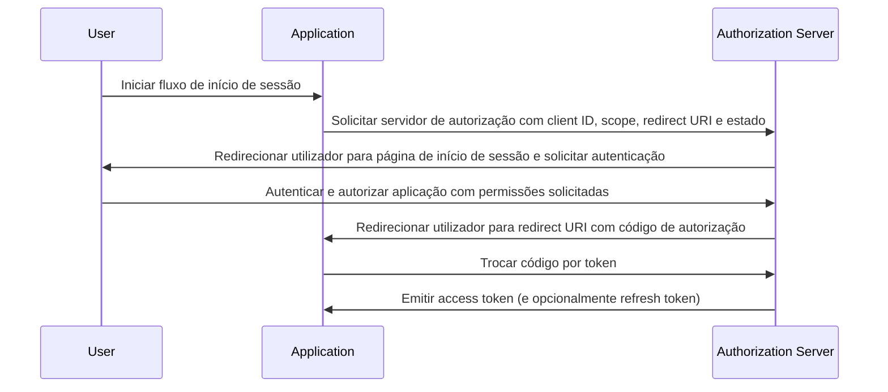

## O que é o fluxo de código de autorização (authorization code flow)?

O fluxo de código de autorização (authorization code flow) (também conhecido como concessão de código de autorização), definido em [OAuth 2.0 RFC 6749, seção 4.1](https://datatracker.ietf.org/doc/html/rfc6749#section-4.1), é um mecanismo de autorização OAuth 2.0 amplamente utilizado que permite que aplicações obtenham um access token em nome de um utilizador.

Este fluxo é ideal para aplicações confidenciais, como aplicações web tradicionais do lado do servidor, que podem armazenar com segurança segredos de cliente.

Também pode ser usado de forma segura para aplicações nativas e Aplicações de Página Única (SPAs) que não podem armazenar com segurança segredos de cliente quando combinadas com a extensão PKCE (<Ref slug="pkce" />).

## Como funciona o fluxo de código de autorização (authorization code flow)?

O fluxo de código de autorização (authorization code flow) envolve os seguintes passos:

1. **Iniciação do fluxo**: O utilizador inicia o fluxo, normalmente clicando num link ou botão na aplicação para iniciar sessão. A aplicação redireciona o utilizador para o endpoint de autorização do servidor de autorização, passando o client ID, o scope solicitado, um redirect URI e um parâmetro de estado. O servidor de autorização valida os parâmetros e solicita que o utilizador se autentique na página de início de sessão do servidor de autorização.
2. **Autenticação e autorização do utilizador**: O utilizador autentica-se com o servidor de autorização e concede à aplicação permissão para aceder aos recursos solicitados.
3. **Geração de código e redirecionamento**: O servidor de autorização gera um código de autorização e redireciona o utilizador de volta para a aplicação usando o redirect URI fornecido anteriormente. O código de autorização é incluído na string de consulta do redirect URI.
4. **Troca de código**: A aplicação extrai o código de autorização da string de consulta e faz um pedido POST para o endpoint de token do servidor de autorização para trocar o código de autorização por um access token. A aplicação também deve incluir o client ID, client secret, redirect URI e o código de autorização no pedido.
5. **Recuperação do access token**: O servidor de autorização valida o código de autorização e emite um access token (e opcionalmente um refresh token) para a aplicação após validação bem-sucedida. A aplicação pode então usar o access token para fazer pedidos de API autorizados em nome do utilizador.

Os passos podem ser ilustrados pelo seguinte diagrama de sequência:



## Como implementar o fluxo de código de autorização (authorization code flow)?

Aqui está um exemplo simples de implementação do fluxo de código de autorização (authorization code flow), seguindo as diretrizes descritas em [OAuth 2.0 RFC 6749, seção 4.1](https://datatracker.ietf.org/doc/html/rfc6749#section-4.1):

### 1. Configuração inicial

Certifica-te de que tens as seguintes informações do teu serviço de auth antes de começares:

```javascript
const config = {
  clientId: "YOUR_CLIENT_ID",
  clientSecret: "YOUR_CLIENT_SECRET",
  authorizationEndpoint: "https://authorization-server.com/auth",
  tokenEndpoint: "https://authorization-server.com/token",
  redirectUri: "http://localhost:3000/callback",
};
```

Client ID, client secret e redirect URI são a configuração da tua aplicação no serviço de auth.

O `authorizationEndpoint` e `tokenEndpoint` são fornecidos pelo teu serviço de auth.

Se o teu servidor de auth implementar OIDC (<Ref slug="openid-connect" />), podes obter esta informação através de <Ref slug="openid-connect-discovery" />.

### 2. Iniciar pedido de autorização

O fluxo começa quando um utilizador quer iniciar sessão (por exemplo, clicando num botão de login). A aplicação fará um pedido de login.

Este pedido inclui parâmetros como `client ID`, `redirect URI` e `scope`. Depois, redireciona o utilizador para o endpoint de autorização do serviço de auth (a página de login do serviço de auth).

O utilizador irá autenticar-se e autorizar nesta página de login.

```javascript
app.get("/login", (req, res) => {
  const authUrl = new URL(config.authorizationEndpoint);
  authUrl.searchParams.append("response_type", "code");
  authUrl.searchParams.append("client_id", config.clientId);
  authUrl.searchParams.append("redirect_uri", config.redirectUri);
  authUrl.searchParams.append("scope", "openid profile email");
  authUrl.searchParams.append("state", "random_state_string");

  res.redirect(authUrl.toString());
});
```

Nota: Podes adicionar mais parâmetros além dos mostrados no exemplo de código. Vê [Definição completa dos parâmetros do pedido de autenticação](https://openid.net/specs/openid-connect-core-1_0.html#AuthRequest).

### 3. Lidar com o callback do redirect URI e troca de token

Após o utilizador completar a autenticação e autorização na página de login do serviço de auth, o serviço de auth redireciona o utilizador de volta para o redirect URI da aplicação. Este redirect URI inclui os parâmetros de código de autorização e estado.

A aplicação extrai os parâmetros de código de autorização e estado do redirect URI e troca-os por access e refresh tokens (se houver) no endpoint de token do serviço de auth.

```javascript
app.get("/callback", async (req, res) => {
  const { code, state } = req.query;

  try {
    // Trocar o código de autorização por um access token e refresh token
    const tokenResponse = await axios.post(config.tokenEndpoint, {
      grant_type: "authorization_code",
      code,
      redirect_uri: config.redirectUri,
      client_id: config.clientId,
      client_secret: config.clientSecret,
    });

    const { access_token, refresh_token } = tokenResponse.data;
    // Armazenar tokens para pedidos subsequentes
    req.session.accessToken = access_token;

    res.send("Autenticação bem-sucedida!");
  } catch (error) {
    res.status(500).send("Falha na troca de token");
  }
});
```

### 4. Usar access token

Uma vez que tenhas o token, usa-o para aceder a recursos protegidos:

```javascript
async function fetchUserProfile(accessToken) {
  const response = await axios.get("https://api.example.com/userinfo", {
    headers: {
      Authorization: `Bearer ${accessToken}`,
    },
  });
  return response.data;
}
```

## Como usar o fluxo de código de autorização (authorization code flow) para clientes públicos (aplicações nativas e SPAs)?

Clientes públicos (como aplicações nativas e SPAs) enfrentam desafios de segurança únicos ao usar o fluxo de código de autorização (authorization code flow). Estas aplicações não podem armazenar com segurança segredos de cliente. O client secret seria exposto no código JavaScript ou no armazenamento do dispositivo. Isso facilita que atacantes extraiam e usem indevidamente o segredo.

Portanto, o principal desafio é como usar o fluxo de código de autorização (authorization code flow) de forma segura sem um client secret. A especificação OAuth 2.0 introduziu a extensão PKCE (<Ref slug="pkce" />) para resolver este problema.

PKCE adiciona medidas de segurança adicionais para proteger o fluxo de código de autorização (authorization code flow) para clientes públicos. Ele previne ataques de interceptação de código de autorização mesmo sem usar um client secret. Confira este blog para saber mais sobre [Como o PKCE protege o fluxo de código de autorização (authorization code flow) para aplicações nativas](https://blog.logto.io/how-pkce-protects-the-authorization-code-flow-for-native-apps).

## Como usar o fluxo de código de autorização (authorization code flow) de forma segura?

### **Usar "state" para prevenir ataques CSRF**

Ataques CSRF (<Ref slug="csrf" />) enganam utilizadores para realizar ações indesejadas numa aplicação web autenticada. O parâmetro de estado ajuda a prevenir isso.

- Gera um valor único e aleatório. Armazena este valor no lado do servidor.
- Inclui o parâmetro de estado. Anexa-o ao URL do pedido de autorização.
- Verifica o estado ao retornar. Quando o servidor de autorização redireciona de volta para a tua aplicação, compara o estado retornado com o valor armazenado. Se não corresponderem, rejeita o pedido. Isso confirma que o pedido originou-se da tua aplicação.

### **Configurar URIs de redirecionamento seguros**

O redirect URI é onde o servidor de autorização envia o código de autorização após a autenticação do utilizador. A configuração segura é crucial.

- Registra URIs de redirecionamento válidos. Durante o registro da aplicação com o servidor de autorização, especifica os URIs de redirecionamento permitidos.
- Correspondência exata. O redirect URI no pedido de autorização deve corresponder exatamente a um URI registrado. Mesmo uma pequena diferença pode criar uma vulnerabilidade.
- Evita URIs com caracteres curinga. Se possível, evita usar URIs com caracteres curinga em produção. Eles ampliam a superfície de ataque.
- HTTPS para produção. Usa sempre HTTPS para URIs de redirecionamento em ambientes de produção.

### **Usar PKCE para todos os clientes**

Embora o PKCE tenha sido originalmente projetado para clientes públicos, a especificação <Ref slug="oauth-2.1" /> exige que o PKCE seja aplicado a todos os clientes, incluindo clientes confidenciais, para melhorar a segurança geral do fluxo de código de autorização (authorization code flow). (Veja [Aplicar PKCE para todos os clientes](https://auth.wiki/oauth-2.1#enforcing-pkce-for-all-clients))

## Qual é a diferença entre o fluxo de código de autorização (authorization code flow) e o fluxo implícito (implicit flow)?

A principal diferença entre o fluxo de código de autorização (authorization code flow) e o fluxo implícito (implicit flow) é como o access token é obtido:

- **Fluxo de código de autorização (authorization code flow)**: A aplicação cliente recebe primeiro um código de autorização do endpoint de autorização, depois troca-o por um access token num pedido POST subsequente para o endpoint de token.
- **Fluxo implícito (implicit flow)**: A aplicação cliente recebe o access token diretamente no fragmento de URL do redirect URI após a autorização do utilizador.

Saiba mais sobre <Ref slug="implicit-flow" />.

## Qual é a diferença entre o fluxo de código de autorização (authorization code flow) e o fluxo de credenciais do cliente (client credentials flow)?

A principal diferença entre o fluxo de código de autorização (authorization code flow) e o fluxo de credenciais do cliente (client credentials flow) é o contexto em que o fluxo é usado:

- **Fluxo de código de autorização (authorization code flow)**: Usado quando a aplicação cliente precisa acessar recursos em nome de um utilizador. O fluxo envolve autenticação e autorização do utilizador.
- **Fluxo de credenciais do cliente (client credentials flow)**: Usado quando a aplicação cliente precisa acessar recursos em seu próprio nome. O fluxo envolve autenticação do cliente, mas não autenticação do utilizador, sendo mais adequado para comunicação máquina a máquina.

Saiba mais sobre <Ref slug="client-credentials-flow" />.

<SeeAlso
  slugs={[
    "device-flow",
    "implicit-flow",
    "client-credentials-flow",
    "pkce",
    "openid-connect",
    "openid-connect-discovery",
    "csrf",
    "oauth-2.1",
  ]}
/>

<Resources urls={[
  "https://datatracker.ietf.org/doc/html/rfc6749",
  "https://openid.net/specs/openid-connect-core-1_0.html#AuthRequest",
  "https://blog.logto.io/how-pkce-protects-the-authorization-code-flow-for-native-apps"
]} />