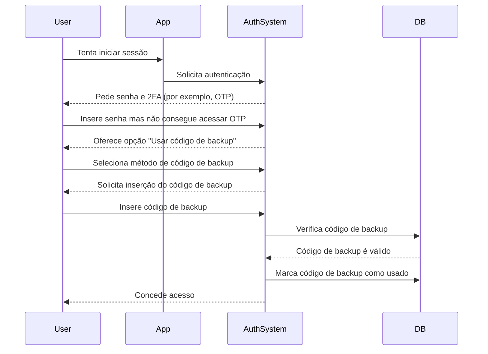

## O que é um código de backup?

Um código de backup (também chamado de código de recuperação) é um conjunto de códigos gerados aleatoriamente, de uso único, que servem como método de autenticação de reserva quando as suas opções principais de MFA — como SMS, aplicações de autenticação ou passkeys — não estão disponíveis. Pense neles como chaves de emergência que garantem que você pode sempre acessar a sua conta, mesmo se perder o seu telefone, enfrentar problemas de rede ou encontrar falhas técnicas.

## Como funciona um código de backup?

Os códigos de backup fornecem uma maneira simples, mas segura, de recuperar o acesso à sua conta quando os métodos padrão de MFA falham. Veja como eles funcionam:

1. **Geração**: O sistema cria um conjunto único de códigos (normalmente de 8 a 12 caracteres cada) durante a configuração do MFA.
2. **Armazenamento**: Você é solicitado a salvar esses códigos de forma segura — seja offline (por exemplo, impresso em papel) ou em um gerenciador de senhas criptografado.
3. **Uso**: Se você não puder usar o seu método principal de MFA, insira um dos seus códigos de backup para autenticar.
4. **Invalidação**: Cada código é automaticamente desativado após o uso para evitar reutilização.

## Quando usar um código de backup?

Os códigos de backup se tornarão obsoletos? O MFA ainda deve suportá-los?

Absolutamente. Os códigos de backup continuam a ser uma rede de segurança crítica para o MFA. Embora métodos mais novos como passkeys e FIDO2 estejam ganhando força, os códigos de backup oferecem uma opção de recuperação universalmente acessível e independente de dispositivo. Eles são uma salvaguarda de baixo custo e alto valor e devem sempre ser suportados juntamente com métodos modernos de MFA.

Use um código de backup quando:

- O seu dispositivo principal de MFA não estiver disponível (por exemplo, telefone perdido, bateria descarregada).
- Problemas de rede impedem a entrega de SMS/email.
- A sua aplicação de autenticação falha em sincronizar.
- O seu token de hardware apresenta falhas.

## Como usar um código de backup com segurança?

Para garantir que os seus códigos de backup permaneçam seguros:

1. **Armazene-os offline**
    - Salve-os em uma pasta criptografada no seu dispositivo.
    - Imprima-os e armazene-os em um local seguro (por exemplo, um cofre com teclado).
    - Evite armazená-los em formatos digitais não seguros (por exemplo, aplicativos de notas online).
2. **Use um gerenciador de senhas**
    - A maioria dos gerenciadores de senhas (por exemplo, 1Password, LastPass) oferece um recurso de notas seguras.
        - Crie uma nova entrada: "Códigos de Backup – [Nome do Serviço]"
        - Copie e cole os seus códigos de backup, depois ative a criptografia.
    - Se usar o Google Password Manager, você pode:
        - Encontrar a entrada do serviço relevante.
        - Editá-la e adicionar uma nota para os seus códigos de backup, e rotular os códigos como "Usados/Não usados" para acompanhá-los.
        - Desta forma, ao preencher automaticamente senhas, você pode acessar rapidamente os seus códigos de backup quando necessário.
3. **Substitua os códigos usados**
    - Gere novos códigos se você tiver usado a maioria deles ou suspeitar que foram comprometidos.

## Projetando uma experiência de MFA com códigos de backup

Para desenvolvedores que implementam códigos de backup, siga estas melhores práticas:

1. **Não dependa apenas de códigos de backup**
Eles são uma reserva de emergência, não um método principal de MFA. Sempre ofereça TOTP, passkeys ou outras opções robustas.
2. **Forneça de 8 a 10 códigos por padrão**
    
    Isso equilibra a usabilidade (suficiente para emergências raras) e a segurança (minimiza o risco de roubo em massa).
    
3. **Imponha uso único**
    
    Invalide automaticamente os códigos após o uso.
    
4. **Regeneração automática de códigos quando esgotados**
    
    Evite bloqueios emitindo novos códigos assim que um usuário esgotar o seu conjunto atual.
    
5. **Permita regeneração manual com verificação rigorosa**
    
    Deixe os usuários gerarem novos códigos se perderem os seus, mas exija reautenticação (por exemplo, confirmação por email/SMS/senha).
    

## Códigos de backup vs. Senhas: Qual é a diferença?

| Característica | Códigos de backup | Senhas |
| --- | --- | --- |
| **Propósito** | Reserva de uso único quando o MFA falha | Método principal de autenticação |
| **Formato** | Gerado pelo sistema, alfanumérico | Escolhido pelo usuário, geralmente mistura de caracteres |
| **Armazenamento** | Hashed (geralmente sem sal, pois são de uso único) | Hashed + salgado (para prevenir ataques de tabela arco-íris) |
| **Uso** | Desativado após um uso | Reutilizável até ser alterado |
| **Regeneração** | Sistema emite novos conjuntos | Usuário redefine manualmente |
| **Segurança** | Deve ser armazenado com segurança | Vulnerável se fraco ou reutilizado |

**Notas de segurança importantes:**

- Ambos devem ser longos e gerados aleatoriamente para resistir a ataques de força bruta.
- Senhas requerem salting porque os usuários frequentemente as reutilizam.
- Códigos de backup geralmente não precisam de salting — são de uso único e gerados aleatoriamente, tornando explorações em larga escala improváveis.

<Resources
  urls={[
    "https://docs.logto.io/end-user-flows/mfa",
    "https://auth-wiki.logto.io/mfa",
    "https://auth-wiki.logto.io/totp"
  ]}
/>