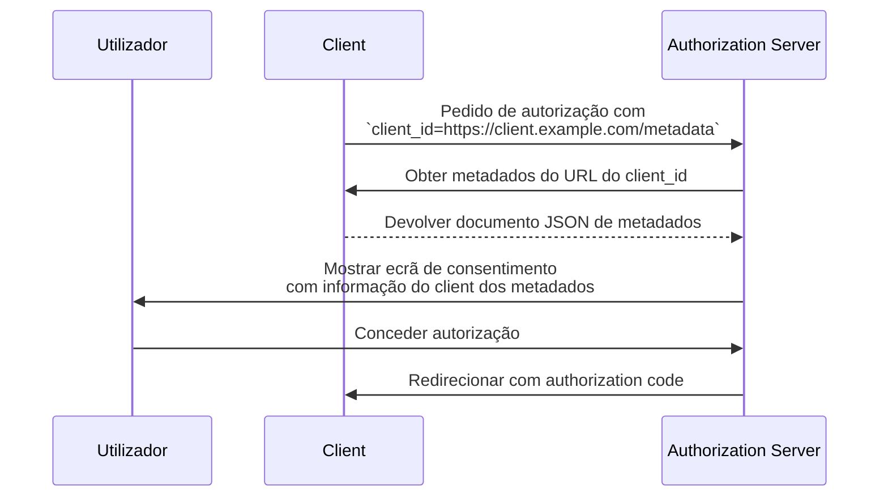

## O que é um Documento de Metadados de Client ID (Client ID Metadata Document)?

Um Documento de Metadados de Client ID (Client ID Metadata Document) é um mecanismo definido na especificação [OAuth Client ID Metadata Document](https://datatracker.ietf.org/doc/draft-ietf-oauth-client-id-metadata-document/) que permite a um OAuth 2.0 <Ref slug="client" /> identificar-se perante um <Ref slug="authorization-server" /> sem registo prévio.

A ideia central: em vez de receber um `client_id` do authorization server (através de registo manual ou [Dynamic Client Registration](https://datatracker.ietf.org/doc/html/rfc7591)), o client **usa um URL HTTPS como seu `client_id`**. Esse URL aponta para um documento JSON contendo os metadados do client — nome, redirect URIs, tipos de grant suportados, e mais. O authorization server obtém este documento quando encontra um `client_id` baseado em URL.

Esta abordagem é por vezes abreviada como **CIMD** (Client ID Metadata Document) na comunidade.

## Como funciona?

Quando um client utiliza um Documento de Metadados de Client ID (Client ID Metadata Document), o fluxo OAuth adiciona um passo: o authorization server resolve o URL do `client_id` para obter os metadados do client.



O que acontece passo a passo:

1. O client inicia um <Ref slug="authorization-request" /> com o seu URL como `client_id` (por exemplo, `https://client.example.com/oauth-client`).
2. O authorization server reconhece o `client_id` como um URL e faz o fetch via HTTPS.
3. A resposta é um documento JSON contendo os metadados padrão do client OAuth.
4. O authorization server valida os metadados, mostra a informação de consentimento ao utilizador e prossegue com o fluxo OAuth.
5. Pedidos subsequentes podem usar metadados em cache de acordo com os headers de cache HTTP.

### O documento de metadados

O documento de metadados é um objeto JSON que utiliza os mesmos campos definidos na [RFC 7591 (OAuth 2.0 Dynamic Client Registration Protocol)](https://datatracker.ietf.org/doc/html/rfc7591). Deve incluir um campo `client_id` cujo valor corresponde exatamente ao URL.

Exemplo:

```json
{
  "client_id": "https://client.example.com/oauth-client",
  "client_name": "A Minha Aplicação",
  "redirect_uris": ["https://client.example.com/callback"],
  "grant_types": ["authorization_code", "refresh_token"],
  "response_types": ["code"],
  "token_endpoint_auth_method": "none",
  "scope": "openid profile email"
}
```

### Requisitos do URL do identificador do client

A especificação impõe requisitos rigorosos sobre o que constitui um URL válido de identificador de client:

- **Deve usar HTTPS** — não é permitido HTTP simples ou outros esquemas.
- **Deve incluir um componente de caminho (path)** — um domínio simples como `https://example.com` não é válido.
- **Não pode conter** fragmentos, nome de utilizador ou componentes de palavra-passe.
- **Não pode conter** segmentos de caminho de ponto único (`.`) ou duplo (`..`).
- Query strings são permitidas mas desaconselhadas.
- Números de porta são permitidos.

Por exemplo:
- `https://client.example.com/oauth-client` — válido
- `http://client.example.com/oauth-client` — inválido (não é HTTPS)
- `https://example.com` — inválido (sem caminho)
- `https://client.example.com/../oauth-client` — inválido (segmento de ponto)

## Porque não usar métodos de registo existentes?

Para perceber porque existe esta especificação, considera as limitações das abordagens existentes:

### Registo estático

Em implementações OAuth tradicionais, um programador regista manualmente o client no authorization server — normalmente através de uma consola de administração — e recebe um `client_id`. Isto funciona quando conheces os teus clients de antemão.

Não funciona para ecossistemas abertos onde qualquer client pode precisar de se ligar. Não podes pré-registar todos os possíveis agentes de IA ou clients MCP.

### Dynamic Client Registration (DCR)

[Dynamic Client Registration (RFC 7591)](https://datatracker.ietf.org/doc/html/rfc7591) permite que os clients se registem programaticamente enviando os seus metadados para um endpoint de registo. O servidor cria um `client_id` e armazena o registo.

Isto funciona, mas cria estado do lado do servidor: cada registo produz um registo que precisa de ser armazenado, mantido e eventualmente limpo. Num ecossistema aberto com muitos clients, o authorization server acumula registos — a maioria dos quais pode ser usada uma vez e abandonada.

O DCR também não tem um mecanismo embutido para verificar se um client é quem afirma ser. Qualquer client pode registar-se com qualquer nome ou logótipo.

### Vantagens do Documento de Metadados de Client ID (Client ID Metadata Document)

A abordagem do Documento de Metadados de Client ID (Client ID Metadata Document) resolve estas questões:

| Aspeto | Registo estático | DCR | Documento de Metadados de Client ID (Client ID Metadata Document) |
|--------|-------------------|-----|----------------------------|
| Estado do lado do servidor | Sim (registos armazenados) | Sim (registos armazenados) | Não (obtido sob pedido) |
| Pré-registo necessário | Sim | Não | Não |
| Verificação de identidade | Revisão manual | Nenhuma embutida | Propriedade do domínio via HTTPS |
| Limpeza necessária | Sim | Sim (registos abandonados) | Não (auto-limpeza via cache HTTP) |
| Client controla metadados | Não | No momento do registo | Sim (atualiza a qualquer momento) |

O ponto-chave é que **a propriedade do domínio torna-se o pilar de confiança**. Só a entidade que controla `client.example.com` pode alojar conteúdo em `https://client.example.com/oauth-client`. O certificado HTTPS prova isto sem necessidade de verificação adicional.

## Restrições de autenticação

Como não existe segredo partilhado previamente entre o client e o authorization server, métodos de autenticação baseados em segredo simétrico não podem ser usados. O documento de metadados **não deve** incluir:

- `client_secret_post`
- `client_secret_basic`
- `client_secret_jwt`
- Qualquer método que dependa de um segredo simétrico partilhado

Os campos `client_secret` e `client_secret_expires_at` também não devem aparecer no documento.

Se o client precisar de se autenticar para além de ser um client público, pode usar criptografia assimétrica. O client publica as suas chaves públicas no documento de metadados (através de uma propriedade `jwks` ou uma referência `jwks_uri`) e autentica-se no token endpoint usando `private_key_jwt`. O authorization server verifica a assinatura JWT contra o <Ref slug="jwk">JWK</Ref> publicado.

## Como é que o authorization server descobre o suporte?

Os authorization servers indicam suporte para Documentos de Metadados de Client ID (Client ID Metadata Documents) incluindo a seguinte propriedade no seu <Ref slug="authorization-server-metadata" />:

```json
{
  "client_id_metadata_document_supported": true
}
```

Os clients podem verificar este flag antes de iniciar um fluxo de autorização com um `client_id` baseado em URL. Se o authorization server não anunciar suporte, o client deve recorrer a outros métodos de registo.

## Considerações de segurança

### Proteção contra SSRF

Quando o authorization server obtém o URL de metadados, está a fazer um pedido HTTP para um URL fornecido pelo client. Isto é um potencial vetor de Server-Side Request Forgery (SSRF). As implementações devem:

- Bloquear pedidos para endereços IP privados e loopback (por exemplo, `127.0.0.1`, `10.x.x.x`, `192.168.x.x`)
- Revalidar endereços de destino após seguir redirecionamentos
- Impor limites ao tamanho da resposta (a especificação recomenda um máximo de 5 KB)
- Definir timeouts apropriados

### Caching

Os authorization servers devem respeitar os headers de cache HTTP (`Cache-Control`, `ETag`) ao fazer cache dos metadados. No entanto:

- **Não fazer cache de respostas de erro** — uma falha temporária não deve bloquear permanentemente um client.
- Os servidores podem impor durações mínimas e máximas de cache independentemente do que o servidor do client especifica.

### Prevenção de phishing

Um client malicioso pode definir `client_name` para o nome de uma marca de confiança e `logo_uri` para o seu logótipo. Os authorization servers devem mitigar isto:

- Mostrando sempre o hostname do `client_id` juntamente com o nome do client nos ecrãs de consentimento
- Pré-carregando e moderando imagens de logótipo em vez de as carregar diretamente do client

### Atestação do Redirect URI

Uma vantagem de segurança em relação ao DCR: os <Ref slug="redirect-uri">redirect URIs</Ref> no documento de metadados são alojados no domínio do client, servidos via HTTPS. Isto cria uma ligação mais forte entre a identidade do client e os seus redirect URIs do que valores auto-declarados num pedido de registo.

## Serviços de Documento de Metadados de Client ID (Client ID Metadata Document Services)

A especificação também define **Serviços de Documento de Metadados de Client ID (Client ID Metadata Document Services)** — serviços web de terceiros que alojam documentos de metadados em nome dos programadores.

Isto resolve uma lacuna prática: durante o desenvolvimento local, os programadores não têm um URL publicamente acessível para alojar os seus metadados. Um Serviço de Documento de Metadados de Client ID (Client ID Metadata Document Service) fornece um URL público estável que os authorization servers podem obter, enquanto o programador trabalha localmente. Isto evita a necessidade de expor máquinas locais à internet ou configurar túneis para testar fluxos OAuth.

<SeeAlso slugs={["client", "authorization-server-metadata", "redirect-uri", "jwk"]} />

<Resources
  urls={[
    "https://datatracker.ietf.org/doc/draft-ietf-oauth-client-id-metadata-document/",
    "https://datatracker.ietf.org/doc/html/rfc7591",
    "https://datatracker.ietf.org/doc/html/rfc8414",
  ]}
/>
