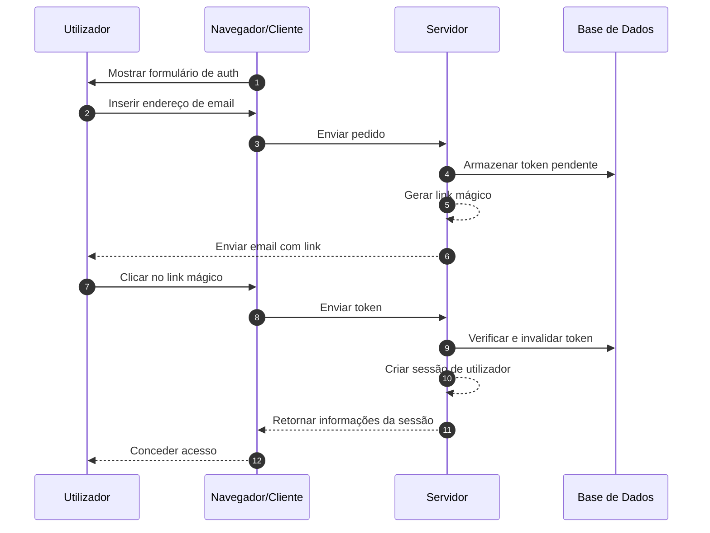
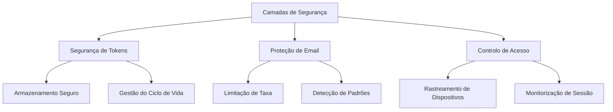

## O que são links mágicos?

Um link mágico (magic link) é um URL seguro e com tempo limitado que permite a autenticação sem senha tanto para processos de registro quanto de login. Em vez de criar e lembrar senhas, os utilizadores recebem um link especial por email que lhes concede acesso imediato. Pense nisso como uma chave digital que funciona apenas uma vez - quando você clica, está autenticado, e então essa chave se torna inválida.

Por exemplo, quando você se inscreve no Medium ou tenta fazer login no Slack, em vez de configurar ou inserir uma senha, essas plataformas enviam um email com um link seguro. Um clique, e você está autenticado. Esta abordagem ganhou popularidade significativa porque combina segurança com simplicidade.

## Como funcionam os links mágicos?

O processo é simples do ponto de vista do utilizador, mas envolve mecanismos de segurança sofisticados nos bastidores. Aqui está o que acontece durante um fluxo típico de autenticação com link mágico (magic link):



## Qual é a estrutura de um link mágico?

Um link mágico típico consiste em vários componentes:

- URL base da aplicação
- Endpoint de autenticação
- Parâmetro de token
- Parâmetros adicionais (opcional)

Por exemplo:

```
https://app.example.com/verify-auth?token=abc123...&redirect=/dashboard
```

## Como é gerado o token de um link mágico?

Quando um utilizador solicita um link mágico (por exemplo, clicando em "Entrar com Email"), precisamos gerar um token seguro e imprevisível. Este token é crucial, pois essencialmente se torna uma senha temporária.

O token deve ser gerado usando um <Ref slug='csprng' />. Um CSPRNG usa entropia do hardware do seu sistema (como tempo de teclado, movimentos do rato, ruído do ventilador, etc.) para gerar números verdadeiramente aleatórios que são impossíveis de prever, mesmo que um atacante conheça saídas anteriores.

Por exemplo, em Node.js:

```javascript
import crypto from "node:crypto";

// Gerar um token aleatório seguro
const token = crypto.randomBytes(32).toString("base64url");
// Resultado: algo como 'dBjftJeZ4CVP-mB92K27uhbUJU1p1r_wW1gFWFOEjXk'

// Alternativa usando Web Crypto API (disponível em Node.js e navegadores)
const buffer = crypto.getRandomValues(new Uint8Array(32));
const token2 = Buffer.from(buffer).toString("base64url");
```

Requisitos para um token seguro:

- Gerado via CSPRNG para garantir imprevisibilidade
- Pelo menos 32 bytes de comprimento (256 bits de entropia)
- Codificado de forma segura para URL (base64url elimina caracteres problemáticos)
- Limitado no tempo e de uso único para prevenir ataques de repetição
- Armazenado de forma segura com metadados (expiração, informações do utilizador)

## Como proteger a autenticação com link mágico

A segurança do link mágico (magic link) requer uma abordagem abrangente em várias camadas. Enquanto a entrega de email e os padrões de acesso são críticos, o manuseio seguro de tokens permanece o alicerce da segurança do sistema.

### Fundamentos de segurança de tokens

A segurança dos links mágicos depende fortemente da implementação adequada de tokens (veja o conteúdo acima). Cada token deve ser criptograficamente seguro e devidamente gerido ao longo do seu ciclo de vida. O sistema deve impor uma expiração rigorosa do token (tipicamente 15-30 minutos) e invalidação imediata após o uso.

Ao armazenar tokens, trate-os com o mesmo nível de segurança que senhas:

- Hash dos tokens antes do armazenamento para prevenir exposição
- Implementar limpeza automática de tokens expirados
- Manter um registo de auditoria do uso e invalidação de tokens
- Armazenar metadados associados (tempo de criação, utilizador pretendido, informações do dispositivo)

### Segurança na entrega de email

O email serve como o principal canal de entrega para links mágicos, tornando-o um alvo potencial para ataques. Implementar limitação de taxa é essencial para prevenir tentativas de força bruta e proteger contra ataques de bombardeio de email. Por exemplo, você pode limitar os utilizadores a 5 pedidos de link mágico por hora a partir do mesmo endereço IP.

Além disso, monitorar padrões de atividade incomuns ajuda a detectar possíveis violações de segurança. Isso inclui:

- Múltiplos pedidos de diferentes IPs para o mesmo email
- Padrões de acesso geográfico incomuns
- Pedidos rápidos que indicam ataques automatizados

### Controlo de acesso e monitorização

A impressão digital do dispositivo adiciona uma camada extra de segurança ao rastrear padrões consistentes de comportamento do utilizador. Quando uma tentativa de login vem de um novo dispositivo ou localização, você pode implementar etapas adicionais de verificação ou alertar o utilizador.

Para segurança aprimorada em aplicações sensíveis:

- Combine links mágicos com fatores adicionais de autenticação
- Implemente monitorização contínua da sessão
- Registe todos os eventos de autenticação para trilhas de auditoria
- Adicione verificação baseada em dispositivo para novas localizações



## Links mágicos vs SMS / Email OTP

Tanto os Links Mágicos quanto o SMS / Email OTP dependem de canais externos para verificação.

Os Links Mágicos enviam um URL único para o email do utilizador, enquanto o OTP envia um código de verificação para o seu telefone ou email.

Os Links Mágicos proporcionam uma experiência superior no desktop, pois os utilizadores simplesmente clicam no link para completar a verificação, eliminando a necessidade de inserir códigos manualmente. Eles também podem transportar informações de contexto adicionais, permitindo fluxos de autenticação mais sofisticados.

No entanto, em cenários móveis, o SMS OTP pode oferecer melhor usabilidade, pois os utilizadores podem rapidamente visualizar e inserir códigos de verificação.

## Links mágicos vs aplicações autenticadoras

Comparados aos códigos OTP gerados por Aplicações Autenticadoras, os Links Mágicos não exigem que os utilizadores instalem aplicações adicionais e funcionam perfeitamente em todos os dispositivos. Isso reduz o atrito, particularmente para utilizadores não técnicos. No entanto, as Aplicações Autenticadoras geram códigos OTP com melhor confiabilidade em tempo real, independentes das velocidades de entrega e disponibilidade do servidor de email.

Para cenários que exigem autenticação frequente com altos requisitos de segurança, as Aplicações Autenticadoras podem ser a escolha preferida.

## Quando usar links mágicos

Os links mágicos são particularmente eficazes para aplicações empresariais e de negócios onde os utilizadores tipicamente fazem login com menos frequência, como ferramentas de gestão de projetos ou painéis de relatórios. Nesses cenários, o ligeiro atraso na entrega de email é insignificante em comparação com a conveniência de não gerir senhas.

### Cenários ideais

Esses métodos de autenticação brilham em contextos empresariais onde o email já é o principal canal de comunicação. Por exemplo, plataformas de colaboração como Slack ou Notion utilizam links mágicos de forma eficaz porque:

- Os utilizadores já estão ativamente monitorizando o seu email
- As sessões de login tendem a ser de longa duração
- O foco está em reduzir o atrito no processo de autenticação

Os links mágicos também são excelentes para fluxos de registro de utilizadores em produtos SaaS onde a otimização de conversão é crucial. Quando os utilizadores podem começar a usar o seu serviço apenas com um endereço de email, isso reduz significativamente as taxas de desistência durante o processo de integração.

### Quando considerar alternativas

No entanto, os links mágicos podem não ser a melhor escolha para aplicações que exigem autenticação frequente. Aplicações bancárias móveis, por exemplo, precisam de métodos de autenticação rápidos e confiáveis, já que os utilizadores podem verificar o seu saldo várias vezes ao dia. Nesses casos, a autenticação biométrica ou códigos PIN muitas vezes proporcionam uma melhor experiência do utilizador.

Considere métodos de autenticação alternativos quando:

- A sua aplicação é principalmente baseada em dispositivos móveis
- Os utilizadores precisam de acesso imediato sem dependência de email
- O ambiente requer autenticação multifatorial
- Atrasos na entrega de email podem impactar significativamente a experiência do utilizador

A chave é alinhar o seu método de autenticação com os padrões de comportamento dos seus utilizadores e requisitos de segurança. Embora os links mágicos ofereçam excelente segurança com atrito mínimo, eles devem fazer parte de uma estratégia de autenticação mais ampla, em vez de serem a única solução.

<SeeAlso slugs={["csprng", "passwordless", "otp", "totp"]} />