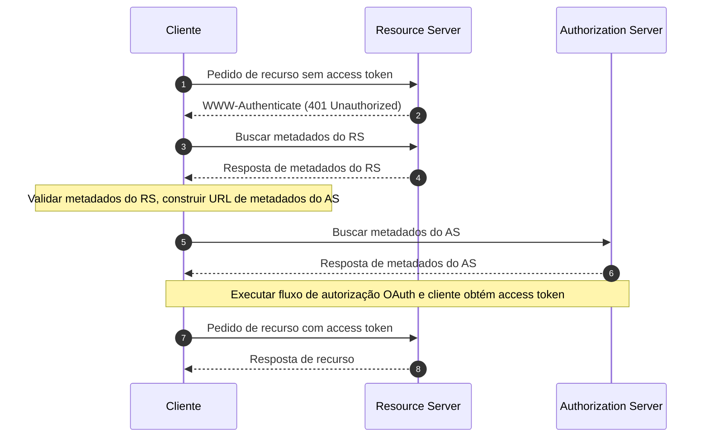

## O que são Metadados de Recursos Protegidos (OAuth 2.0 Protected Resource Metadata)?

Os Metadados de Recursos Protegidos (OAuth 2.0 Protected Resource Metadata) são um formato padronizado definido no [RFC 9728](https://datatracker.ietf.org/doc/html/rfc9728). Eles ajudam os clientes e servidores de autorização a entender como interagir com recursos protegidos.

Este formato de metadados fornece informações essenciais sobre:
- Capacidades do servidor de recursos
- Formatos de token suportados
- Mecanismos de segurança necessários
- Relações com servidores de autorização
- Scopes e permissões disponíveis

## Quais são os benefícios dos Metadados de Recursos Protegidos?

No sistema OAuth 2.0, existem quatro papéis básicos:
- <Ref slug="authorization-server"/>: Emite access tokens para clientes após autenticar com sucesso o resource owner
- <Ref slug="client"/>: Aplicação que solicita acesso a recursos protegidos
- <Ref slug="resource-owner"/>: Entidade capaz de conceder acesso a recursos protegidos
- <Ref slug="resource-server"/>: Servidor que hospeda recursos protegidos

Tradicionalmente, quando um cliente precisa acessar recursos protegidos, ele deve primeiro descobrir e interagir com o authorization server para obter os tokens necessários. O papel do Resource Server era principalmente limitado a validar tokens e servir recursos, com todos os detalhes de autenticação e autorização sendo coordenados através do authorization server e da aplicação cliente.

Isso significava que os clientes não tinham uma maneira padronizada de descobrir os requisitos ou capacidades específicos de um Resource Server diretamente.

Os Metadados de Recursos Protegidos transformam essa dinâmica ao permitir que Resource Servers publiquem ativamente seus requisitos e capacidades, trazendo vários benefícios importantes:
- Descoberta Direta: Os clientes agora podem aprender sobre os requisitos de um Resource Server diretamente da fonte
- Autonomia Aprimorada: Resource Servers podem especificar explicitamente seus formatos de token suportados, mecanismos de segurança e servidores de autorização confiáveis
- Interoperabilidade Melhorada: Um formato padronizado garante comunicação consistente dos requisitos de acesso em diferentes implementações
- Configuração Dinâmica: Resource Servers podem atualizar seus requisitos sem depender de alterações no authorization server

## Como funcionam os Metadados de Recursos Protegidos (OAuth 2.0 Protected Resource Metadata)?

Os Metadados de Recursos Protegidos operam dentro do ecossistema OAuth 2.0 através de um processo padronizado de descoberta e interação:



O documento de metadados do resource server é um objeto JSON que contém os seguintes campos:

```json
   {
     "resource": "https://api.example.com",
     "authorization_servers": [
       "https://auth.example.com"
     ],
     "scopes_supported": ["read", "write"],
     "token_formats_supported": ["jwt"],
     "token_introspection_endpoint": "https://api.example.com/introspect",
     "dpop_signing_alg_values_supported": ["ES256", "PS256"]
   }
   ```

E uma vez que o cliente tenha recebido o documento de metadados, ele pode usá-lo para se configurar e interagir com o resource server principalmente de acordo com os seguintes campos:

- `resource`: Identificador para o recurso protegido
- `authorization_servers`: Lista de authorization servers autorizados
- `scopes_supported`: Scopes disponíveis para este recurso
- `token_formats_supported`: Formatos de token suportados
- `token_introspection_endpoint`: Endpoint para validação de token
- `dpop_signing_alg_values_supported`: Algoritmos DPoP suportados

## Como descobrir endpoints de Metadados de Recursos Protegidos (OAuth 2.0 Protected Resource Metadata)?

Existem dois mecanismos principais de descoberta para Metadados de Recursos Protegidos:

1. **Descoberta de Cabeçalho WWW-Authenticate (Baseada em Fluxo)**:

Quando um cliente faz uma solicitação não autorizada a um recurso protegido, o servidor responde com um código de status 401 e inclui a URL de metadados no cabeçalho WWW-Authenticate:

```bash
# 1. Cliente faz solicitação sem token
GET /api/resource HTTP/1.1
Host: api.example.com

# 2. Servidor responde com 401 e URL de metadados
HTTP/1.1 401 Unauthorized
WWW-Authenticate: Bearer realm="example",
  scope="read write",
  resource_metadata_url="https://api.example.com/.well-known/oauth-resource-server"
```

O cabeçalho fornece:
- Identificação do realm do recurso
- Scopes necessários
- Localização da URL de metadados

2. **Descoberta Direta de URI Bem Conhecido**:

Você pode acessar diretamente os metadados fazendo uma solicitação GET ao endpoint bem conhecido:

```bash
GET /.well-known/oauth-resource-server HTTP/1.1
Host: api.example.com
```

O endpoint segue um formato padronizado:
- URI Base: `https://api.example.com`
- Caminho bem conhecido: `/.well-known/oauth-resource-server`
- URL Completa: `https://api.example.com/.well-known/oauth-resource-server`

## Como funciona o cabeçalho WWW-Authenticate em Metadados de Recursos Protegidos?

O cabeçalho WWW-Authenticate é um componente chave nos Metadados de Recursos Protegidos para implementar o mecanismo de descoberta automática. Ele utiliza o cabeçalho HTTP padrão `WWW-Authenticate` para transmitir informações de metadados, permitindo que os clientes descubram e configurem automaticamente os requisitos de acesso para resource servers.

Quando um cliente tenta acessar um recurso protegido sem fornecer um access token, o resource server responde com um código de status 401 Unauthorized e inclui um cabeçalho WWW-Authenticate:

```
WWW-Authenticate: Bearer realm="example",
  scope="read write",
  resource_metadata_url="https://api.example.com/.well-known/oauth-resource-server"
```

Este cabeçalho pode conter várias informações chave:
- `Bearer`: Indica que este é um esquema de autenticação OAuth 2.0 Bearer Token
- `realm`: Define o espaço de proteção do recurso
- `scope`: Especifica as permissões de acesso necessárias
- `resource_metadata_url`: Aponta para a localização do documento de metadados contendo a configuração completa do resource server

Ao receber este cabeçalho, o cliente extrai o `resource_metadata_url` e recupera o documento de metadados completo a partir dessa URL.

Com base nas informações de metadados obtidas, o cliente pode determinar os authorization servers apropriados, formatos de token suportados, scopes disponíveis e outros detalhes de configuração para configurar adequadamente os authentication requests.

## Como proteger os Metadados de Recursos Protegidos (OAuth 2.0 Protected Resource Metadata)?

Considerações essenciais de segurança incluem:

1. **Segurança de Transporte**:
   - Uso obrigatório de TLS
   - Validação de certificado
   - Manipulação segura de conexões

2. **Integridade dos Metadados**:
   - Validação de origem
   - Verificação de assinatura
   - Estratégias de cache seguro

3. **Controle de Acesso**:
   - Limitação de taxa
   - Validação de solicitações
   - Monitoramento de abuso

## Como implementar Metadados de Recursos Protegidos (OAuth 2.0 Protected Resource Metadata)?

Veja como os Metadados de Recursos Protegidos (OAuth 2.0 Protected Resource Metadata) são implementados em diferentes componentes:

1. **Implementação do Resource Server**

O resource server responde com um status 401 Unauthorized e inclui a URL de metadados no cabeçalho WWW-Authenticate ao receber uma tentativa de acesso não autorizado:

```
HTTP/1.1 401 Unauthorized
WWW-Authenticate: Bearer realm="example",
  resource_metadata_url="https://api.example.com/.well-known/oauth-resource-server"
```

2. **Implementação do Cliente**

O cliente implementa uma função assíncrona para lidar com o acesso a recursos. Ao receber uma resposta 401, esta função extrai a URL de metadados do cabeçalho WWW-Authenticate, busca os metadados e os utiliza para a configuração do cliente:

```javascript
async function handleResourceAccess(response) {
  if (response.status === 401) {
    const wwwAuthenticate = response.headers.get('WWW-Authenticate');
    const metadataUrl = extractMetadataUrl(wwwAuthenticate);
    const metadata = await fetchMetadata(metadataUrl);
    // Configuração do cliente baseada em metadados
  }
}
```

3. **Estrutura do Documento de Metadados**

O resource server fornece um documento de metadados como um objeto JSON contendo:
- Identificador de recurso
- Lista de authorization servers autorizados
- Scopes suportados
- Formatos de token suportados
- Algoritmos de assinatura DPoP suportados

Aqui está um exemplo do documento de metadados:

```json
{
  "resource": "https://api.example.com",
  "authorization_servers": ["https://auth.example.com"],
  "scopes_supported": ["read", "write"],
  "token_formats_supported": ["jwt"],
  "dpop_signing_alg_values_supported": ["ES256"]
}
```

Esses componentes trabalham juntos para formar uma implementação completa de Metadados de Recursos Protegidos (OAuth 2.0 Protected Resource Metadata). Através desta implementação, os clientes podem descobrir e configurar automaticamente os parâmetros necessários para acessar recursos protegidos.

<SeeAlso slugs={["resource-server", "authorization-server"]} />

<Resources urls={[
  "https://datatracker.ietf.org/doc/html/rfc9728",
]} />