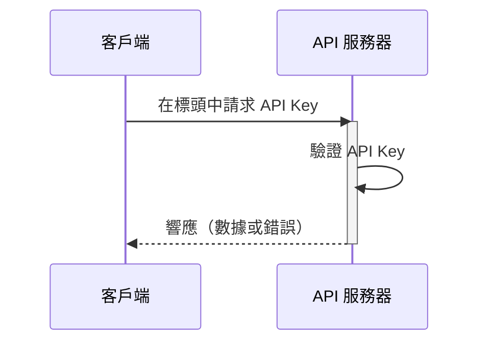

## 什麼是 API key？

API key 是用於驗證訪問 API 的客戶端的秘密令牌。它就像是應用程序的密碼，允許訪問特定的 API。可以將其視為進入建築物的門禁卡。門禁卡授予訪問權限，但不一定識別你的身份。

## API key 如何運作？

API key 通過簡單的請求和響應過程運作。

1. **請求：** 你的應用程序向 API 發送請求，包括 API key。該 key 通常在請求的標頭中發送。例如，標頭可能如下所示：`x-api-key: your_actual_api_key`。標頭名稱或值格式沒有統一標準。

2. **驗證：** API 服務器將提供的 key 與其數據庫進行檢查。

3. **響應：** 如果 key 有效，服務器授予訪問權限並發回請求的數據。如果無效，則拒絕訪問。

以下是說明該過程的序列圖：

## API key 的優缺點是什麼？

讓我們看看 API key 的優勢和不足之處：

### 優點

- **超級簡單使用**：只需在請求中添加一個 key 就可以了！就像使用房門鑰匙一樣 - 不需要複雜的步驟。

- **易於追蹤**：想知道誰在使用你的 API？API key 讓這變得簡單。你可以看到哪些應用在調用以及它們的調用頻率。

- **快速速率限制**：通過為每個 key 設置限制來防止人們過度使用你的 API。這就像在俱樂部門口有個保鏢數人進出次數。

- **適合公共數據**：如果你正在分享非敏感信息（如天氣數據或公共統計數據），API key 非常合適。

### 缺點

- **不如現代替代方案安全**：API key 不如其他形式的 API 認證有效，例如 <Ref slug="oauth-2.0" /> 和 <Ref slug="jwt" />。可以將它們視為基本鎖，相比之下，現代安全系統更為先進。然而，它們仍然受歡迎，因為它們是追蹤 API 使用和開始 API 安全的最簡單方法。

- **安全風險**：API key 就像把房門鑰匙放在門墊下。如果有人找到它，他們可以永遠使用。原因如下：
  - 它們通常在代碼中可見
  - 它們不會自動過期
  - 如果洩露（如在公共 GitHub 存儲庫中），任何人都可以使用它們

- **無法區分用戶**：雖然一些公司使用可以識別用戶的 "API key"（如 Stripe），但傳統的 API key 無法告訴你誰是誰。它們只告訴你是哪個應用在發出請求。

- **本質上是靜態的**：與現代的認證令牌不同，API key 通常永遠保持不變。這意味著：
  - 沒有自動的安全刷新
  - 需要手動更換 key
  - 如果 key 暴露，風險更高

## API key 的使用案例是什麼？

- 服務到服務的通信：API key 適用於應用程序需要通過 CLI 直接與 API 通信的場景。例如，調用 OpenAI API。
- 公共 API：當向公眾公開 API 時，API key 提供了一種簡單的訪問控制方法。
- 簡化設置：對於快速和簡單的認證需求，特別是在開發階段。與 Machine-to-machine 認證不同，API key 不需要事先註冊客戶端，也不需要交換 access token。你只需在請求中將 API key 作為參數傳遞即可。

在現實世界的場景中，構建產品時最常見的目的是產品集成。這裡有一個典型的使用案例：

### 示例：與 Stripe 集成

Stripe 使用 API key 與不同平台和應用程序進行安全集成。你可以通過開發者儀表板創建、查看、刪除和管理這些 key。通過使用 API key，你可以將 Stripe 的結帳和計費功能集成到你的產品中。

## Personal Access Tokens (PAT) 和 Machine-to-Machine (M2M) 有什麼區別？

談到 API key，personal access tokens 和 <Ref slug="machine-to-machine" /> 也可以一起提到，因為它們都可以通過 CLI 命令以編程方式訪問 API 資源，或在後端服務之間建立通信。

### Personal Access Tokens (PATs)

Personal access token 也是一個字符串，但代表***特定用戶的***身份和權限，並在成功認證或登錄後動態生成，通常具有有限的壽命但可以刷新。它提供對用戶特定數據和功能的細粒度訪問控制，通常用於 CLI 工具、腳本或個人 API 訪問。主要區別在於它更具針對性，用於用戶特定的操作。

### Machine-to-Machine (M2M)

M2M 通信是指設備在更廣泛的意義上自動交換數據而無需人工干預。

在 <Ref slug="openid-connect" />（或 <Ref slug="oauth-2.0" />）的上下文中，M2M 應用程序使用 <Ref slug="client-credentials-flow" />，如 [OAuth 2.0 RFC 6749 協議](https://datatracker.ietf.org/doc/html/rfc6749) 中所定義，支持類似的標準協議。它通常涉及客戶端應用程序（機器或服務）自行或代表用戶訪問資源。這對於只有受信任的客戶端可以訪問後端服務的情況非常理想。

<SeeAlso slugs={["machine-to-machine"]} />