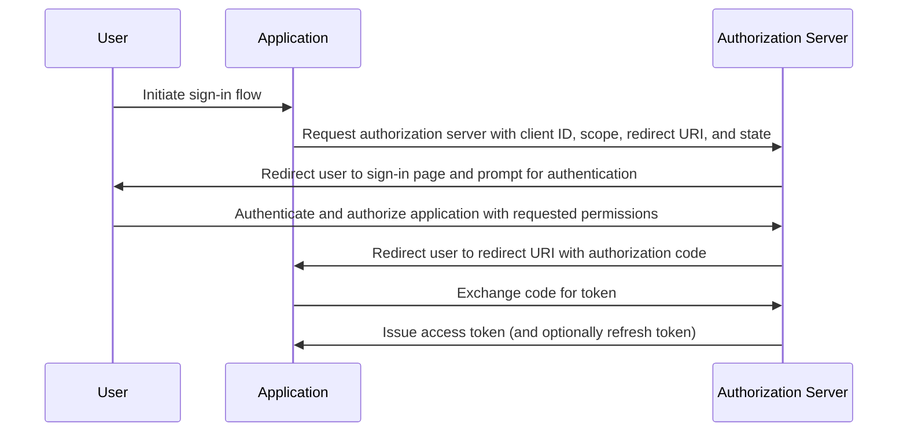

## 什麼是授權碼流程 (Authorization code flow)？

授權碼流程 (Authorization code flow)（又稱授權碼授權 (authorization code grant)），定義於 [OAuth 2.0 RFC 6749, section 4.1](https://datatracker.ietf.org/doc/html/rfc6749#section-4.1)，是一種廣泛使用的 OAuth 2.0 授權機制，允許應用程式代表用戶獲取存取權杖 (access token)。

此流程非常適合於可以安全存儲客戶端密鑰的機密應用程式，如傳統的伺服器端網頁應用程式。

當與 PKCE (<Ref slug="pkce" />) 擴展結合使用時，它也可以安全地用於無法安全存儲客戶端密鑰的原生應用程式和單頁應用程式 (SPAs)。

## 授權碼流程 (Authorization code flow) 如何運作？

授權碼流程 (Authorization code flow) 涉及以下步驟：

1. **流程啟動**：用戶通常通過點擊應用程式中的鏈接或按鈕來啟動流程。應用程式將用戶重定向到授權伺服器的授權端點，傳遞客戶端 ID、請求的範圍 (scope)、重定向 URI 和狀態參數。授權伺服器驗證參數並提示用戶在授權伺服器的登錄頁面上進行認證。
2. **用戶認證和授權**：用戶在授權伺服器上進行認證並授予應用程式訪問請求資源的權限。
3. **代碼生成和重定向**：授權伺服器生成授權碼並使用先前提供的重定向 URI 將用戶重定向回應用程式。授權碼包含在重定向 URI 的查詢字串中。
4. **代碼交換**：應用程式從查詢字串中提取授權碼，並向授權伺服器的權杖端點發出 POST 請求，以交換授權碼以獲取存取權杖 (access token)。應用程式還必須在請求中包含客戶端 ID、客戶端密鑰、重定向 URI 和授權碼。
5. **存取權杖檢索**：授權伺服器驗證授權碼，並在成功驗證後向應用程式發出存取權杖 (access token)（以及可選的刷新權杖 (refresh token)）。然後，應用程式可以使用存取權杖 (access token) 代表用戶發出授權的 API 請求。

以下序列圖可以說明這些步驟：



## 如何實現授權碼流程 (Authorization code flow)？

以下是一個實現授權碼流程 (Authorization code flow) 的簡單示例，遵循 [OAuth 2.0 RFC 6749, section 4.1](https://datatracker.ietf.org/doc/html/rfc6749#section-4.1) 中的指南：

### 1. 初始設置

在開始之前，確保你從你的 auth 服務獲得以下信息：

```javascript
const config = {
  clientId: "YOUR_CLIENT_ID",
  clientSecret: "YOUR_CLIENT_SECRET",
  authorizationEndpoint: "https://authorization-server.com/auth",
  tokenEndpoint: "https://authorization-server.com/token",
  redirectUri: "http://localhost:3000/callback",
};
```

客戶端 ID、客戶端密鑰和重定向 URI 是你的應用程式在 auth 服務中的配置。

`authorizationEndpoint` 和 `tokenEndpoint` 是由你的 auth 服務提供的。

如果你的 auth 伺服器實現了 OIDC (<Ref slug="openid-connect" />)，你可以通過 <Ref slug="openid-connect-discovery" /> 獲取此信息。

### 2. 啟動授權請求

當用戶想要登錄時（例如，點擊登錄按鈕），流程開始。應用程式將發出登錄請求。

此請求包括 `client ID`、`redirect URI` 和 `scope` 等參數。然後，它將用戶重定向到 auth 服務的授權端點（auth 服務的登錄頁面）。

用戶將在此登錄頁面上進行認證和授權。

```javascript
app.get("/login", (req, res) => {
  const authUrl = new URL(config.authorizationEndpoint);
  authUrl.searchParams.append("response_type", "code");
  authUrl.searchParams.append("client_id", config.clientId);
  authUrl.searchParams.append("redirect_uri", config.redirectUri);
  authUrl.searchParams.append("scope", "openid profile email");
  authUrl.searchParams.append("state", "random_state_string");

  res.redirect(authUrl.toString());
});
```

注意：你可以在示例代碼中顯示的參數之外添加更多參數。請參閱 [完整的認證請求參數定義](https://openid.net/specs/openid-connect-core-1_0.html#AuthRequest)。

### 3. 處理重定向 URI 回調和權杖交換

在用戶完成 auth 服務的登錄頁面上的認證和授權後，auth 服務將用戶重定向回應用程式的重定向 URI。此重定向 URI 包含授權碼和狀態參數。

應用程式從重定向 URI 中提取授權碼和狀態參數，並在 auth 服務的權杖端點交換它們以獲取存取權杖 (access token) 和刷新權杖 (refresh token)（如果有的話）。

```javascript
app.get("/callback", async (req, res) => {
  const { code, state } = req.query;

  try {
    // Exchange the authorization code for an access token and refresh token
    const tokenResponse = await axios.post(config.tokenEndpoint, {
      grant_type: "authorization_code",
      code,
      redirect_uri: config.redirectUri,
      client_id: config.clientId,
      client_secret: config.clientSecret,
    });

    const { access_token, refresh_token } = tokenResponse.data;
    // Store tokens for subsequent requests
    req.session.accessToken = access_token;

    res.send("Authentication successful!");
  } catch (error) {
    res.status(500).send("Token exchange failed");
  }
});
```

### 4. 使用存取權杖 (Access token)

一旦你擁有權杖，使用它來訪問受保護的資源：

```javascript
async function fetchUserProfile(accessToken) {
  const response = await axios.get("https://api.example.com/userinfo", {
    headers: {
      Authorization: `Bearer ${accessToken}`,
    },
  });
  return response.data;
}
```

## 如何為公共客戶端（原生應用程式和 SPAs）使用授權碼流程 (Authorization code flow)？

公共客戶端（如原生應用程式和 SPAs）在使用授權碼流程 (Authorization code flow) 時面臨獨特的安全挑戰。這些應用程式無法安全地存儲客戶端密鑰。客戶端密鑰將暴露在 JavaScript 代碼中或設備的存儲中。這使得攻擊者容易提取和濫用密鑰。

因此，關鍵挑戰是如何在沒有客戶端密鑰的情況下安全地使用授權碼流程 (Authorization code flow)。OAuth 2.0 規範引入了 PKCE (<Ref slug="pkce" />) 擴展來解決這個問題。

PKCE 增加了額外的安全措施來保護公共客戶端的授權碼流程 (Authorization code flow)。即使不使用客戶端密鑰，它也能防止授權碼攔截攻擊。查看這篇博客以了解更多關於 [PKCE 如何保護 OAuth 2.0 授權碼流程 (Authorization code flow)](https://blog.logto.io/how-pkce-protects-the-authorization-code-flow-for-native-apps) 的信息。

## 如何安全地使用授權碼流程 (Authorization code flow)？

### **使用 "state" 防止 CSRF 攻擊**

CSRF (<Ref slug="csrf" />) 攻擊會誘騙用戶在已認證的網頁應用程式中執行不需要的操作。狀態參數有助於防止這種情況。

- 生成一個唯一的隨機值。將此值存儲在伺服器端。
- 包含狀態參數。將其附加到授權請求 URL。
- 驗證返回的狀態。當授權伺服器重定向回你的應用程式時，將返回的狀態與存儲的值進行比較。如果它們不匹配，則拒絕請求。這確認了請求來自你的應用程式。

### **配置安全的重定向 URI**

重定向 URI 是授權伺服器在用戶認證後發送授權碼的地方。安全配置至關重要。

- 註冊有效的重定向 URI。在應用程式向授權伺服器註冊時，指定允許的重定向 URI。
- 精確匹配。授權請求中的重定向 URI 必須與註冊的 URI 完全匹配。即使是微小的差異也可能造成漏洞。
- 避免使用通配符 URI。如果可能，避免在生產環境中使用通配符 URI。它們會擴大攻擊面。
- 生產環境使用 HTTPS。在生產環境中，始終使用 HTTPS 作為重定向 URI。

### **為所有客戶端使用 PKCE**

雖然 PKCE 最初是為公共客戶端設計的，但 <Ref slug="oauth-2.1" /> 規範要求對所有客戶端（包括機密客戶端）強制執行 PKCE，以增強授權碼流程 (Authorization code flow) 的整體安全性。（參見 [對所有客戶端強制執行 PKCE](https://auth.wiki/oauth-2.1#enforcing-pkce-for-all-clients)）

## 授權碼流程 (Authorization code flow) 和隱式流程 (Implicit flow) 有什麼區別？

授權碼流程 (Authorization code flow) 和隱式流程 (Implicit flow) 的主要區別在於獲取存取權杖 (access token) 的方式：

- **授權碼流程 (Authorization code flow)**：客戶端應用程式首先從授權端點接收授權碼，然後在隨後的 POST 請求中將其交換為存取權杖 (access token)。
- **隱式流程 (Implicit flow)**：客戶端應用程式在用戶授權後直接在重定向 URI 的 URL 片段中接收存取權杖 (access token)。

了解更多關於 <Ref slug="implicit-flow" /> 的信息。

## 授權碼流程 (Authorization code flow) 和客戶端憑證流程 (Client credentials flow) 有什麼區別？

授權碼流程 (Authorization code flow) 和客戶端憑證流程 (Client credentials flow) 的主要區別在於使用流程的上下文：

- **授權碼流程 (Authorization code flow)**：當客戶端應用程式需要代表用戶訪問資源時使用。該流程涉及用戶認證和授權。
- **客戶端憑證流程 (Client credentials flow)**：當客戶端應用程式需要代表自己訪問資源時使用。該流程涉及客戶端認證，但不涉及用戶認證，最適合於機器對機器 (machine-to-machine) 通信。

了解更多關於 <Ref slug="client-credentials-flow" /> 的信息。

<SeeAlso
  slugs={[
    "device-flow",
    "implicit-flow",
    "client-credentials-flow",
    "pkce",
    "openid-connect",
    "openid-connect-discovery",
    "csrf",
    "oauth-2.1",
  ]}
/>

<Resources urls={[
  "https://datatracker.ietf.org/doc/html/rfc6749",
  "https://openid.net/specs/openid-connect-core-1_0.html#AuthRequest",
  "https://blog.logto.io/how-pkce-protects-the-authorization-code-flow-for-native-apps"
]} />