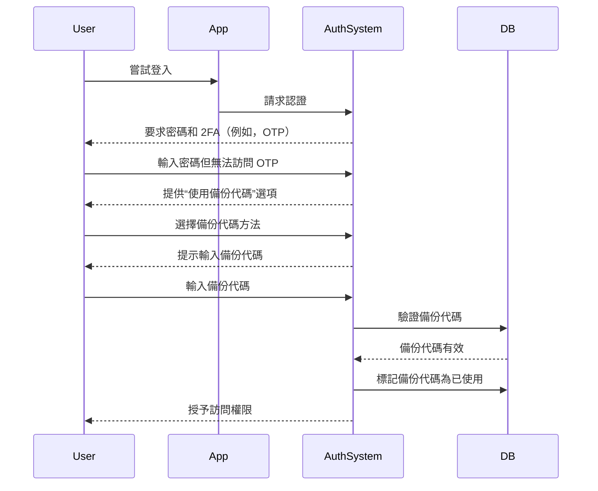

## 什麼是備份代碼 (Backup code)？

備份代碼 (也稱為恢復代碼) 是一組隨機生成的單次使用代碼，當你的主要 MFA 選項（如 SMS、身份驗證器應用或通行密鑰）不可用時，作為備用的認證方法。可以將它們視為緊急鑰匙，確保即使你丟失手機、遇到網絡問題或技術故障時，也能始終訪問你的帳戶。

## 備份代碼 (Backup code) 如何運作？

備份代碼提供了一種簡單但安全的方法，當標準 MFA 方法失效時，重新獲得帳戶訪問權。以下是它們的工作原理：

1. **生成**：系統在 MFA 設置期間創建一組唯一的代碼（通常每個代碼有 8–12 個字符）。
2. **存儲**：系統會提示你安全地保存這些代碼——可以離線保存（例如，打印在紙上）或存儲在加密的密碼管理器中。
3. **使用**：如果你無法使用主要的 MFA 方法，則輸入其中一個備份代碼進行身份驗證。
4. **失效**：每個代碼在使用後會自動失效，以防止重複使用。

## 何時使用備份代碼 (Backup code)？

備份代碼會過時嗎？MFA 是否仍應支持它們？

絕對不會。備份代碼仍然是 MFA 的重要安全網。雖然像通行密鑰和 FIDO2 這樣的新方法正在獲得關注，但備份代碼提供了一種普遍可訪問的、與設備無關的恢復選項。它們是一種低成本、高價值的保障，應始終與現代 MFA 方法一起支持。

在以下情況下使用備份代碼：

- 你的主要 MFA 設備不可用（例如，手機丟失，電池沒電）。
- 網絡問題阻止 SMS/電子郵件傳送。
- 你的身份驗證器應用無法同步。
- 你的硬體令牌發生故障。

## 如何安全地使用備份代碼 (Backup code)？

為確保你的備份代碼保持安全：

1. **離線存儲**
    - 將它們保存在設備上的加密文件夾中。
    - 打印它們並存放在安全位置（例如，密碼保險箱）。
    - 避免將它們存儲在不安全的數字格式中（例如，線上筆記應用）。
2. **使用密碼管理器**
    - 大多數密碼管理器（例如，1Password、LastPass）提供安全筆記功能。
        - 創建新條目：“備份代碼 – [服務名稱]”
        - 複製並粘貼你的備份代碼，然後啟用加密。
    - 如果使用 Google Password Manager，你可以：
        - 找到相關服務條目。
        - 編輯並添加備份代碼的筆記，並標記代碼為“已使用/未使用”以跟踪它們。
        - 這樣，當自動填充密碼時，你可以在需要時快速訪問備份代碼。
3. **更換已使用的代碼**
    - 如果你已使用大部分代碼或懷疑它們已被洩露，請重新生成新代碼。

## 設計具有備份代碼 (Backup code) 的 MFA 體驗

對於實施備份代碼的開發人員，請遵循以下最佳實踐：

1. **不要僅依賴備份代碼**
它們是緊急備用，而不是主要的 MFA 方法。始終提供 TOTP、通行密鑰或其他強大的選項。
2. **默認提供 8–10 個代碼**
    
    這在可用性（足以應對罕見的緊急情況）和安全性（最小化大規模盜竊風險）之間取得平衡。
    
3. **強制一次性使用**
    
    使用後自動使代碼失效。
    
4. **在耗盡時自動重新生成代碼**
    
    當用戶用完當前代碼集時，發行新代碼以防止鎖定。
    
5. **允許嚴格驗證的手動重新生成**
    
    如果用戶丟失代碼，允許他們生成新代碼，但需要重新認證（例如，電子郵件/SMS/密碼確認）。
    

## 備份代碼 (Backup code) 與密碼：有什麼區別？

| 特徵 | 備份代碼 | 密碼 |
| --- | --- | --- |
| **目的** | 當 MFA 失效時的一次性備用 | 主要認證方法 |
| **格式** | 系統生成，字母數字組合 | 用戶選擇，通常是字符的混合 |
| **存儲** | 哈希（通常不加鹽，因為它們是一次性使用） | 哈希 + 加鹽（防止彩虹表攻擊） |
| **使用** | 使用後禁用 | 可重複使用直到更改 |
| **再生** | 系統發行新集 | 用戶手動重置 |
| **安全性** | 必須安全存儲 | 如果弱或重用則易受攻擊 |

**關鍵安全提示：**

- 兩者都應該是長且隨機生成的，以抵抗暴力攻擊。
- 密碼需要加鹽，因為用戶經常重用它們。
- 備份代碼通常不需要加鹽——它們是一次性使用且隨機生成的，使大規模攻擊不太可能。

<Resources
  urls={[
    "https://docs.logto.io/end-user-flows/mfa",
    "https://auth-wiki.logto.io/mfa",
    "https://auth-wiki.logto.io/totp"
  ]}
/>