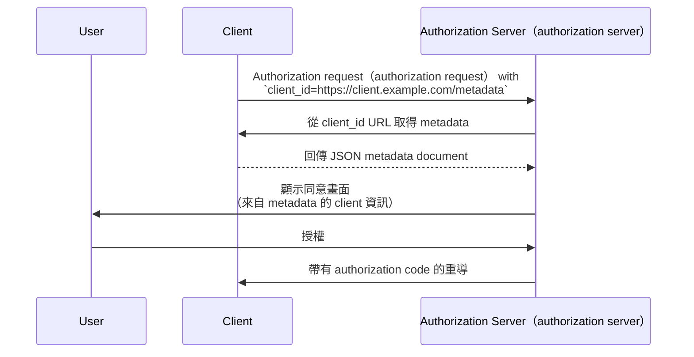

## 什麼是 Client ID Metadata Document (CIMD)？

Client ID Metadata Document (CIMD) 是 [OAuth Client ID Metadata Document](https://datatracker.ietf.org/doc/draft-ietf-oauth-client-id-metadata-document/) 規範中定義的一種機制，允許 OAuth 2.0 <Ref slug="client" /> 在未事先註冊的情況下，向 <Ref slug="authorization-server" /> 進行身份識別。

核心概念是：client（client）不再需要從 authorization server（authorization server）獲取 `client_id`（無論是手動註冊還是透過 [Dynamic Client Registration](https://datatracker.ietf.org/doc/html/rfc7591)），而是**直接使用一個 HTTPS URL 作為 `client_id`**。該 URL 指向一份包含 client（client）metadata（metadata）的 JSON 文件——如名稱、redirect URI、支援的 grant type（grant type）等。當 authorization server（authorization server）遇到這種 URL 型態的 `client_id` 時，會自動抓取這份文件。

這種方式有時在社群中簡稱為 **CIMD**（Client ID Metadata Document）。

## 它如何運作？

當 client（client）使用 Client ID Metadata Document（CIMD）時，OAuth 流程會多一個步驟：authorization server（authorization server）會解析 `client_id` URL 並取得 client（client）的 metadata（metadata）。



具體步驟如下：

1. client（client）發起 <Ref slug="authorization-request" />，並以自己的 URL 作為 `client_id`（例如 `https://client.example.com/oauth-client`）。
2. authorization server（authorization server）辨識出 `client_id` 是一個 URL，並透過 HTTPS 抓取該 URL。
3. 回應內容是一份包含標準 OAuth client metadata（metadata）的 JSON 文件。
4. authorization server（authorization server）驗證 metadata，向使用者顯示同意資訊，並繼續 OAuth 流程。
5. 後續請求可根據 HTTP cache header（cache header）使用快取的 metadata。

### metadata document（metadata 文件）

metadata document（metadata 文件）是一個 JSON 物件，欄位與 [RFC 7591 (OAuth 2.0 Dynamic Client Registration Protocol)](https://datatracker.ietf.org/doc/html/rfc7591) 中定義的相同。必須包含一個 `client_id` 欄位，其值必須與該 URL 完全一致。

範例：

```json
{
  "client_id": "https://client.example.com/oauth-client",
  "client_name": "My Application",
  "redirect_uris": ["https://client.example.com/callback"],
  "grant_types": ["authorization_code", "refresh_token"],
  "response_types": ["code"],
  "token_endpoint_auth_method": "none",
  "scope": "openid profile email"
}
```

### client identifier URL（client identifier URL）要求

規範對有效的 client identifier URL（client identifier URL）有嚴格要求：

- **必須使用 HTTPS** —— 不可用純 HTTP 或其他協定。
- **必須包含 path component** —— 像 `https://example.com` 這樣的裸域名無效。
- **不得包含** fragment、username 或 password 元素。
- **不得包含** 單點（`.`）或雙點（`..`）路徑片段。
- Query string 允許但不建議。
- Port 號允許。

例如：
- `https://client.example.com/oauth-client` —— 有效
- `http://client.example.com/oauth-client` —— 無效（非 HTTPS）
- `https://example.com` —— 無效（無 path）
- `https://client.example.com/../oauth-client` —— 無效（dot segment）

## 為什麼不用現有的註冊方式？

要理解這個規範的必要性，可以看看現有方式的限制：

### Static registration（static registration）

在傳統 OAuth 部署中，開發者需手動在 authorization server（authorization server）註冊 client（client），通常透過管理後台，然後獲得一個 `client_id`。這種方式適合已知 client（client）的情境。

但對於開放生態系，任何 client（client）都可能需要連接。你無法預先註冊所有可能的 AI agent 或 MCP client。

### Dynamic Client Registration (DCR)（Dynamic Client Registration (DCR)）

[Dynamic Client Registration (RFC 7591)](https://datatracker.ietf.org/doc/html/rfc7591) 允許 client（client）以程式方式將 metadata（metadata）送到註冊端點，server（server）會建立一個 `client_id` 並儲存註冊資訊。

這雖然可行，但會產生 server-side state（server-side state）：每次註冊都會產生一筆紀錄，需儲存、維護，最終還要清理。在開放生態系中，authorization server（authorization server）會累積大量註冊紀錄——其中多數可能只用一次就被遺棄。

DCR 也沒有內建機制驗證 client（client）的真實身份。任何 client（client）都能用任意名稱或 logo 註冊。

### Client ID Metadata Document（CIMD）優勢

Client ID Metadata Document（CIMD）解決了上述問題：

| 面向 | Static registration（static registration） | DCR | Client ID Metadata Document（CIMD） |
|--------|-------------------|-----|----------------------------|
| Server-side state（server-side state） | 有（需儲存紀錄） | 有（需儲存紀錄） | 無（隨需抓取） |
| 是否需預先註冊 | 是 | 否 | 否 |
| 身份驗證 | 人工審查 | 無內建 | 透過 HTTPS 驗證網域所有權 |
| 是否需清理 | 是 | 是（遺棄紀錄） | 否（HTTP cache 自動清理） |
| client 是否可控 metadata | 否 | 僅註冊時 | 是（隨時可更新） |

關鍵在於**網域所有權成為信任錨點**。只有控制 `client.example.com` 的實體，才能在 `https://client.example.com/oauth-client` 上託管內容。HTTPS 憑證即證明了這一點，無需額外驗證步驟。

## 認證（Authentication）限制

由於 client（client）與 authorization server（authorization server）之間沒有預先共享的密鑰，不能使用對稱密鑰的認證（Authentication）方式。metadata document（metadata 文件）**不得**包含：

- `client_secret_post`
- `client_secret_basic`
- `client_secret_jwt`
- 任何依賴對稱密鑰的認證（Authentication）方式

`client_secret` 與 `client_secret_expires_at` 欄位也不得出現在文件中。

如果 client（client）需要超越 public client 的認證（Authentication），可以使用非對稱加密。client（client）可在 metadata document（metadata 文件）中發布自己的公開金鑰（透過 `jwks` 屬性或 `jwks_uri` 參考），並在 token endpoint 以 `private_key_jwt` 進行認證（Authentication）。authorization server（authorization server）會用 client（client）發布的 <Ref slug="jwk">JWK</Ref> 驗證 JWT 簽章。

## authorization server（authorization server）如何發現支援？

authorization server（authorization server）會在其 <Ref slug="authorization-server-metadata" /> 中加入下列屬性，表示支援 Client ID Metadata Document（CIMD）：

```json
{
  "client_id_metadata_document_supported": true
}
```

client（client）可在發起 URL 型態 `client_id` 的授權流程前，先檢查這個旗標。如果 authorization server（authorization server）未宣告支援，client（client）應回退到其他註冊方式。

## 安全性考量

### SSRF 防護

當 authorization server（authorization server）抓取 metadata URL 時，實際上是對 client（client）提供的 URL 發出 HTTP 請求。這可能成為 Server-Side Request Forgery（SSRF）攻擊向量。實作時應：

- 阻擋對私有與 loopback IP（如 `127.0.0.1`、`10.x.x.x`、`192.168.x.x`）的請求
- 跟隨重導後再次驗證目標位址
- 強制回應大小上限（規範建議最大 5 KB）
- 設定適當的逾時

### 快取

authorization server（authorization server）在快取 metadata 時，應遵循 HTTP cache header（如 `Cache-Control`、`ETag`）。但要注意：

- **不要快取錯誤回應**——暫時性失敗不應永久阻擋 client（client）。
- server（server）可自行強制最小與最大快取時長，不必完全依 client（client）server 指定。

### 防釣魚

惡意 client（client）可能將 `client_name` 設為知名品牌名稱，`logo_uri` 設為其 logo。authorization server（authorization server）應採取下列措施：

- 在同意畫面上，始終同時顯示 `client_id` 主機名稱與 client name
- 預先抓取並審核 logo 圖片，而非直接從 client（client）載入

### Redirect URI（redirect uri）驗證

相較於 DCR，這種方式的安全優勢在於：metadata document（metadata 文件）中的 <Ref slug="redirect-uri">redirect URI</Ref> 託管於 client（client）自己的網域，且必須用 HTTPS 提供。這讓 client（client）身份與其 redirect URI（redirect uri）有更強的綁定，而非註冊請求中自我宣稱的值。

## Client ID Metadata Document Services

規範也定義了 **Client ID Metadata Document Services**——第三方網路服務，代開發者託管 metadata document（metadata 文件）。

這解決了一個實務問題：本地開發時，開發者通常沒有公開可存取的 URL 來託管 metadata。Client ID Metadata Document Service 可提供一個穩定的公開 URL，讓 authorization server（authorization server）能抓取 metadata，而開發者仍可在本地作業。這樣就不必將本機暴露到網際網路，或為測試 OAuth 流程而架設 tunnel。

<SeeAlso slugs={["client", "authorization-server-metadata", "redirect-uri", "jwk"]} />

<Resources
  urls={[
    "https://datatracker.ietf.org/doc/draft-ietf-oauth-client-id-metadata-document/",
    "https://datatracker.ietf.org/doc/html/rfc7591",
    "https://datatracker.ietf.org/doc/html/rfc8414",
  ]}
/>
