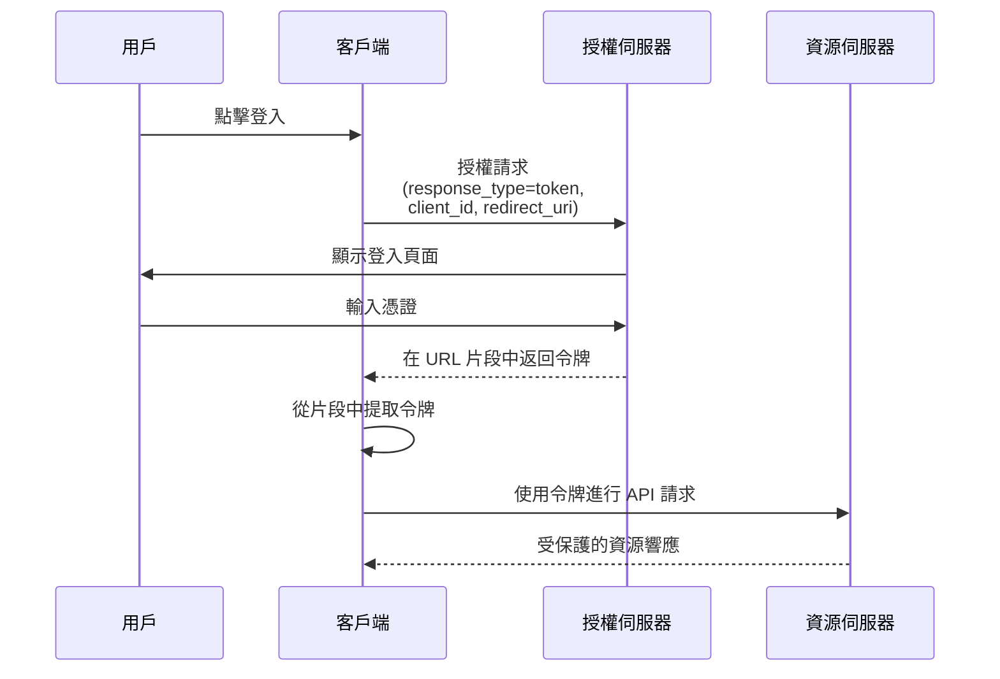

## 什麼是隱式流程 (Implicit flow)？

OAuth 2.0 隱式流程 (Implicit flow) 是一種認證 (Authentication) 方法，允許僅限客戶端的應用程式（如 SPA 和原生應用程式）直接通過 URL 片段從授權伺服器接收令牌，而無需提供客戶端密鑰。

隱式流程 (Implicit flow) 是為僅限客戶端的應用程式設計的，因為它們完全在瀏覽器或用戶設備上運行，無法安全地存儲客戶端密鑰。

由於安全原因（將在下文提到），隱式流程 (Implicit flow) 已在 <Ref slug="oauth-2.1" /> 中被正式棄用。僅限客戶端的應用程式現在應使用 <Ref slug="authorization-code-flow" /> 與 <Ref slug="pkce" /> 擴展。

## 隱式流程 (Implicit flow) 如何運作？

隱式流程 (Implicit flow) 的主要步驟如下：

注意：

- 客戶端在授權請求中只需提供 `client_id`，而不需要 `client_secret`。  
  這是因為這些客戶端無法安全地存儲密鑰，因此此流程不需要客戶端密鑰。

- `response_type` 參數設置為 `token`，指示授權伺服器直接返回存取令牌 (Access token) 而不是授權碼。  
  在 OIDC (<Ref slug="openid-connect" />) 中，`response_type` 是 `id_token` 或 `id_token token`，認證 (Auth) 服務將根據不同的響應類型返回相應的令牌。

- 令牌直接在 URL 片段中返回。這意味著令牌暴露在 URL 中，可以被其他應用程式或腳本輕易訪問。

## 隱式流程 (Implicit flow) 安全嗎？

不，OAuth 2.0 中的隱式流程 (Implicit flow) 通常被認為比其他流程（如授權碼流程）安全性較低。

由於多個漏洞，對於大多數使用情況不推薦使用：

- **令牌暴露在 URL 中**
   - 存取令牌 (Access token) 直接出現在瀏覽器的 URL 中（在 # 符號之後）
   - 這些令牌可能會：
     - 被保存到瀏覽器歷史記錄中
     - 通過引用標頭洩漏
     - 被同一頁面的惡意 JavaScript 代碼捕獲

- **無客戶端認證 (Authentication)**
   - 客戶端應用程式不需要證明其身份
   - 這意味著任何知道 `client_id` 的人都可以假裝是合法的客戶端

- **無刷新令牌 (Refresh token)**
   - 此流程不支持刷新令牌 (Refresh token)
   - 當存取令牌 (Access token) 過期時，用戶必須重新登入
   - 為避免頻繁登入，用戶可能會以不安全的方式存儲令牌

- **易受 XSS 攻擊**
   - 所有令牌都在瀏覽器中處理
   - 如果網站遭受 XSS 攻擊（跨站腳本攻擊）
   - 攻擊者的 JavaScript 代碼可以輕易竊取這些令牌

由於這些安全問題，隱式流程 (Implicit flow) 已在 <Ref slug="oauth-2.1" /> 中被棄用。僅限客戶端的應用程式現在應使用 <Ref slug="authorization-code-flow" /> 與 <Ref slug="pkce" /> 擴展。

你可以查看 [什麼是 PKCE：從基本概念到深入理解](https://blog.logto.io/how-pkce-protects-the-authorization-code-flow-for-native-apps) 以了解 PKCE 如何保護僅限客戶端應用程式的授權碼流程。

<SeeAlso
  slugs={["oauth-2.1", "authorization-code-flow", "pkce", "openid-connect"]}
/>

<Resources
  urls={[
    "https://blog.logto.io/implicit-flow-is-dead",
    {
      url: "https://tools.ietf.org/html/rfc6749#section-4.2",
      result: {
        ogTitle: "The OAuth 2.0 Authorization Framework: Implicit Grant",
        ogDescription:
          "The implicit grant type is used to obtain access tokens (it does not support the issuance of refresh tokens) and is optimized for public clients known to operate a particular redirection URI. These clients are typically implemented in a browser using a scripting language such as JavaScript.",
      },
    },
    "https://openid.net/specs/openid-connect-core-1_0.html",
    "https://blog.logto.io/how-pkce-protects-the-authorization-code-flow-for-native-apps",
  ]}
/>