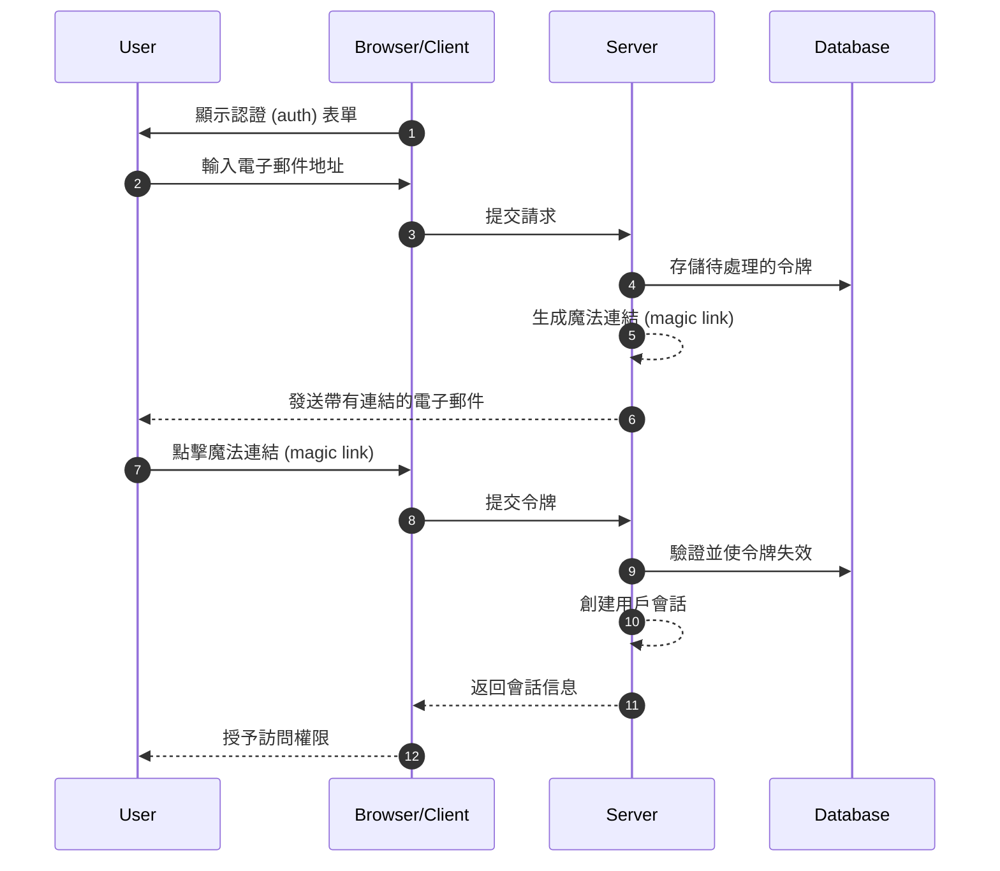
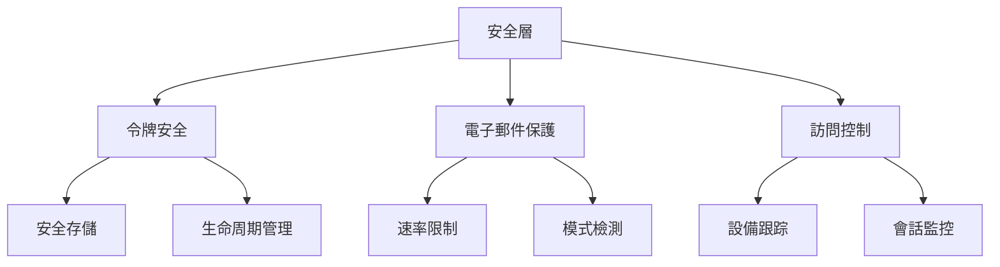

## 什麼是魔法連結 (Magic links)？

魔法連結 (Magic link) 是一個安全且有時間限制的 URL，能夠為註冊和登入過程提供無密碼認證 (passwordless authentication)。用戶不需要創建和記住密碼，而是通過電子郵件接收一個特殊的連結，點擊後即可立即訪問。可以將其視為一次性使用的數位鑰匙——當你點擊它時，你就被認證 (authenticated) 了，然後該鑰匙就失效了。

例如，當你註冊 Medium 或嘗試登入 Slack 時，這些平台會發送一封帶有安全連結的電子郵件，而不是設置或輸入密碼。只需點擊一次，你就被認證 (authenticated) 了。這種方法因其結合了安全性和簡單性而獲得了廣泛的歡迎。

## 魔法連結 (Magic links) 如何運作？

從用戶的角度來看，這個過程很簡單，但在幕後涉及複雜的安全機制。以下是典型的魔法連結 (magic link) 認證 (authentication) 流程中發生的事情：



## 魔法連結 (Magic link) 的結構是什麼？

典型的魔法連結 (magic link) 包含幾個組件：

- 應用程序的基本 URL
- 認證 (authentication) 端點
- 令牌參數
- 附加參數（可選）

例如：

```
https://app.example.com/verify-auth?token=abc123...&redirect=/dashboard
```

## 魔法連結 (Magic link) 的令牌是如何生成的？

當用戶請求魔法連結 (magic link)（例如，點擊“使用電子郵件登入”）時，我們需要生成一個安全且不可預測的令牌。這個令牌至關重要，因為它本質上成為一個臨時密碼。

令牌必須使用 <Ref slug='csprng' /> 生成。CSPRNG 使用系統硬體的熵（如鍵盤計時、鼠標移動、風扇噪音等）來生成真正隨機的數字，即使攻擊者知道之前的輸出也無法預測。

例如，在 Node.js 中：

```javascript
import crypto from "node:crypto";

// 生成一個安全的隨機令牌
const token = crypto.randomBytes(32).toString("base64url");
// 結果：類似 'dBjftJeZ4CVP-mB92K27uhbUJU1p1r_wW1gFWFOEjXk'

// 使用 Web Crypto API 的替代方法（在 Node.js 和瀏覽器中可用）
const buffer = crypto.getRandomValues(new Uint8Array(32));
const token2 = Buffer.from(buffer).toString("base64url");
```

安全令牌的要求：

- 通過 CSPRNG 生成以確保不可預測性
- 至少 32 字節長（256 位熵）
- URL 安全編碼（base64url 消除了問題字符）
- 有時間限制且一次性使用以防止重放攻擊
- 與元數據（過期時間，用戶信息）一起安全存儲

## 如何確保魔法連結 (magic link) 認證 (authentication) 的安全

魔法連結 (magic link) 的安全性需要在多個層面上採取全面的方法。雖然電子郵件傳遞和訪問模式至關重要，但安全的令牌處理仍然是系統安全的基石。

### 令牌安全基礎

魔法連結 (magic link) 的安全性在很大程度上取決於正確的令牌實施（見上文內容）。每個令牌必須在其生命周期中保持加密安全並得到妥善管理。系統應強制執行嚴格的令牌過期（通常為 15-30 分鐘）並在使用後立即失效。

存儲令牌時，應像對待密碼一樣對待它們：

- 在存儲前對令牌進行哈希處理以防止暴露
- 實施過期令牌的自動清理
- 維護令牌使用和失效的審計記錄
- 存儲相關元數據（創建時間，預期用戶，設備信息）

### 電子郵件傳遞安全

電子郵件是魔法連結 (magic link) 的主要傳遞渠道，使其成為攻擊的潛在目標。實施速率限制對於防止暴力破解嘗試和保護免受電子郵件轟炸攻擊至關重要。例如，你可以限制用戶每小時從同一 IP 地址請求 5 次魔法連結 (magic link)。

此外，監控不尋常的活動模式有助於檢測潛在的安全漏洞。這包括：

- 從不同 IP 為同一電子郵件發送多個請求
- 不尋常的地理訪問模式
- 表示自動化攻擊的快速請求

### 訪問控制和監控

設備指紋識別通過跟踪一致的用戶行為模式增加了一層額外的安全性。當來自新設備或位置的登入嘗試發生時，你可以實施額外的驗證步驟或提醒用戶。

對於敏感應用程序的增強安全性：

- 將魔法連結 (magic link) 與其他認證 (authentication) 因素結合使用
- 實施持續的會話監控
- 記錄所有認證 (authentication) 事件以供審計
- 為新位置添加基於設備的驗證



## 魔法連結 (Magic links) vs SMS / 電子郵件 OTP

魔法連結 (Magic Links) 和 SMS / 電子郵件 OTP 都依賴外部渠道進行驗證。

魔法連結 (Magic Links) 向用戶的電子郵件發送一次性 URL，而 OTP 則向他們的手機或電子郵件發送驗證碼。

魔法連結 (Magic Links) 提供了更好的桌面體驗，因為用戶只需點擊連結即可完成驗證，無需手動輸入代碼。它們還可以攜帶額外的上下文信息，實現更複雜的認證 (authentication) 流程。

然而，在移動場景中，SMS OTP 可能提供更好的可用性，因為用戶可以快速查看和輸入驗證碼。

## 魔法連結 (Magic links) vs 認證器應用程序

與認證器應用程序生成的 OTP 代碼相比，魔法連結 (Magic Links) 不需要用戶安裝額外的應用程序，並且可以在所有設備上無縫運作。這減少了摩擦，特別是對於非技術用戶。然而，認證器應用程序生成的 OTP 代碼具有更好的實時可靠性，獨立於電子郵件服務器的傳遞速度和可用性。

對於需要頻繁認證 (authentication) 且具有高安全性要求的場景，認證器應用程序可能是首選。

## 何時使用魔法連結 (Magic links)

魔法連結 (Magic Links) 對於用戶通常不頻繁登入的商業和企業應用程序特別有效，例如項目管理工具或報告儀表板。在這些場景中，電子郵件傳遞的輕微延遲與不需要管理密碼的便利性相比微不足道。

### 理想場景

這些認證 (authentication) 方法在電子郵件已經是主要通信渠道的商業環境中表現出色。例如，像 Slack 或 Notion 這樣的協作平台有效地利用了魔法連結 (magic link)，因為：

- 用戶已經在積極監控他們的電子郵件
- 登入會話往往是長期的
- 重點是減少認證 (authentication) 過程中的摩擦

魔法連結 (Magic Links) 也非常適合需要優化轉化的 SaaS 產品的用戶註冊流程。當用戶只需使用電子郵件地址即可開始使用你的服務時，這大大降低了在入門過程中的流失率。

### 何時考慮替代方案

然而，對於需要頻繁認證 (authentication) 的應用程序，魔法連結 (magic link) 可能不是最佳選擇。例如，移動銀行應用程序需要快速且可靠的認證 (authentication) 方法，因為用戶可能每天多次查看餘額。在這種情況下，生物識別認證 (authentication) 或 PIN 碼通常提供更好的用戶體驗。

考慮替代認證 (authentication) 方法的情況：

- 你的應用程序主要基於移動設備
- 用戶需要立即訪問而不依賴電子郵件
- 環境需要多因素認證 (authentication)
- 電子郵件傳遞延遲可能會顯著影響用戶體驗

關鍵是將你的認證 (authentication) 方法與用戶的行為模式和安全要求對齊。雖然魔法連結 (magic link) 提供了出色的安全性和最小的摩擦，但它們應該是更廣泛的認證 (authentication) 策略的一部分，而不是唯一的解決方案。

<SeeAlso slugs={["csprng", "passwordless", "otp", "totp"]} />