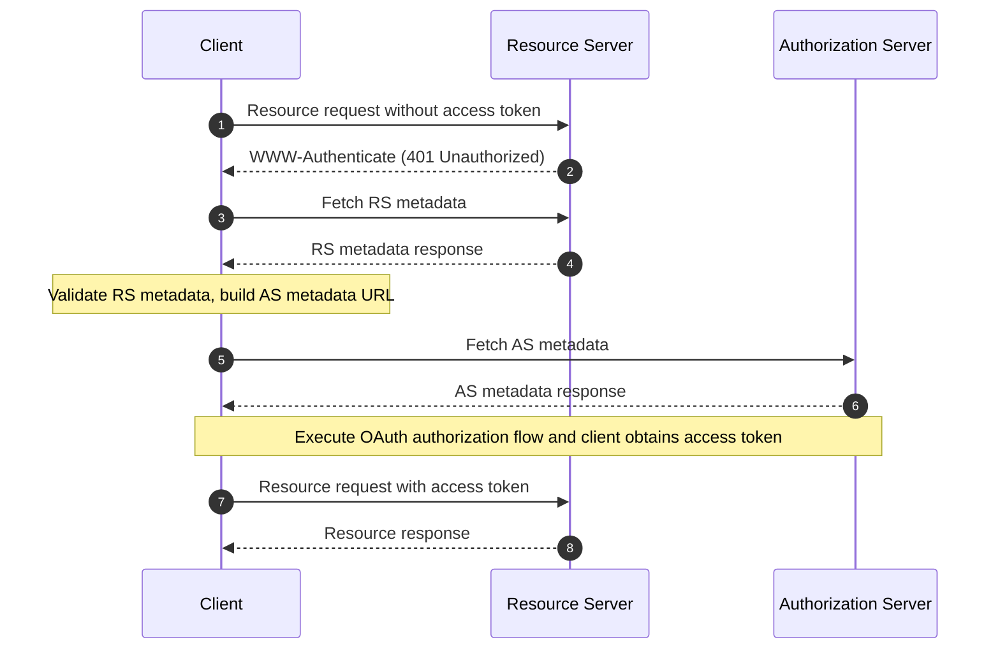

## 什麼是 OAuth 2.0 受保護資源中繼資料？

OAuth 2.0 受保護資源中繼資料是一種在 [RFC 9728](https://datatracker.ietf.org/doc/html/rfc9728) 中定義的標準化格式。它幫助客戶端和授權伺服器了解如何與受保護資源互動。

此中繼資料格式提供了關於以下內容的基本信息：
- 資源伺服器功能
- 支援的 token 格式
- 所需的安全機制
- 授權伺服器關係
- 可用的 scope 和權限

## 受保護資源中繼資料的好處是什麼？

在 OAuth 2.0 系統中，有四個基本角色：
- <Ref slug="authorization-server"/>：在成功驗證資源擁有者後向客戶端發放 access token
- <Ref slug="client"/>：請求訪問受保護資源的應用程式
- <Ref slug="resource-owner"/>：能夠授予訪問受保護資源的實體
- <Ref slug="resource-server"/>：託管受保護資源的伺服器

傳統上，當客戶端需要訪問受保護資源時，必須首先發現並與授權伺服器互動以獲取必要的 token。資源伺服器的角色主要限於驗證 token 和提供資源，所有的認證和授權細節都通過授權伺服器和客戶端應用程式協調。

這意味著客戶端沒有標準化的方法來直接發現資源伺服器的具體要求或功能。

受保護資源中繼資料改變了這種動態，允許資源伺服器主動發布其要求和功能，並帶來幾個關鍵好處：
- 直接發現：客戶端現在可以直接從源頭了解資源伺服器的要求
- 增強自主性：資源伺服器可以明確指定其支援的 token 格式、安全機制和受信任的授權伺服器
- 改善互操作性：標準化格式確保不同實現之間訪問要求的一致通信
- 動態配置：資源伺服器可以在不依賴授權伺服器更改的情況下更新其要求

## OAuth 2.0 受保護資源中繼資料如何運作？

受保護資源中繼資料在 OAuth 2.0 生態系統中通過標準化的發現和互動過程運作：



資源伺服器中繼資料文件是一個包含以下字段的 JSON 對象：

```json
   {
     "resource": "https://api.example.com",
     "authorization_servers": [
       "https://auth.example.com"
     ],
     "scopes_supported": ["read", "write"],
     "token_formats_supported": ["jwt"],
     "token_introspection_endpoint": "https://api.example.com/introspect",
     "dpop_signing_alg_values_supported": ["ES256", "PS256"]
   }
   ```

一旦客戶端收到中繼資料文件，它可以根據以下字段進行配置並與資源伺服器互動：

- `resource`: 受保護資源的標識符
- `authorization_servers`: 授權的授權伺服器列表
- `scopes_supported`: 此資源的可用 scope
- `token_formats_supported`: 支援的 token 格式
- `token_introspection_endpoint`: token 驗證的端點
- `dpop_signing_alg_values_supported`: 支援的 DPoP 算法

## 如何發現 OAuth 2.0 受保護資源中繼資料端點？

受保護資源中繼資料有兩種主要的發現機制：

1. **WWW-Authenticate 標頭發現（基於流程）**：

當客戶端對受保護資源發出未授權請求時，伺服器會以 401 狀態碼響應，並在 WWW-Authenticate 標頭中包含中繼資料 URL：

```bash
# 1. Client makes request without token
GET /api/resource HTTP/1.1
Host: api.example.com

# 2. Server responds with 401 and metadata URL
HTTP/1.1 401 Unauthorized
WWW-Authenticate: Bearer realm="example",
  scope="read write",
  resource_metadata_url="https://api.example.com/.well-known/oauth-resource-server"
```

標頭提供：
- 資源領域識別
- 所需的 scope
- 中繼資料 URL 位置

2. **直接 Well-Known URI 發現**：

你可以通過對 well-known 端點發出 GET 請求直接訪問中繼資料：

```bash
GET /.well-known/oauth-resource-server HTTP/1.1
Host: api.example.com
```

端點遵循標準化格式：
- 基本 URI: `https://api.example.com`
- Well-known 路徑: `/.well-known/oauth-resource-server`
- 完整 URL: `https://api.example.com/.well-known/oauth-resource-server`

## WWW-Authenticate 標頭在受保護資源中繼資料中如何運作？

WWW-Authenticate 標頭是實現自動發現機制的受保護資源中繼資料中的關鍵組件。它利用標準 HTTP `WWW-Authenticate` 標頭來傳輸中繼資料信息，使客戶端能夠自動發現和配置資源伺服器的訪問要求。

當客戶端首次嘗試在未提供 access token 的情況下訪問受保護資源時，資源伺服器會以 401 Unauthorized 狀態碼響應，並包含一個 WWW-Authenticate 標頭：

```
WWW-Authenticate: Bearer realm="example",
  scope="read write",
  resource_metadata_url="https://api.example.com/.well-known/oauth-resource-server"
```

此標頭可能包含幾個關鍵信息：
- `Bearer`: 表示這是一個 OAuth 2.0 Bearer Token 認證方案
- `realm`: 定義資源的保護空間
- `scope`: 指定所需的訪問權限
- `resource_metadata_url`: 指向包含完整資源伺服器配置的中繼資料文件的位置

收到此標頭後，客戶端提取 `resource_metadata_url` 並從該 URL 獲取完整的中繼資料文件。

根據獲得的中繼資料信息，客戶端可以確定適當的授權伺服器、支援的 token 格式、可用的 scope 和其他配置細節，以正確配置認證請求。

## 如何保護 OAuth 2.0 受保護資源中繼資料？

基本的安全考量包括：

1. **傳輸安全**：
   - 強制使用 TLS
   - 證書驗證
   - 安全連接處理

2. **中繼資料完整性**：
   - 來源驗證
   - 簽名驗證
   - 安全緩存策略

3. **訪問控制**：
   - 限制速率
   - 請求驗證
   - 濫用監控

## 如何實現 OAuth 2.0 受保護資源中繼資料？

以下是如何在不同組件中實現 OAuth 2.0 受保護資源中繼資料：

1. **資源伺服器實現**

資源伺服器在接收到未授權的訪問嘗試時，以 401 Unauthorized 狀態響應，並在 WWW-Authenticate 標頭中包含中繼資料 URL：

```
HTTP/1.1 401 Unauthorized
WWW-Authenticate: Bearer realm="example",
  resource_metadata_url="https://api.example.com/.well-known/oauth-resource-server"
```

2. **客戶端實現**

客戶端實現一個異步函數來處理資源訪問。當收到 401 響應時，此函數從 WWW-Authenticate 標頭中提取中繼資料 URL，獲取中繼資料，並用於客戶端配置：

```javascript
async function handleResourceAccess(response) {
  if (response.status === 401) {
    const wwwAuthenticate = response.headers.get('WWW-Authenticate');
    const metadataUrl = extractMetadataUrl(wwwAuthenticate);
    const metadata = await fetchMetadata(metadataUrl);
    // Client configuration based on metadata
  }
}
```

3. **中繼資料文件結構**

資源伺服器提供一個中繼資料文件，作為包含以下內容的 JSON 對象：
- 資源標識符
- 授權的授權伺服器列表
- 支援的 scope
- 支援的 token 格式
- 支援的 DPoP 簽名算法

以下是中繼資料文件的示例：

```json
{
  "resource": "https://api.example.com",
  "authorization_servers": ["https://auth.example.com"],
  "scopes_supported": ["read", "write"],
  "token_formats_supported": ["jwt"],
  "dpop_signing_alg_values_supported": ["ES256"]
}
```

這些組件共同形成一個完整的 OAuth 2.0 受保護資源中繼資料實現。通過此實現，客戶端可以自動發現並配置訪問受保護資源所需的參數。

<SeeAlso slugs={["resource-server", "authorization-server"]} />

<Resources urls={[
  "https://datatracker.ietf.org/doc/html/rfc9728",
]} />