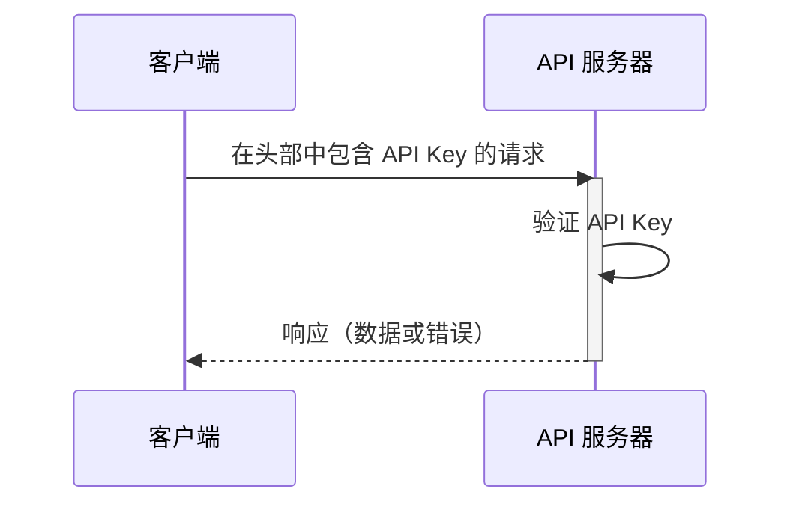

## 什么是 API key？

API key 是用于认证访问 API 的客户端的秘密令牌。它就像是你的应用程序的密码，允许访问特定的 API。可以将其视为访问建筑物的钥匙卡。钥匙卡授予访问权限，但不一定识别你的身份。

## API key 如何工作？

API key 通过简单的请求和响应过程工作。

1. **请求：** 你的应用程序向 API 发送请求，包括 API key。该 key 通常在请求的头部发送。例如，头部可能看起来像这样：`x-api-key: your_actual_api_key`。头部名称或值格式没有统一标准。

2. **验证：** API 服务器检查提供的 key 是否在其数据库中。

3. **响应：** 如果 key 有效，服务器授予访问权限并返回请求的数据。如果无效，则拒绝访问。

以下是说明该过程的序列图：

## API key 的优缺点是什么？

让我们看看 API key 的优点和不足之处：

### 优点

- **超级简单使用**：只需在请求中添加一个 key 就可以了！就像使用房屋钥匙一样 - 不需要复杂的步骤。

- **易于跟踪**：想知道谁在使用你的 API？API key 让这一切变得简单。你可以看到哪些应用在调用以及它们的调用频率。

- **快速限流**：通过为每个 key 设置限制来防止人们过度使用你的 API。就像俱乐部的保镖数着有人进出多少次。

- **适合公共数据**：如果你在分享非敏感信息（如天气数据或公共统计数据），API key 是非常合适的。

### 缺点

- **比现代替代方案安全性低**：API key 不如其他形式的 API 认证（如 <Ref slug="oauth-2.0" /> 和 <Ref slug="jwt" />）有效。可以将它们视为与现代安全系统相比的基本锁。然而，它们仍然很受欢迎，因为它们是跟踪 API 使用和开始 API 安全的最简单方法。

- **安全风险**：API key 就像把你的房屋钥匙放在门垫下。如果有人找到了，它们可以永远使用。原因如下：
  - 它们通常在代码中可见
  - 它们不会自动过期
  - 如果泄露（如在公共 GitHub 仓库中），任何人都可以使用它们

- **无法区分用户**：虽然一些公司使用可以识别用户的“API key”（如 Stripe），但传统的 API key 无法告诉你谁是谁。它们只告诉你哪个应用在发出请求。

- **本质上是静态的**：与现代认证令牌不同，API key 通常永远保持不变。这意味着：
  - 没有自动的安全刷新
  - 需要手动旋转 key
  - 如果 key 暴露，风险更高

## API key 的使用场景是什么？

- 服务到服务的通信：API key 适用于应用程序需要通过 CLI 直接与 API 通信的场景。例如，调用 OpenAI API。
- 公共 API：当向公众公开 API 时，API key 提供了一种简单的访问控制方法。
- 简化设置：对于快速和简单的认证需求，尤其是在开发阶段。与 Machine-to-machine (M2M) 认证不同，API key 不需要事先注册客户端，也不需要交换访问令牌。你只需在请求中传递你的 API key 作为参数，它就能正常工作。

在实际场景中，构建产品时最常见的目的是产品集成。以下是一个典型的使用案例：

### 示例：与 Stripe 的集成

Stripe 使用 API key 来实现与不同平台和应用程序的安全集成。你可以通过开发者仪表板创建、查看、删除和管理这些 key。通过使用 API key，你可以将 Stripe 的结账和计费功能集成到你的产品中。

## Personal Access Tokens (PAT) 和 Machine-to-Machine (M2M) 之间的区别是什么？

在谈论 API key 时，personal access tokens 和 <Ref slug="machine-to-machine" /> 也可以一起提到，因为它们都可以通过 CLI 命令以编程方式访问 API 资源，或在后端服务之间建立通信。

### Personal Access Tokens (PATs)

Personal access token 也是一个字符串，但代表***特定用户的***身份和权限，在成功认证或登录后动态生成，通常具有有限的生命周期，但可以刷新。它提供对用户特定数据和功能的细粒度访问控制，通常用于 CLI 工具、脚本或个人 API 访问。主要区别在于它更具体，并用于用户特定的操作。

### Machine-to-Machine (M2M)

M2M 通信是指设备在更广泛的意义上自动交换数据而无需人工参与。

在 <Ref slug="openid-connect" />（或 <Ref slug="oauth-2.0" />）的上下文中，M2M 应用程序使用 <Ref slug="client-credentials-flow" />，如 [OAuth 2.0 RFC 6749 协议](https://datatracker.ietf.org/doc/html/rfc6749) 中定义的那样，支持类似的标准协议。它通常涉及客户端应用程序（机器或服务）自行或代表用户访问资源。它非常适合只有受信任的客户端可以访问后端服务的情况。

<SeeAlso slugs={["machine-to-machine"]} />