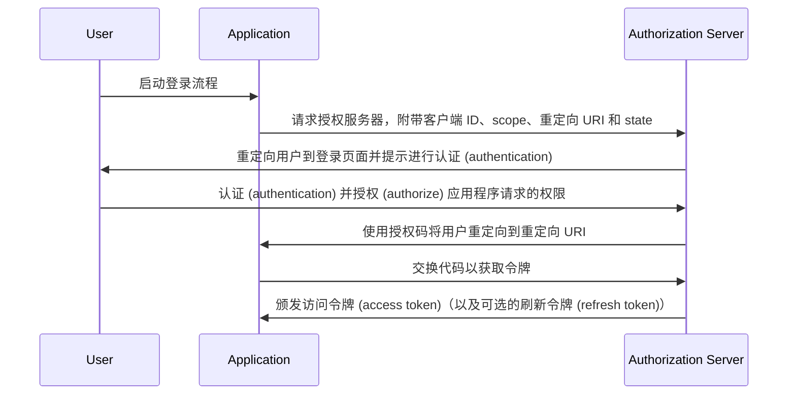

## 什么是授权码流程 (Authorization code flow)？

授权码流程 (Authorization code flow)（又称授权码授权 (authorization code grant)），在 [OAuth 2.0 RFC 6749, section 4.1](https://datatracker.ietf.org/doc/html/rfc6749#section-4.1) 中定义，是一种广泛使用的 OAuth 2.0 授权机制，允许应用程序代表用户获取访问令牌 (access token)。

此流程非常适合传统服务器端 Web 应用等机密应用程序，因为它们可以安全地存储客户端密钥。

当与 PKCE (<Ref slug="pkce" />) 扩展结合使用时，它也可以安全地用于无法安全存储客户端密钥的本机应用程序和单页应用程序 (SPAs)。

## 授权码流程 (Authorization code flow) 如何工作？

授权码流程 (Authorization code flow) 包括以下步骤：

1. **流程启动**：用户通常通过点击应用程序中的链接或按钮来启动流程以登录。应用程序将用户重定向到授权服务器的授权端点，传递客户端 ID、请求的 scope、重定向 URI 和 state 参数。授权服务器验证参数并提示用户在授权服务器的登录页面上进行认证 (authentication)。
2. **用户认证 (authentication) 和授权 (authorization)**：用户在授权服务器上进行认证 (authentication) 并授予应用程序访问请求资源的权限。
3. **代码生成和重定向**：授权服务器生成授权码并使用先前提供的重定向 URI 将用户重定向回应用程序。授权码包含在重定向 URI 的查询字符串中。
4. **代码交换**：应用程序从查询字符串中提取授权码，并向授权服务器的令牌端点发起 POST 请求，以交换授权码以获取访问令牌 (access token)。请求中还必须包含客户端 ID、客户端密钥、重定向 URI 和授权码。
5. **访问令牌 (Access token) 检索**：授权服务器验证授权码，并在成功验证后向应用程序颁发访问令牌 (access token)（以及可选的刷新令牌 (refresh token)）。应用程序随后可以使用访问令牌 (access token) 代表用户发起授权的 API 请求。

以下序列图可以说明这些步骤：



## 如何实现授权码流程 (Authorization code flow)？

以下是实现授权码流程 (Authorization code flow) 的简单示例，遵循 [OAuth 2.0 RFC 6749, section 4.1](https://datatracker.ietf.org/doc/html/rfc6749#section-4.1) 中的指南：

### 1. 初始设置

在开始之前，请确保从你的认证服务 (auth service) 获取以下信息：

```javascript
const config = {
  clientId: "YOUR_CLIENT_ID",
  clientSecret: "YOUR_CLIENT_SECRET",
  authorizationEndpoint: "https://authorization-server.com/auth",
  tokenEndpoint: "https://authorization-server.com/token",
  redirectUri: "http://localhost:3000/callback",
};
```

客户端 ID、客户端密钥和重定向 URI 是你的应用程序在认证服务 (auth service) 中的配置。

`authorizationEndpoint` 和 `tokenEndpoint` 由你的认证服务 (auth service) 提供。

如果你的认证服务器实现了 OIDC (<Ref slug="openid-connect" />)，你可以通过 <Ref slug="openid-connect-discovery" /> 获取此信息。

### 2. 启动授权请求

当用户想要登录时（例如，通过点击登录按钮），流程开始。应用程序将发起登录请求。

此请求包括 `client ID`、`redirect URI` 和 `scope` 等参数。然后，它将用户重定向到认证服务 (auth service) 的授权端点（认证服务的登录页面）。

用户将在此登录页面上进行认证 (authentication) 和授权 (authorization)。

```javascript
app.get("/login", (req, res) => {
  const authUrl = new URL(config.authorizationEndpoint);
  authUrl.searchParams.append("response_type", "code");
  authUrl.searchParams.append("client_id", config.clientId);
  authUrl.searchParams.append("redirect_uri", config.redirectUri);
  authUrl.searchParams.append("scope", "openid profile email");
  authUrl.searchParams.append("state", "random_state_string");

  res.redirect(authUrl.toString());
});
```

注意：你可以在示例代码中添加更多参数。请参阅 [完整认证请求参数定义](https://openid.net/specs/openid-connect-core-1_0.html#AuthRequest)。

### 3. 处理重定向 URI 回调和令牌交换

在用户完成认证 (authentication) 和授权 (authorization) 后，认证服务 (auth service) 将用户重定向回应用程序的重定向 URI。此重定向 URI 包含授权码和 state 参数。

应用程序从重定向 URI 中提取授权码和 state 参数，并在认证服务 (auth service) 的令牌端点交换它们以获取访问令牌 (access token) 和刷新令牌 (refresh token)（如果有）。

```javascript
app.get("/callback", async (req, res) => {
  const { code, state } = req.query;

  try {
    // 交换授权码以获取访问令牌 (access token) 和刷新令牌 (refresh token)
    const tokenResponse = await axios.post(config.tokenEndpoint, {
      grant_type: "authorization_code",
      code,
      redirect_uri: config.redirectUri,
      client_id: config.clientId,
      client_secret: config.clientSecret,
    });

    const { access_token, refresh_token } = tokenResponse.data;
    // 存储令牌以供后续请求使用
    req.session.accessToken = access_token;

    res.send("认证 (Authentication) 成功！");
  } catch (error) {
    res.status(500).send("令牌交换失败");
  }
});
```

### 4. 使用访问令牌 (Access token)

一旦你拥有令牌，就可以使用它来访问受保护的资源：

```javascript
async function fetchUserProfile(accessToken) {
  const response = await axios.get("https://api.example.com/userinfo", {
    headers: {
      Authorization: `Bearer ${accessToken}`,
    },
  });
  return response.data;
}
```

## 如何为公共客户端（本机应用程序和 SPAs）使用授权码流程 (Authorization code flow)？

公共客户端（如本机应用程序和 SPAs）在使用授权码流程 (Authorization code flow) 时面临独特的安全挑战。这些应用程序无法安全地存储客户端密钥。客户端密钥可能会暴露在 JavaScript 代码中或设备的存储中。这使得攻击者容易提取和滥用密钥。

因此，关键挑战是如何在没有客户端密钥的情况下安全地使用授权码流程 (Authorization code flow)。OAuth 2.0 规范引入了 PKCE (<Ref slug="pkce" />) 扩展来解决这个问题。

PKCE 为公共客户端保护授权码流程 (Authorization code flow) 增加了额外的安全措施。即使不使用客户端密钥，它也能防止授权码拦截攻击。查看这篇博客了解更多关于 [PKCE 如何保护 OAuth 2.0 授权码流程 (Authorization code flow)](https://blog.logto.io/how-pkce-protects-the-authorization-code-flow-for-native-apps) 的信息。

## 如何安全地使用授权码流程 (Authorization code flow)？

### **使用 "state" 防止 CSRF 攻击**

CSRF (<Ref slug="csrf" />) 攻击会诱使用户在经过认证的 Web 应用程序中执行不需要的操作。state 参数有助于防止这种情况。

- 生成一个唯一的随机值。将此值存储在服务器端。
- 包含 state 参数。将其附加到授权请求 URL。
- 验证返回时的 state。当授权服务器重定向回你的应用程序时，将返回的 state 与存储的值进行比较。如果它们不匹配，则拒绝请求。这确认了请求来自你的应用程序。

### **配置安全的重定向 URI**

重定向 URI 是授权服务器在用户认证 (authentication) 后发送授权码的地方。安全配置至关重要。

- 注册有效的重定向 URI。在应用程序注册授权服务器时，指定允许的重定向 URI。
- 精确匹配。授权请求中的重定向 URI 必须与注册的 URI 完全匹配。即使是细微的差异也可能造成漏洞。
- 避免使用通配符 URI。如果可能，避免在生产中使用通配符 URI。它们会扩大攻击面。
- 生产环境使用 HTTPS。在生产环境中，始终使用 HTTPS 作为重定向 URI。

### **为所有客户端使用 PKCE**

虽然 PKCE 最初是为公共客户端设计的，但 <Ref slug="oauth-2.1" /> 规范要求对所有客户端（包括机密客户端）强制执行 PKCE，以增强授权码流程 (Authorization code flow) 的整体安全性。（参见 [对所有客户端强制执行 PKCE](https://auth.wiki/oauth-2.1#enforcing-pkce-for-all-clients)）

## 授权码流程 (Authorization code flow) 和隐式流程 (Implicit flow) 有什么区别？

授权码流程 (Authorization code flow) 和隐式流程 (Implicit flow) 的主要区别在于如何获取访问令牌 (access token)：

- **授权码流程 (Authorization code flow)**：客户端应用程序首先从授权端点接收授权码，然后在随后的 POST 请求中将其交换为令牌端点的访问令牌 (access token)。
- **隐式流程 (Implicit flow)**：客户端应用程序在用户授权后直接在重定向 URI 的 URL 片段中接收访问令牌 (access token)。

了解更多关于 <Ref slug="implicit-flow" /> 的信息。

## 授权码流程 (Authorization code flow) 和客户端凭证流程 (Client credentials flow) 有什么区别？

授权码流程 (Authorization code flow) 和客户端凭证流程 (Client credentials flow) 的主要区别在于流程使用的上下文：

- **授权码流程 (Authorization code flow)**：用于客户端应用程序需要代表用户访问资源的情况。流程涉及用户认证 (authentication) 和授权 (authorization)。
- **客户端凭证流程 (Client credentials flow)**：用于客户端应用程序需要代表自己访问资源的情况。流程涉及客户端认证 (authentication) 而不是用户认证 (authentication)，最适合机器对机器 (machine-to-machine) 通信。

了解更多关于 <Ref slug="client-credentials-flow" /> 的信息。

<SeeAlso
  slugs={[
    "device-flow",
    "implicit-flow",
    "client-credentials-flow",
    "pkce",
    "openid-connect",
    "openid-connect-discovery",
    "csrf",
    "oauth-2.1",
  ]}
/>

<Resources urls={[
  "https://datatracker.ietf.org/doc/html/rfc6749",
  "https://openid.net/specs/openid-connect-core-1_0.html#AuthRequest",
  "https://blog.logto.io/how-pkce-protects-the-authorization-code-flow-for-native-apps"
]} />
