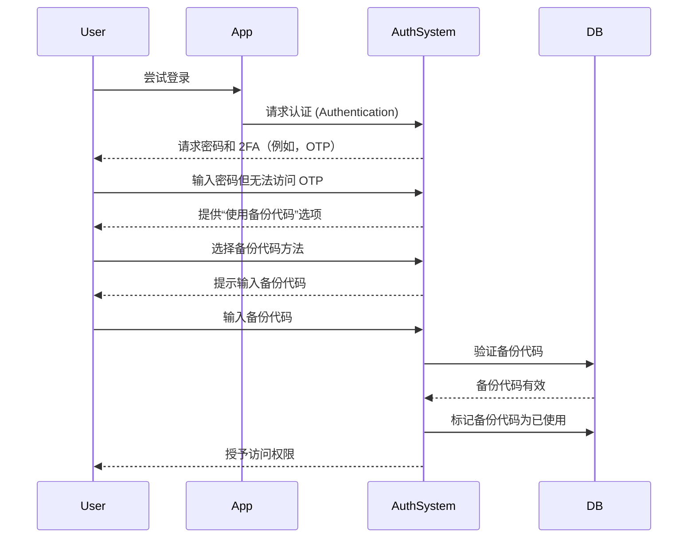

## 什么是备份代码 (Backup code)？

备份代码 (也称为恢复代码) 是一组随机生成的、一次性使用的代码，当你的主要 MFA 选项（如 SMS、认证器应用或通行密钥）不可用时，作为备用认证 (Authentication) 方法。可以将它们视为紧急钥匙，确保即使你丢失手机、遇到网络问题或技术故障时，也能始终访问你的账户。

## 备份代码 (Backup code) 如何工作？

备份代码提供了一种简单但安全的方式，当标准 MFA 方法失效时，重新获得账户访问权限。以下是它们的工作原理：

1. **生成**：系统在 MFA 设置期间创建一组唯一的代码（通常每个代码有 8-12 个字符）。
2. **存储**：系统提示你安全地保存这些代码——可以离线保存（例如，打印在纸上）或存储在加密的密码管理器中。
3. **使用**：如果你无法使用主要的 MFA 方法，可以输入一个备份代码进行认证 (Authentication)。
4. **失效**：每个代码在使用后会自动失效，以防止重复使用。

## 何时使用备份代码 (Backup code)？

备份代码会过时吗？MFA 是否仍应支持它们？

绝对不会。备份代码仍然是 MFA 的重要安全保障。虽然像通行密钥和 FIDO2 这样的新方法正在获得关注，但备份代码提供了一种普遍可访问的、与设备无关的恢复选项。它们是一种低成本、高价值的保护措施，应始终与现代 MFA 方法一起支持。

在以下情况下使用备份代码：

- 你的主要 MFA 设备不可用（例如，手机丢失、电池耗尽）。
- 网络问题阻止 SMS/电子邮件的发送。
- 你的认证器应用无法同步。
- 你的硬件令牌发生故障。

## 如何安全使用备份代码 (Backup code)？

为了确保你的备份代码保持安全：

1. **离线存储**
    - 将它们保存在设备上的加密文件夹中。
    - 打印出来并存放在安全位置（例如，密码保险箱）。
    - 避免将它们存储在不安全的数字格式中（例如，在线笔记应用）。
2. **使用密码管理器**
    - 大多数密码管理器（例如，1Password、LastPass）提供安全笔记功能。
        - 创建一个新条目：“备份代码 – [服务名称]”
        - 复制并粘贴你的备份代码，然后启用加密。
    - 如果使用 Google Password Manager，你可以：
        - 找到相关服务条目。
        - 编辑并添加备份代码的备注，并将代码标记为“已使用/未使用”以便跟踪。
        - 这样，当自动填充密码时，你可以在需要时快速访问备份代码。
3. **更换已使用的代码**
    - 如果你已经使用了大部分代码或怀疑它们已被泄露，请重新生成新代码。

## 设计包含备份代码 (Backup code) 的 MFA 体验

对于实现备份代码的开发人员，请遵循以下最佳实践：

1. **不要仅依赖备份代码**
它们是紧急备用，而不是主要的 MFA 方法。始终提供 TOTP、通行密钥或其他强大的选项。
2. **默认提供 8-10 个代码**
    
    这在可用性（足够应对罕见的紧急情况）和安全性（最小化批量盗窃风险）之间取得平衡。
    
3. **强制一次性使用**
    
    使用后自动使代码失效。
    
4. **在用尽时自动重新生成代码**
    
    当用户用尽当前代码集时，通过发放新代码来防止锁定。
    
5. **允许严格验证的手动重新生成**
    
    如果用户丢失了代码，让他们生成新代码，但需要重新认证 (Authentication)（例如，电子邮件/SMS/密码确认）。
    

## 备份代码 (Backup code) 与密码：有什么区别？

| 特性 | 备份代码 | 密码 |
| --- | --- | --- |
| **目的** | 当 MFA 失败时的一次性备用 | 主要认证 (Authentication) 方法 |
| **格式** | 系统生成，字母数字 | 用户选择，通常是字符混合 |
| **存储** | 哈希（通常不加盐，因为它们是一次性使用的） | 哈希 + 加盐（防止彩虹表攻击） |
| **使用** | 使用一次后失效 | 可重复使用，直到更改 |
| **重新生成** | 系统发放新代码集 | 用户手动重置 |
| **安全性** | 必须安全存储 | 如果弱或重复使用则易受攻击 |

**关键安全提示：**

- 两者都应长且随机生成，以抵抗暴力攻击。
- 密码需要加盐，因为用户经常重复使用它们。
- 备份代码通常不需要加盐——它们是一次性使用且随机生成的，大规模攻击的可能性很小。

<Resources
  urls={[
    "https://docs.logto.io/end-user-flows/mfa",
    "https://auth-wiki.logto.io/mfa",
    "https://auth-wiki.logto.io/totp"
  ]}
/>