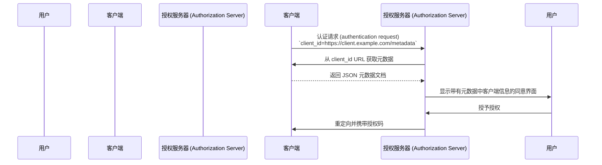

## 什么是客户端 ID 元数据文档 (Client ID Metadata Document, CIMD)？

客户端 ID 元数据文档 (Client ID Metadata Document, CIMD) 是 [OAuth Client ID Metadata Document](https://datatracker.ietf.org/doc/draft-ietf-oauth-client-id-metadata-document/) 规范中定义的一种机制，允许 OAuth 2.0 <Ref slug="client" /> 在无需预先注册的情况下向 <Ref slug="authorization-server" /> 标识自己。

核心思想是：客户端不再通过授权服务器（通过手动注册或 [Dynamic Client Registration](https://datatracker.ietf.org/doc/html/rfc7591)）获取 `client_id`，而是**使用一个 HTTPS URL 作为其 `client_id`**。该 URL 指向一个包含客户端元数据（如名称、redirect URI、支持的 grant type 等）的 JSON 文档。当授权服务器遇到基于 URL 的 `client_id` 时，会去获取这个文档。

这种方式有时在社区中被简称为 **CIMD**（Client ID Metadata Document）。

## 它是如何工作的？

当客户端使用客户端 ID 元数据文档 (Client ID Metadata Document, CIMD) 时，OAuth 流程会多出一步：授权服务器会解析 `client_id` URL 以获取客户端的元数据。



具体步骤如下：

1. 客户端发起 <Ref slug="authorization-request" />，并将其 URL 作为 `client_id`（例如 `https://client.example.com/oauth-client`）。
2. 授权服务器识别 `client_id` 是一个 URL，并通过 HTTPS 获取它。
3. 响应内容是一个包含标准 OAuth 客户端元数据的 JSON 文档。
4. 授权服务器验证元数据，向用户展示同意信息，并继续 OAuth 流程。
5. 后续请求可以根据 HTTP 缓存头使用缓存的元数据。

### 元数据文档

元数据文档是一个 JSON 对象，使用 [RFC 7591 (OAuth 2.0 Dynamic Client Registration Protocol)](https://datatracker.ietf.org/doc/html/rfc7591) 中定义的字段。它必须包含一个 `client_id` 字段，其值与 URL 完全一致。

示例：

```json
{
  "client_id": "https://client.example.com/oauth-client",
  "client_name": "My Application",
  "redirect_uris": ["https://client.example.com/callback"],
  "grant_types": ["authorization_code", "refresh_token"],
  "response_types": ["code"],
  "token_endpoint_auth_method": "none",
  "scope": "openid profile email"
}
```

### 客户端标识符 URL 要求

规范对有效的客户端标识符 URL 有严格要求：

- **必须使用 HTTPS** —— 不允许明文 HTTP 或其他协议。
- **必须包含路径部分** —— 仅有域名如 `https://example.com` 无效。
- **不得包含** fragment、用户名或密码部分。
- **不得包含** 单点 (`.`) 或双点 (`..`) 路径段。
- 允许但不推荐使用查询字符串。
- 允许端口号。

例如：
- `https://client.example.com/oauth-client` —— 有效
- `http://client.example.com/oauth-client` —— 无效（不是 HTTPS）
- `https://example.com` —— 无效（无路径）
- `https://client.example.com/../oauth-client` —— 无效（包含点段）

## 为什么不用现有的注册方法？

要理解该规范存在的原因，需要考虑现有方法的局限性：

### 静态注册

在传统 OAuth 部署中，开发者通过管理控制台手动将客户端注册到授权服务器，并获得一个 `client_id`。这种方式适用于你已知所有客户端的场景。

但在开放生态系统中，任何客户端都可能需要接入。你无法预先注册所有可能的 AI agent 或 MCP client。

### Dynamic Client Registration (DCR)

[Dynamic Client Registration (RFC 7591)](https://datatracker.ietf.org/doc/html/rfc7591) 允许客户端通过编程方式将元数据发送到注册端点，服务器创建 `client_id` 并存储注册信息。

这种方式虽然可行，但会产生服务器端状态：每次注册都会生成一条需要存储、维护并最终清理的记录。在有大量客户端的开放生态中，授权服务器会积累大量注册记录——其中大多数可能只用过一次就被遗弃。

DCR 也没有内置机制来验证客户端的真实身份。任何客户端都可以用任意名称或 logo 注册。

### 客户端 ID 元数据文档 (Client ID Metadata Document, CIMD) 的优势

客户端 ID 元数据文档 (Client ID Metadata Document, CIMD) 方式解决了上述问题：

| 方面 | 静态注册 | DCR | 客户端 ID 元数据文档 (Client ID Metadata Document, CIMD) |
|--------|-------------------|-----|----------------------------|
| 服务器端状态 | 有（存储记录） | 有（存储记录） | 无（按需获取） |
| 是否需要预注册 | 是 | 否 | 否 |
| 身份验证 | 人工审核 | 无内置机制 | 通过 HTTPS 验证域名所有权 |
| 是否需要清理 | 是 | 是（遗弃记录） | 否（通过 HTTP 缓存自动清理） |
| 客户端是否可控元数据 | 否 | 注册时可控 | 是（随时可更新） |

关键点在于**域名所有权成为信任锚点**。只有控制 `client.example.com` 的实体才能在 `https://client.example.com/oauth-client` 上托管内容。HTTPS 证书无需额外验证步骤即可证明这一点。

## 认证 (Authentication) 限制

由于客户端与授权服务器之间没有预共享密钥，不能使用对称密钥认证方法。元数据文档**不得**包含：

- `client_secret_post`
- `client_secret_basic`
- `client_secret_jwt`
- 任何依赖共享对称密钥的方法

`client_secret` 和 `client_secret_expires_at` 字段也不得出现在文档中。

如果客户端需要超越 public client 的认证 (authentication)，可以使用非对称加密。客户端在元数据文档中发布其公钥（通过 `jwks` 属性或 `jwks_uri` 引用），并在 token endpoint 使用 `private_key_jwt` 进行认证 (authentication)。授权服务器会用发布的 <Ref slug="jwk">JWK</Ref> 验证 JWT 签名。

## 授权服务器如何发现支持情况？

授权服务器通过在其 <Ref slug="authorization-server-metadata" /> 中包含以下属性，表明支持客户端 ID 元数据文档 (Client ID Metadata Document, CIMD)：

```json
{
  "client_id_metadata_document_supported": true
}
```

客户端可以在发起基于 URL 的 `client_id` 的授权流程前检查此标志。如果授权服务器未声明支持，客户端应回退到其他注册方式。

## 安全注意事项

### SSRF 防护

当授权服务器获取元数据 URL 时，会向客户端提供的 URL 发起 HTTP 请求。这可能成为服务端请求伪造（SSRF）攻击向量。实现时应：

- 阻止对私有和回环 IP 地址（如 `127.0.0.1`、`10.x.x.x`、`192.168.x.x`）的请求
- 跟随重定向后重新验证目标地址
- 强制响应大小限制（规范建议最大 5 KB）
- 设置合理的超时时间

### 缓存

授权服务器在缓存元数据时应遵循 HTTP 缓存头（`Cache-Control`、`ETag`）。但需注意：

- **不要缓存错误响应** —— 临时失败不应永久阻止客户端。
- 服务器可强制最小和最大缓存时长，无论客户端服务器指定的如何。

### 钓鱼防护

恶意客户端可能将 `client_name` 设置为受信任品牌名，将 `logo_uri` 设置为其 logo。授权服务器应通过以下方式缓解：

- 在同意界面始终显示 `client_id` 主机名及客户端名称
- 预取并审核 logo 图片，而不是直接从客户端加载

### Redirect URI 证明

相比 DCR，一个安全优势在于：元数据文档中的 <Ref slug="redirect-uri">redirect URI</Ref> 托管在客户端域名下，并通过 HTTPS 提供。这比注册请求中自声明的值有更强的客户端身份与 redirect URI 绑定。

## 客户端 ID 元数据文档服务 (Client ID Metadata Document Services)

规范还定义了**客户端 ID 元数据文档服务 (Client ID Metadata Document Services)** —— 由第三方为开发者托管元数据文档的 Web 服务。

这解决了一个实际问题：本地开发时，开发者没有可公开访问的 URL 来托管元数据。客户端 ID 元数据文档服务 (Client ID Metadata Document Service) 提供一个稳定的公共 URL，授权服务器可以获取，而开发者在本地工作。这样无需将本地机器暴露到互联网，也无需为测试 OAuth 流程搭建隧道。

<SeeAlso slugs={["client", "authorization-server-metadata", "redirect-uri", "jwk"]} />

<Resources
  urls={[
    "https://datatracker.ietf.org/doc/draft-ietf-oauth-client-id-metadata-document/",
    "https://datatracker.ietf.org/doc/html/rfc7591",
    "https://datatracker.ietf.org/doc/html/rfc8414",
  ]}
/>
