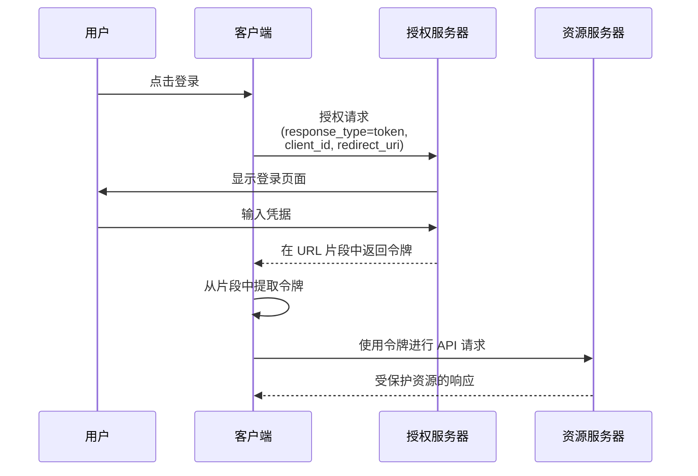

## 什么是隐式流 (Implicit flow)？

OAuth 2.0 隐式流 (implicit flow) 是一种认证 (authentication) 方法，允许仅客户端应用程序（如 SPA 和本地应用）通过 URL 片段直接从授权服务器 (authorization server) 接收令牌，而无需提供客户端密钥。

隐式流 (Implicit flow) 设计用于仅客户端应用程序，因为它们完全在浏览器或用户设备上运行，无法安全地存储客户端密钥。

由于安全原因（将在下文提到），隐式流 (implicit flow) 已在 <Ref slug="oauth-2.1" /> 中被正式弃用。仅客户端应用程序现在应使用带有 <Ref slug="pkce" /> 扩展的 <Ref slug="authorization-code-flow" />。

## 隐式流 (Implicit flow) 如何工作？

隐式流 (implicit flow) 的主要步骤如下：

注意：

- 客户端在授权请求中只需提供 `client_id`，无需提供 `client_secret`。  
  这是因为这些客户端无法安全地存储密钥，因此此流不需要客户端密钥。

- `response_type` 参数设置为 `token`，指示授权服务器直接返回访问令牌而不是授权码。  
  在 OIDC (<Ref slug="openid-connect" />) 中，`response_type` 可以是 `id_token` 或 `id_token token`，认证服务将根据不同的响应类型返回相应的令牌。

- 令牌直接在 URL 片段中返回。这意味着令牌暴露在 URL 中，可以被其他应用程序或脚本轻松访问。

## 隐式流 (Implicit flow) 安全吗？

不，OAuth 2.0 中的隐式流 (implicit flow) 通常被认为比其他流（如授权码流 (authorization code flow)）安全性更低。

由于以下几个漏洞，大多数情况下不推荐使用：

- **令牌暴露在 URL 中**
   - 访问令牌直接出现在浏览器的 URL 中（# 符号之后）
   - 这些令牌可能会：
     - 被保存在浏览器历史记录中
     - 通过引用头泄露
     - 被同一页面上的恶意 JavaScript 代码捕获

- **没有客户端认证 (client authentication)**
   - 客户端应用程序不需要证明其身份
   - 这意味着任何知道 `client_id` 的人都可以假装是合法客户端

- **没有刷新令牌 (refresh tokens)**
   - 此流不支持刷新令牌
   - 当访问令牌过期时，用户必须重新登录
   - 为了避免频繁登录，用户可能会以不安全的方式存储令牌

- **易受 XSS 攻击**
   - 所有令牌都在浏览器中处理
   - 如果网站遭受 XSS 攻击（跨站脚本攻击）
   - 攻击者的 JavaScript 代码可以轻松窃取这些令牌

由于这些安全问题，隐式流 (implicit flow) 已在 <Ref slug="oauth-2.1" /> 中被弃用。仅客户端应用程序现在应使用带有 <Ref slug="pkce" /> 扩展的 <Ref slug="authorization-code-flow" />。

你可以查看 [什么是 PKCE：从基本概念到深入理解](https://blog.logto.io/how-pkce-protects-the-authorization-code-flow-for-native-apps) 以了解 PKCE 如何保护仅客户端应用程序的授权码流 (authorization code flow)。

<SeeAlso
  slugs={["oauth-2.1", "authorization-code-flow", "pkce", "openid-connect"]}
/>

<Resources
  urls={[
    "https://blog.logto.io/implicit-flow-is-dead",
    {
      url: "https://tools.ietf.org/html/rfc6749#section-4.2",
      result: {
        ogTitle: "The OAuth 2.0 Authorization Framework: Implicit Grant",
        ogDescription:
          "The implicit grant type is used to obtain access tokens (it does not support the issuance of refresh tokens) and is optimized for public clients known to operate a particular redirection URI. These clients are typically implemented in a browser using a scripting language such as JavaScript.",
      },
    },
    "https://openid.net/specs/openid-connect-core-1_0.html",
    "https://blog.logto.io/how-pkce-protects-the-authorization-code-flow-for-native-apps",
  ]}
/>