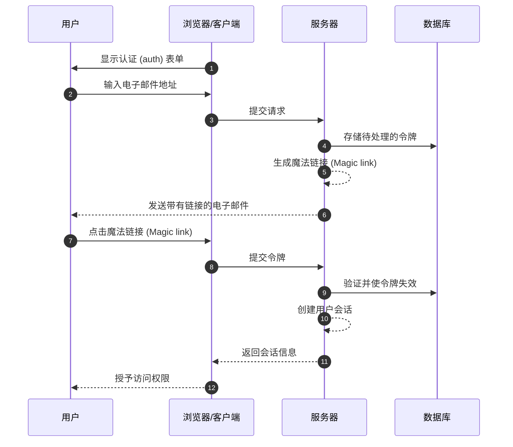
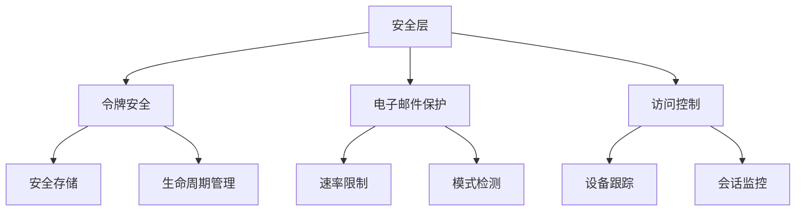

## 什么是魔法链接 (Magic link)？

魔法链接 (Magic link) 是一种安全的、时间有限的 URL，它能够为注册和登录过程提供无密码认证 (passwordless authentication)。用户无需创建和记住密码，而是通过电子邮件接收一个特殊链接，点击后即可立即访问。可以将其视为一次性使用的数字钥匙——当你点击它时，你就被认证了，然后该钥匙就失效了。

例如，当你注册 Medium 或尝试登录 Slack 时，这些平台会发送一封带有安全链接的电子邮件，而不是设置或输入密码。只需点击一下，你就完成了认证 (authentication)。这种方法因其结合了安全性和简便性而获得了广泛的欢迎。

## 魔法链接 (Magic link) 如何工作？

从用户的角度来看，这个过程很简单，但在后台涉及复杂的安全机制。以下是典型的魔法链接 (Magic link) 认证 (authentication) 流程中发生的事情：



## 魔法链接 (Magic link) 的结构是什么？

一个典型的魔法链接 (Magic link) 由几个组件组成：

- 应用程序的基本 URL
- 认证 (authentication) 端点
- 令牌参数
- 其他参数（可选）

例如：

```
https://app.example.com/verify-auth?token=abc123...&redirect=/dashboard
```

## 魔法链接 (Magic link) 的令牌是如何生成的？

当用户请求魔法链接 (Magic link)（例如，点击“使用电子邮件登录”）时，我们需要生成一个安全、不可预测的令牌。这个令牌至关重要，因为它实际上成为了一个临时密码。

令牌必须使用 <Ref slug='csprng' /> 生成。CSPRNG 使用系统硬件（如键盘计时、鼠标移动、风扇噪音等）的熵来生成真正随机的数字，即使攻击者知道以前的输出，也无法预测。

例如，在 Node.js 中：

```javascript
import crypto from "node:crypto";

// 生成一个安全的随机令牌
const token = crypto.randomBytes(32).toString("base64url");
// 结果：类似 'dBjftJeZ4CVP-mB92K27uhbUJU1p1r_wW1gFWFOEjXk'

// 使用 Web Crypto API 的替代方法（在 Node.js 和浏览器中可用）
const buffer = crypto.getRandomValues(new Uint8Array(32));
const token2 = Buffer.from(buffer).toString("base64url");
```

安全令牌的要求：

- 通过 CSPRNG 生成以确保不可预测性
- 至少 32 字节长（256 位熵）
- URL 安全编码（base64url 消除了问题字符）
- 时间限制和一次性使用以防止重放攻击
- 安全存储元数据（过期时间、用户信息）

## 如何确保魔法链接 (Magic link) 认证 (authentication) 的安全性

魔法链接 (Magic link) 的安全性需要在多个层面上采取全面的方法。虽然电子邮件传递和访问模式至关重要，但安全的令牌处理仍然是系统安全的基石。

### 令牌安全基础

魔法链接 (Magic link) 的安全性在很大程度上取决于正确的令牌实现（见上文内容）。每个令牌必须在其生命周期内保持加密安全并得到妥善管理。系统应强制执行严格的令牌过期（通常为 15-30 分钟）和使用后的立即失效。

存储令牌时，应像对待密码一样对待它们：

- 存储前对令牌进行哈希处理以防止暴露
- 实现过期令牌的自动清理
- 维护令牌使用和失效的审计记录
- 存储相关元数据（创建时间、预期用户、设备信息）

### 电子邮件传递安全

电子邮件是魔法链接 (Magic link) 的主要传递渠道，使其成为攻击的潜在目标。实施速率限制对于防止暴力攻击和保护免受电子邮件轰炸攻击至关重要。例如，你可以限制用户每小时从同一 IP 地址请求 5 次魔法链接 (Magic link)。

此外，监控异常活动模式有助于检测潜在的安全漏洞。这包括：

- 来自不同 IP 的多个请求针对同一电子邮件
- 异常的地理访问模式
- 表示自动攻击的快速请求

### 访问控制和监控

设备指纹识别通过跟踪用户行为的一致模式增加了一层额外的安全性。当登录尝试来自新设备或位置时，你可以实施额外的验证步骤或提醒用户。

对于敏感应用程序的增强安全性：

- 将魔法链接 (Magic link) 与其他认证 (authentication) 因素结合使用
- 实施持续会话监控
- 记录所有认证 (authentication) 事件以供审计
- 为新位置添加基于设备的验证



## 魔法链接 (Magic link) 与 SMS / Email OTP

魔法链接 (Magic link) 和 SMS / Email OTP 都依赖外部渠道进行验证。

魔法链接 (Magic link) 向用户的电子邮件发送一次性 URL，而 OTP 向他们的手机或电子邮件发送验证码。

魔法链接 (Magic link) 提供了更好的桌面体验，因为用户只需点击链接即可完成验证，无需手动输入代码。它们还可以携带额外的上下文信息，从而实现更复杂的认证 (authentication) 流程。

然而，在移动场景中，SMS OTP 可能提供更好的可用性，因为用户可以快速查看和输入验证码。

## 魔法链接 (Magic link) 与认证器应用

与认证器应用生成的 OTP 代码相比，魔法链接 (Magic link) 不需要用户安装额外的应用程序，并且可以在所有设备上无缝工作。这减少了摩擦，特别是对于非技术用户。然而，认证器应用生成的 OTP 代码具有更好的实时可靠性，不依赖于电子邮件服务器的传递速度和可用性。

对于需要频繁认证 (authentication) 且安全要求较高的场景，认证器应用可能是首选。

## 何时使用魔法链接 (Magic link)

魔法链接 (Magic link) 特别适用于用户通常登录频率较低的商业和企业应用程序，例如项目管理工具或报告仪表板。在这些场景中，电子邮件传递的轻微延迟与不需要管理密码的便利性相比微不足道。

### 理想场景

这些认证 (authentication) 方法在电子邮件已经是主要通信渠道的商业环境中表现出色。例如，像 Slack 或 Notion 这样的协作平台有效地利用了魔法链接 (Magic link)，因为：

- 用户已经在积极监控他们的电子邮件
- 登录会话往往是长期的
- 重点是减少认证 (authentication) 过程中的摩擦

魔法链接 (Magic link) 也非常适合需要优化转化率的 SaaS 产品的用户注册流程。当用户只需一个电子邮件地址即可开始使用你的服务时，它显著减少了用户在注册过程中的流失率。

### 何时考虑替代方案

然而，对于需要频繁认证 (authentication) 的应用程序，魔法链接 (Magic link) 可能不是最佳选择。例如，移动银行应用需要快速和可靠的认证 (authentication) 方法，因为用户可能每天多次检查他们的余额。在这种情况下，生物识别认证 (authentication) 或 PIN 码通常提供更好的用户体验。

在以下情况下考虑替代认证 (authentication) 方法：

- 你的应用程序主要基于移动设备
- 用户需要立即访问而不依赖电子邮件
- 环境需要多因素认证 (authentication)
- 电子邮件传递延迟可能会显著影响用户体验

关键是将你的认证 (authentication) 方法与用户的行为模式和安全要求对齐。虽然魔法链接 (Magic link) 提供了出色的安全性和最小的摩擦，但它们应该是更广泛的认证 (authentication) 策略的一部分，而不是唯一的解决方案。

<SeeAlso slugs={["csprng", "passwordless", "otp", "totp"]} />