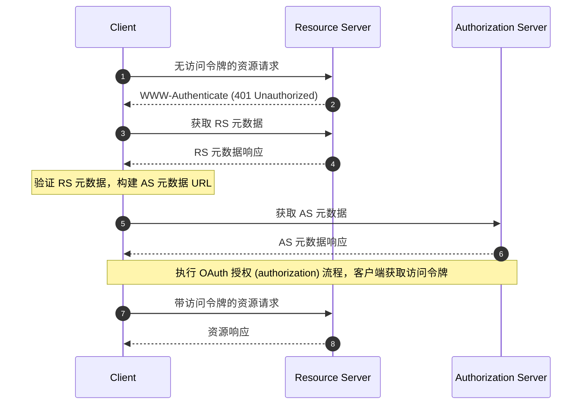

## 什么是 OAuth 2.0 受保护资源元数据 (Protected Resource Metadata)？

OAuth 2.0 受保护资源元数据 (Protected Resource Metadata) 是在 [RFC 9728](https://datatracker.ietf.org/doc/html/rfc9728) 中定义的标准化格式。它帮助客户端和授权服务器了解如何与受保护资源交互。

这种元数据格式提供了关于以下内容的重要信息：
- 资源服务器能力
- 支持的令牌格式
- 所需的安全机制
- 授权服务器关系
- 可用的 scope 和权限

## 受保护资源元数据 (Protected Resource Metadata) 的好处是什么？

在 OAuth 2.0 系统中，有四个基本角色：
- <Ref slug="authorization-server"/>：在成功认证 (authentication) 资源所有者后向客户端颁发访问令牌 (access token)
- <Ref slug="client"/>：请求访问受保护资源的应用程序
- <Ref slug="resource-owner"/>：能够授予访问受保护资源权限的实体
- <Ref slug="resource-server"/>：托管受保护资源的服务器

传统上，当客户端需要访问受保护资源时，它必须首先发现并与授权服务器交互以获取必要的令牌。资源服务器的角色主要限于验证令牌和提供资源，所有认证 (authentication) 和授权 (authorization) 细节都通过授权服务器和客户端应用程序协调。

这意味着客户端没有标准化的方法来直接发现资源服务器的特定要求或能力。

受保护资源元数据 (Protected Resource Metadata) 改变了这种动态，使资源服务器能够主动发布其要求和能力，并带来几个关键好处：
- 直接发现：客户端现在可以直接从源头了解资源服务器的要求
- 增强的自主性：资源服务器可以明确指定其支持的令牌格式、安全机制和可信的授权服务器
- 改进的互操作性：标准化格式确保在不同实现之间一致地传达访问要求
- 动态配置：资源服务器可以更新其要求，而无需依赖授权服务器的更改

## OAuth 2.0 受保护资源元数据 (Protected Resource Metadata) 如何工作？

受保护资源元数据 (Protected Resource Metadata) 在 OAuth 2.0 生态系统中通过标准化的发现和交互过程运行：



资源服务器元数据文档是一个包含以下字段的 JSON 对象：

```json
   {
     "resource": "https://api.example.com",
     "authorization_servers": [
       "https://auth.example.com"
     ],
     "scopes_supported": ["read", "write"],
     "token_formats_supported": ["jwt"],
     "token_introspection_endpoint": "https://api.example.com/introspect",
     "dpop_signing_alg_values_supported": ["ES256", "PS256"]
   }
   ```

一旦客户端收到元数据文档，它可以根据以下字段主要配置自身并与资源服务器交互：

- `resource`: 受保护资源的标识符
- `authorization_servers`: 授权的授权服务器列表
- `scopes_supported`: 此资源的可用 scope
- `token_formats_supported`: 支持的令牌格式
- `token_introspection_endpoint`: 令牌验证的端点
- `dpop_signing_alg_values_supported`: 支持的 DPoP 算法

## 如何发现 OAuth 2.0 受保护资源元数据 (Protected Resource Metadata) 端点？

受保护资源元数据 (Protected Resource Metadata) 有两种主要的发现机制：

1. **WWW-Authenticate 头发现 (基于流程)**：

当客户端向受保护资源发出未经授权的请求时，服务器以 401 状态码响应，并在 WWW-Authenticate 头中包含元数据 URL：

```bash
# 1. 客户端在没有令牌的情况下发出请求
GET /api/resource HTTP/1.1
Host: api.example.com

# 2. 服务器以 401 响应并提供元数据 URL
HTTP/1.1 401 Unauthorized
WWW-Authenticate: Bearer realm="example",
  scope="read write",
  resource_metadata_url="https://api.example.com/.well-known/oauth-resource-server"
```

该头提供：
- 资源领域标识
- 所需的 scope
- 元数据 URL 位置

2. **直接访问 Well-Known URI 发现**：

你可以通过向 well-known 端点发出 GET 请求直接访问元数据：

```bash
GET /.well-known/oauth-resource-server HTTP/1.1
Host: api.example.com
```

该端点遵循标准化格式：
- 基础 URI: `https://api.example.com`
- Well-known 路径: `/.well-known/oauth-resource-server`
- 完整 URL: `https://api.example.com/.well-known/oauth-resource-server`

## WWW-Authenticate 头在受保护资源元数据 (Protected Resource Metadata) 中如何工作？

WWW-Authenticate 头是实现自动发现机制的受保护资源元数据 (Protected Resource Metadata) 的关键组件。它利用标准 HTTP `WWW-Authenticate` 头传输元数据信息，使客户端能够自动发现和配置资源服务器的访问要求。

当客户端首次尝试访问受保护资源而未提供访问令牌时，资源服务器以 401 Unauthorized 状态码响应，并包含一个 WWW-Authenticate 头：

```
WWW-Authenticate: Bearer realm="example",
  scope="read write",
  resource_metadata_url="https://api.example.com/.well-known/oauth-resource-server"
```

此头可能包含几个关键信息：
- `Bearer`: 表示这是一个 OAuth 2.0 Bearer Token 认证 (authentication) 方案
- `realm`: 定义资源的保护空间
- `scope`: 指定所需的访问权限
- `resource_metadata_url`: 指向包含完整资源服务器配置的元数据文档的位置

收到此头后，客户端提取 `resource_metadata_url` 并从该 URL 检索完整的元数据文档。

根据获取的元数据信息，客户端可以确定适当的授权服务器、支持的令牌格式、可用的 scope 和其他配置细节，以正确配置认证请求。

## 如何保护 OAuth 2.0 受保护资源元数据 (Protected Resource Metadata)？

基本的安全考虑包括：

1. **传输安全**：
   - 强制使用 TLS
   - 证书验证
   - 安全连接处理

2. **元数据完整性**：
   - 源验证
   - 签名验证
   - 安全缓存策略

3. **访问控制**：
   - 速率限制
   - 请求验证
   - 滥用监控

## 如何实现 OAuth 2.0 受保护资源元数据 (Protected Resource Metadata)？

以下是如何在不同组件中实现 OAuth 2.0 受保护资源元数据 (Protected Resource Metadata)：

1. **资源服务器实现**

当收到未经授权的访问尝试时，资源服务器以 401 Unauthorized 状态响应，并在 WWW-Authenticate 头中包含元数据 URL：

```
HTTP/1.1 401 Unauthorized
WWW-Authenticate: Bearer realm="example",
  resource_metadata_url="https://api.example.com/.well-known/oauth-resource-server"
```

2. **客户端实现**

客户端实现一个异步函数来处理资源访问。当收到 401 响应时，该函数从 WWW-Authenticate 头中提取元数据 URL，获取元数据，并根据元数据进行客户端配置：

```javascript
async function handleResourceAccess(response) {
  if (response.status === 401) {
    const wwwAuthenticate = response.headers.get('WWW-Authenticate');
    const metadataUrl = extractMetadataUrl(wwwAuthenticate);
    const metadata = await fetchMetadata(metadataUrl);
    // 根据元数据进行客户端配置
  }
}
```

3. **元数据文档结构**

资源服务器提供一个元数据文档，作为包含以下内容的 JSON 对象：
- 资源标识符
- 授权的授权服务器列表
- 支持的 scope
- 支持的令牌格式
- 支持的 DPoP 签名算法

以下是元数据文档的示例：

```json
{
  "resource": "https://api.example.com",
  "authorization_servers": ["https://auth.example.com"],
  "scopes_supported": ["read", "write"],
  "token_formats_supported": ["jwt"],
  "dpop_signing_alg_values_supported": ["ES256"]
}
```

这些组件共同构成了完整的 OAuth 2.0 受保护资源元数据 (Protected Resource Metadata) 实现。通过这种实现，客户端可以自动发现和配置访问受保护资源所需的参数。

<SeeAlso slugs={["resource-server", "authorization-server"]} />

<Resources urls={[
  "https://datatracker.ietf.org/doc/html/rfc9728",
]} />